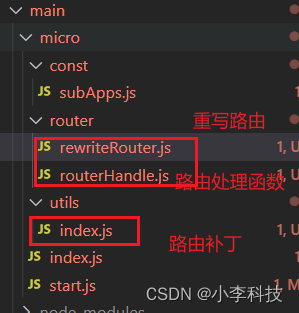
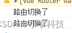
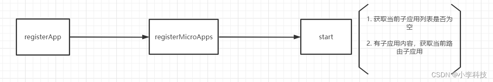
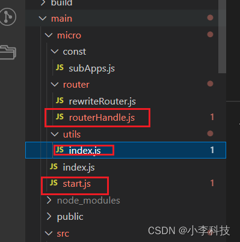

# [微前端实战]---042 框架初建（路由拦截,获取首个子应用）

> 原文出处：https://blog.csdn.net/qq_35812380/article/details/126616203

### 框架初建（路由拦截,获取首个子应用）

#### 一. 路由拦截



`router/rewriteRouter.js`

```
import { patchRouter } from '../utils'
import { turnApp } from './routerHandle'

// 重写路由跳转： 实现路由拦截
export const rewriteRouter = () => {

    window.history.pushState =  patchRouter(window.history.pushState, 'micro_push')
    window.history.replaceState = patchRouter(window.history.replaceState, 'micro_replace')

    // add:event bind
    window.addEventListener('micro_push', turnApp)
    window.addEventListener('micro_replace', turnApp)

    // 监听返回事件
    window.onpopstate = function () {
        turnApp()
    }
}
```

`router/routerHandle.js`

```
// 每次路由切换打印事件
export const turnApp = ()=>{
    console.log('路由切换了');

}
```

`utils/index.js`

```
// 给当前路由跳转打补丁
export const patchRouter = (globalEvent, eventName)=>{
    return function(){
        const e = new Event(eventName)
        globalEvent.apply(this, arguments)
        window.dispatchEvent(e)
    }
}
```

> this指向:window事件监听,传递到`routerHandle.js`

`start.js`

```
// start 文件
import { setList } from './const/subApps'
// 实现路由拦截
+import { rewriteRouter } from './router/rewriteRouter'

+ rewriteRouter()

const registerMicroApps = (appList)=>{...}

export default {
    registerMicroApps
}
```

切换路由时候可以看到:



[18.中央控制器-路由拦截](https://github.com/dL-hx/micro-web/releases/tag/0.1.9)

#### 二. 获取首个子应用





`micro/src/store/utils.js`

```
import { MicroStart } from '../../micro'

const { registerMicroApps, start }= MicroStart
// 注册子应用
export const registerApp=(list)=>{
    // 注册到微前端框架
    registerMicroApps(list)

    // 启动微前端框架
+  start()
}
```

`micro/start.js`

```
// start 文件
import { setList ,getList } from './const/subApps'
// 实现路由拦截
import { rewriteRouter } from './router/rewriteRouter'

import { currentApp } from './utils'

rewriteRouter()

const registerMicroApps = (appList)=>{
    // 注册到window上
    // window.appList = appList
    setList(appList)
}

// 启动微前端框架
const start = ()=>{
   // 1. 获取当前子应用列表是否为空
   const apps = getList()
   if (!apps.length) {
       // 子应用列表为空
       throw Error('子应用列表为空， 请正确注册')
   }
   // 2. 有子应用内容，获取当前路由子应用
   const app = currentApp()


   if (app) {
    const { pathname, hash } = window.location
    const url = pathname + hash
    window.history.pushState('', '', url)

    window.__CURRENT_SUB_APP__ = app.activeRule
   }

}

export default {
    registerMicroApps,
    start
}
```

`utils/index.js`

```
...
// 过滤当前路由
const filterApp = (key, value)=>{// 当前key值===value值

    const currentApp = getList().filter(item => item[key]===getCurrentPrefix()) // => array
    // console.log('currentApp', currentApp);

    return currentApp && currentApp.length ? currentApp[0]:{}
}

const getCurrentPrefix = (value=window.location.pathname)=>{
    const currentPrefix = value.match(/(\/\w+)/g)
    return currentPrefix[0]
}

// 子应用是否做了切换
export const isTurnChild = ()=>{

    if (window.__CURRENT_SUB_APP__===getCurrentPrefix()) {
        return false;
    }
    return true
}
```

`getCurrentPrefix`: 获取路由前缀， 确定是那个子应用

`filterApp`: **命中**子应用，确定使用的子应用容器代码

> 这里切换还有些问题，会触发二次渲染， 这里需要后续更新了…

[19.获取首个子应用](https://github.com/dL-hx/micro-web/releases/tag/0.2.0)
