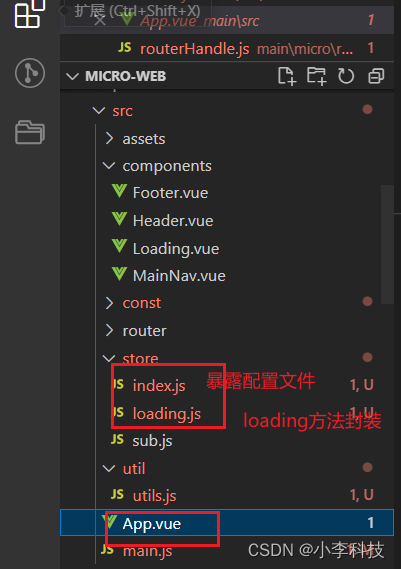
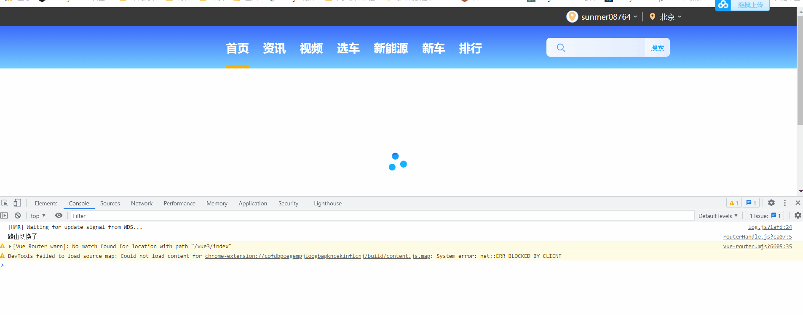
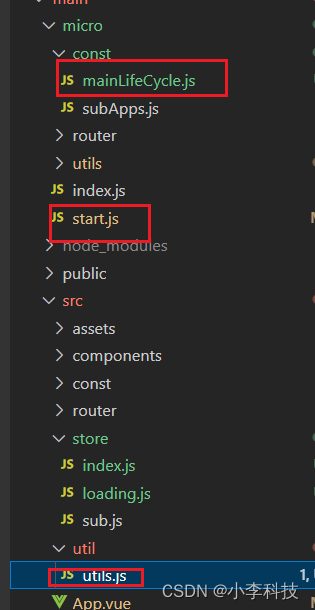
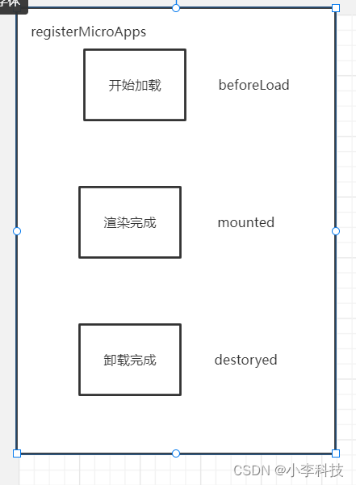
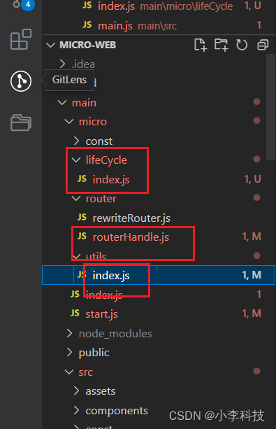
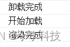

# [微前端实战]---043 框架初建（主微应用生命周期）

> 原文出处：https://blog.csdn.net/qq_35812380/article/details/126653195

### 框架初建（主微应用生命周期）

#### 一. 主应用生命周期

> 通过控制`beforeLoad`, 和`mounted` 方法控制主应用的生命周期

**优化Loading**



`store/loading.js`

```
import {ref} from 'vue';

export let loadingStatus = ref(true)

// 设置loading
export const changeLoading = type => loadingStatus.value = type

 setTimeout(()=>{// 3s 后关闭 loading
    changeLoading(false)
 },3000)
```

`store/index.js`

```
// 暴露Loading方法
export * as loading from './loading'
```

`App.vue`

```
import { ref } from 'vue'
...

import {loading} from './store'

export default {
  name: 'App',
  components: { ...},
  setup() {
    // 声明双向数据ref

    // const loading = ref(true)

    // setTimeout(()=>{// 3s 后关闭 loding
    //   loading.value = false
    // },3000)

    return {// 将代码提取到store中
      loading:loading.loadingStatus,
    }
  }
}
</script>
```



3s后隐藏loading,其他地方引用该变量之处， 也会**同步更新**





`util/utils.js`

> 暴露生命周期方法

```
...
export const registerApp=(list)=>{
    // 注册到微前端框架
    registerMicroApps(list,{
        beforeLoad:[
            ()=>{
                loading.changeLoading(true)
                console.log('开始加载')
            }
        ],
        mounted:[
            ()=>{
                loading.changeLoading(false)
                console.log('渲染完成')
            }
        ],
        destoryed :[
            ()=>{
                console.log('卸载完成')
            }
        ]
    })

    // 启动微前端框架
    start()
}
```

`const/mainLifeCycle.js`

```
let lifeCycle = {}

export const getMainLifecycle = ()=> lifeCycle

export const setMainLifecycle = data => lifeCycle = data
```

`start.js`

> 注册生命周期，进行控制

```
// start 文件

const registerMicroApps = (appList, lifeCycle)=>{
    // 注册到window上
    // window.appList = appList
    setList(appList)

    lifeCycle.beforeLoad[0]()

    setTimeout(()=>{// 3s后隐藏loading
        lifeCycle.mounted[0]()
    },3000)
    // 缓存生命周期
    setMainLifecycle(lifeCycle)
}

// 启动微前端框架
const start = ()=>{...}

export default {
    registerMicroApps,
    start
}
```

最后实现， 控制主应用`生命周期`的`beforeLoad`和`mounted`控制页面是否展示`loading`

[20.主应用生命周期](https://github.com/dL-hx/micro-web/releases/tag/0.2.1)

#### 二. 微应用生命周期

> 设置微前端的生命周期




`micro/router/routerHandle.js`

```
...
export const turnApp = async ()=>{
    if (isTurnChild()) {
        // 微前端的生命周期执行
        await lifecycle()
    }
}
```

```
window.__ORIGIN_APP__: 获取上个子应用
window.__CURRENT_SUB_APP__:获取当前子应用
```

`micro/lifecycle/index.js`

```
import { getMainLifecycle } from '../const/mainLifeCycle';
import { findAppByRoute} from '../utils';
export const lifecycle = async () =>{
    // 获取上一个子应用
    const prevApp = findAppByRoute(window.__ORIGIN_APP__)
    // 获取要跳转的子应用
    const nextApp = findAppByRoute(window.__CURRENT_SUB_APP__)

    console.log(prevApp, nextApp);

    if(!nextApp){
        return
    }

    // 1.销毁上个App,执行 主应用生命周期
    if (prevApp && prevApp.destoryed ) {
        await destoryed(prevApp)
    }

    // 2. 渲染当前子组件
    const app = await beforeLoad(nextApp)

    await mounted(app)// 将mounted设置为同步函数, 并执行
}

export const beforeLoad = async (app)=>{
    await runMainLifeCycle('beforeLoad')

    app && app.beforeLoad&&app.beforeLoad()

    const appContext = null // 将app内容进行渲染

    return appContext
}

export const mounted = async (app)=>{
    app && app.mounted&&app.mounted()

    // 执行主应用生命周期-mounted
    await runMainLifeCycle('mounted')
}

export const destoryed =async (app)=>{
    app && app.destoryed&&app.destoryed()
    // 对应执行以下主应用的生命周期-执行(await)销毁生命周期
    await runMainLifeCycle('destoryed')
}

export const runMainLifeCycle = async (type) =>{
  const mainlife = getMainLifecycle() // 获取所有的生命周期

  // 通过type执行生命周期
  await Promise.all(mainlife[type].map(async item => await item()))

}
```

`micro/utils/index.js`

```
...

export const findAppByRoute = (router) =>{
    return filterApp('activeRule', router)
}

// 过滤当前路由
const filterApp = (key, value)=>{// 当前key值===value值
    const currentApp = getList().filter(item => item[key]===value) // => array
    return currentApp && currentApp.length ? currentApp[0]:{}
}

// 子应用是否做了切换
export const isTurnChild = ()=>{
    window.__ORIGIN_APP__ = window.__CURRENT_SUB_APP__ // window.__ORIGIN_APP__ : 上个子应用
    const currentApp= getCurrentPrefix()

    if (!currentApp) {
        return ;
    }

    if (window.__CURRENT_SUB_APP__ === currentApp) {
        return false;
    }


    window.__CURRENT_SUB_APP__ = currentApp// window.__CURRENT_SUB_APP__ : 当前子应用

    return true
}
```



> 完成微应用切换，下一步解析html, 渲染子应用内容

[21.微应用生命周期](https://github.com/dL-hx/micro-web/releases/tag/0.2.2)
