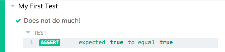
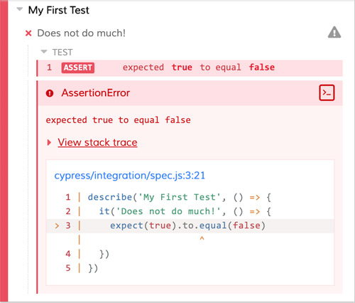
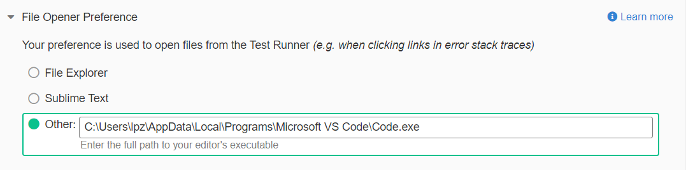
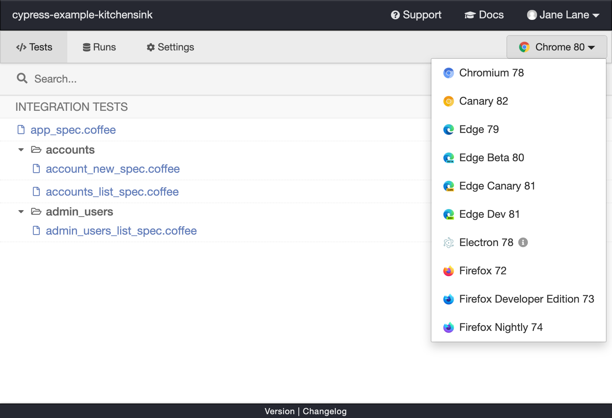

# E2E测试---Cypress 使用

> 原文出处：https://blog.csdn.net/qq_35812380/article/details/124706711

## E2E测试—Cypress 使用

* [官网](https://www.cypress.io/)
* [GitHub](https://github.com/cypress-io/cypress)

### 安装

```
# npm
npm install cypress --save-dev

# yarn
yarn add cypress --dev
```

添加 npm 脚本：

```
{
  "scripts": {
    "cypress:open": "cypress open"
  }
}
```

启动：

```
npm run cypress:open
```

### 编写测试

#### Cypress 目录说明

```
cypress //cypress目录
---- fixtures # 测试数据配置文件，可以使用 fixture 方法读取
---- integration # 测试脚本文件
---- plugin # 插件支持
---- support # 支持文件
-cypress.json # cypress 全局配置文件
```

#### 创建测试文件

```
touch {your_project}/cypress/integration/sample_spec.js
```

创建该文件后，我们应该看到 Cypress Test Runner 立即将其显示在 Integration Tests 列表中。Cypress 会监控您的规格文件是否有任何更改，并自动显示任何更改。

即使我们还没有编写任何测试-没关系-让我们单击 `sample_spec.js` 并观看 Cypress 启动您的浏览器。

Cypress 会在系统上安装的浏览器中打开测试。您可以在启动浏览器中阅读有关我们如何执行此操作的更多信息。

#### 编写测试文件

```
describe('My First Test', () => {
  it('Does not do much!', () => {
    expect(true).to.equal(true)
  })
})
```



编写一个失败的测试：

```
describe('My First Test', () => {
  it('Does not do much!', () => {
    expect(true).to.equal(false)
  })
})
```

再次保存后，测试失败，Cypress 会以红色显示失败的测试 false。

Cypress 还会在断言失败的地方（如果可用）显示堆栈跟踪和代码帧。您可以单击蓝色文件链接以在首选文件打开器中打开发生错误的文件。要了解有关错误显示的更多信息，请阅读有关调试错误的信息。





比如我这里的 vscode 的路径是：`C:\Users\lpz\AppData\Local\Programs\Microsoft VS Code\Code.exe`

#### 切换浏览器

Cypress 测试运行器试图在用户计算机上查找所有兼容的浏览器。选择其他浏览器下拉菜单位于测试运行器的右上角。



更多使用方式参考：https://docs.cypress.io/guides/guides/launching-browsers。

### 编写一个真实的测试

1. 访问网页。
2. 查询元素。
3. 与该元素进行交互。
4. 声明页面上的内容。

### Cypress 调试

* 时间旅行
* 快照
* 错误
* 页面事件
* 控制台输出
* 特殊命令
* + `cy.pause()`
  + `cy.debug()`

### Cypress 常用 API

```
describe('Post Resource', () => {
  it('Creating a New Post', () => {
    cy.visit('/posts/new') // 1.

    cy.get('input.post-title') // 2.
      .type('My First Post') // 3.

    cy.get('input.post-body') // 4.
      .type('Hello, world!') // 5.

    cy.contains('Submit') // 6.
      .click() // 7.

    cy.url() // 8.
      .should('include', '/posts/my-first-post')

    cy.get('h1') // 9.
      .should('contain', 'My First Post')
  })
})
```

1. 前往的网页 `/posts/new`。
2. 找到 `<input>` with类 `post-title`。
3. 在其中输入“我的第一条帖子”。
4. 找到 `<input>` with类 `post-body`。
5. 输入“你好，世界！” 进去。
6. 找到包含文本的元素 `Submit`。
7. 点击它。
8. 抓取浏览器网址，确保其中包含 `/posts/my-first-post`。
9. 找到 h1 标签，确保它包含文本“我的第一篇文章”。

#### 查询元素

如果您以前使用过 `jQuery`，则可能习惯于查询以下元素：

```
$('.my-selector')
```

在 `Cypress` 中，查询元素相同：

```
cy.get('.my-selector')
```

实际上，Cypress 捆绑了 jQuery，并向您公开了许多 DOM 遍历方法，因此您可以使用已经熟悉的 API 轻松处理复杂的 HTML 结构。

```
// Each method is equivalent to its jQuery counterpart. Use what you know!
cy.get('#main-content').find('.article').children('img[src^="/static"]').first()
```

但是，访问从查询返回的 DOM 元素的方法有所不同：

```
// This is fine, jQuery returns the element synchronously.
const $jqElement = $('.element')

// This will not work! Cypress does not return the element synchronously.
const $cyElement = cy.get('.element')
```

#### Cypress 不像 jQuery

参考：https://docs.cypress.io/guides/core-concepts/introduction-to-cypress#Cypress-is-Not-Like-jQuery。

#### 通过文字内容查询

```
// Find an element in the document containing the text 'New Post'
cy.contains('New Post')

// Find an element within '.main' containing the text 'New Post'
cy.get('.main').contains('New Post')
```

#### 查询超时时间

```
// Give this element 10 seconds to appear
cy.get('.my-slow-selector', { timeout: 10000 })
```

默认是 4 秒。

#### 与元素互动

```
cy.get('textarea.post-body').type('This is an excellent post.')
```

Cypress 提供了与您的应用交互的更多操作命令：

* `.blur()` -使聚焦的DOM元素模糊。
* `.focus()` -专注于DOM元素。
* `.clear()` -清除输入或文本区域的值。
* `.check()` -选中复选框或单选按钮。
* `.uncheck()` -取消选中复选框。
* `.select()`-在中选择`<option>`一个`<select>`。
* `.dblclick()` -双击DOM元素。
* `.rightclick()` -右键单击DOM元素。

#### 断言元素

```
cy.get(':checkbox').should('be.disabled')

cy.get('form').should('have.class', 'form-horizontal')

cy.get('input').should('not.have.value', 'US')

// 针对长度的断言
cy.get('li.selected').should('have.length',3)

// 针对类的断言
cy.get('from').fijd('input').should('not.have.class','disabled')

// 针对值的断言
cy.get('textarea').should('have.value','3testing')

// 针对文本内容的断言
cy.get('a').parent('span.help').should('contain','click me')

// 针对元素可见与否的断言
cy.get('button').should('be.visible')

// 针对元素存在与否的断言
cy.get('#loading').should('not.exist')

// 针对元素状态的State的断言
cy.get(':radio').should('be.checked')

// 针对CSS的断言
cy.get('.completed').should('have.css','text-decoration','line-through')
```

#### 使用别名引用查询

```
cy.get('.my-selector')
  .as('myElement') // sets the alias
  .click()

/* many more actions */

cy.get('@myElement') // re-queries the DOM as before (only if necessary)
  .click()
```

这样，当元素仍在 DOM 中时，我们便可以将 DOM 查询重新用于更快的测试，并且当在 DOM 中没有立即找到该元素时，它会自动为我们处理 DOM 的重新查询。在处理进行大量重新渲染的前端框架时，这特别有用！

### 测试自己的应用

* 启动本地服务
* 开始测试
