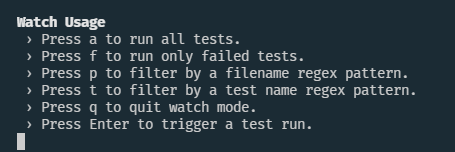
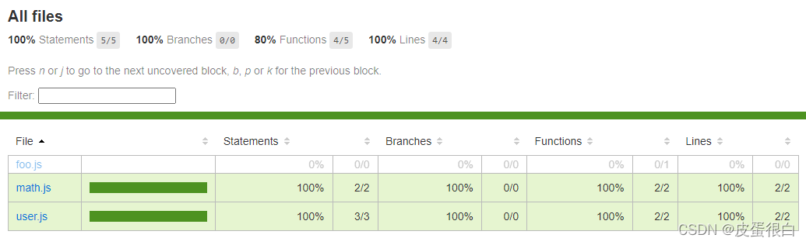
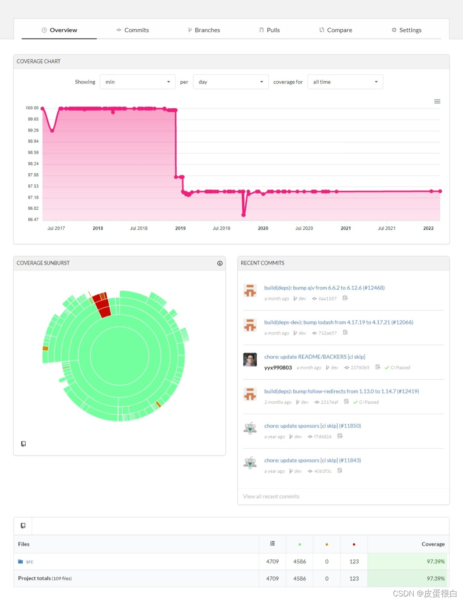
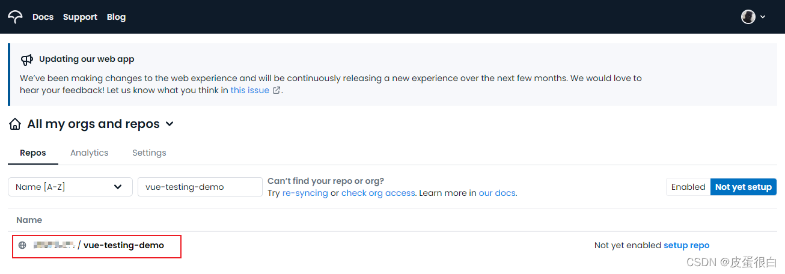
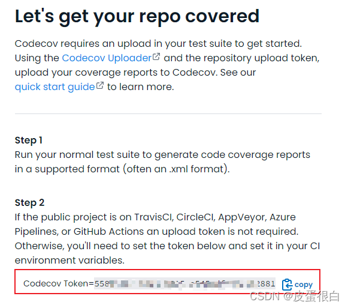
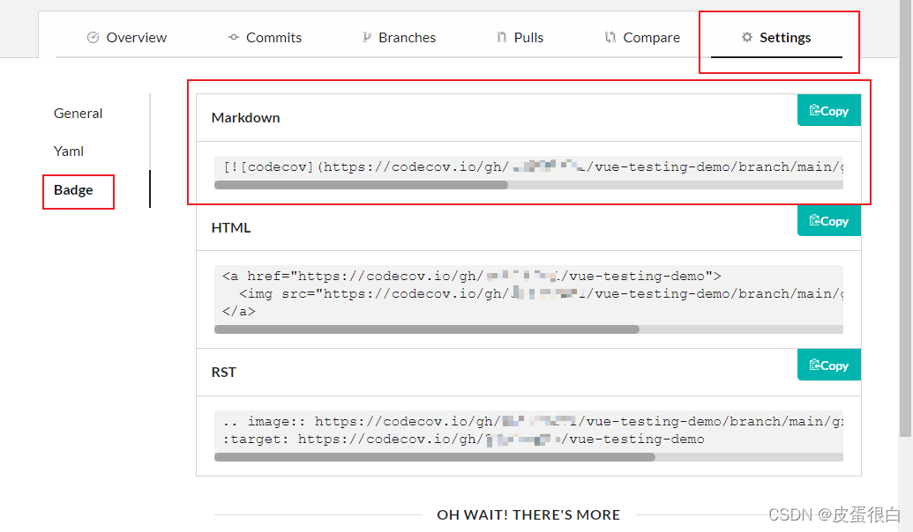
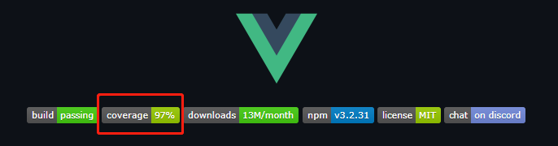

# Jest基础

> 原文出处：https://blog.csdn.net/qq_35812380/article/details/124684952

## Jest基础

### 一 测试是什么

```
// math.test.js
const { sum, substrct }= require('./math.js')

// 测试示例2
const result = sum(1,2)
const expected = 3

if (result !== expected) {
    throw new Error(`1 + 2 应该等于 ${expected}，但是结果却是 ${result}`)
}

// 测试示例2

const result2 = subtract(2, 1)
// 期望结果
const expected2 = 1

if (result2 !== expected2) {
  throw new Error(`2 - 1 应该等于 ${expected2}，但是结果却是 ${result2}`)
}
```

### 二 断言与测试用例

> 函数封装,进行断言, 函数封装

```
expect, 称之为断言函数,断定一个真实的结构是期待的结果
test 函数相当于测试用例
```

**期待进行如下调用**

```
expect(sum(1, 2)).toBe(3)
expect(subtract(2, 1)).toBe(-1)
```

**实现expect方法:**

```
function expect(result) {
    return {
        toBe(actual) {
            if (result !== actual) {
                throw new Error(`预期值和实际值不相等，预期 ${result}，结果确实 ${actual}`)
              }

        }
    }
}
```

**追加提示错误信息:**

**期待如下调用:**

```
test('测试加法', () => {
  expect(sum(1, 2)).toBe(3)
})
```

**实现test方法:**

```
test('测试加法', () => {
    expect(sum(1, 2)).toBe(3)
})

function test(description, callback) {
  try {
    callback()
  } catch (error) {
    console.error(`${description} 没有通过测试：${error}`)
  }
}
```

### 三 Jest使用

##### 3.1 jest 使用

https://jestjs.io/docs/getting-started

安装 Jest 到项目中：

```
npm init -y
npm install -D jest
```

package.json 添加脚本：

```
"scripts": {
  "test": "jest"
},
```

编写代码：

```
// math.js
function sum(a, b) {
  return a + b
}

function subtract(x, y) {
  return x - y
}

module.exports = {
  sum,
  subtract
}
```

用例:

```
// math.test.js
const { sum, substrct }= require('./math.js')

test('adds 1 + 2 to equal 3', () => {
  expect(sum(1, 2)).toBe(3);
});
```

最后，运行`yarn test`or`npm test`并且 Jest 将打印此消息：

```
PASS  ./sum.test.js
✓ adds 1 + 2 to equal 3 (5ms)
```

[外链图片转存失败,源站可能有防盗链机制,建议将图片保存下来直接上传(img-sPPoqMDd-1652154442542)(Jest%E5%9F%BA%E7%A1%80.assets/image-20220509194522835.png)]

**您刚刚使用 Jest 成功编写了您的第一个测试！**

该测试使用`expect`and`toBe`来测试两个值是否完全相同。要了解 Jest 可以测试的其他内容，请参阅[使用 Matchers](https://jestjs.io/docs/using-matchers)。

#### [vscode](https://so.csdn.net/so/search?q=vscode&spm=1001.2101.3001.7020) 中 jest 代码智能提示

由于文件中并没有引入 Jest 的方法，所以使用的时候 vscode 没有提供智能提示。

可以通过安装 jest 的类型声明文件 `@types/jest` 来解决。

```
npm i -D @types/jest
```

注意：@types/jest 必须安装到项目的根目录，并且以根目录的方式在 vscode 中打开，否则不生效。

或者说只要是 vscode 打开的项目根目录有 @types/jest 这个包就可以了。

这是因为 TS 是从项目根目录下的 node\_modules 查找 @types 类型声明文件的。

##### 3.2 jest 配置

```
$	npm jest --init
```

```
# 生成 jest 配置文件
npx jest --init

# 配置文件的格式 ts or js
√ Would you like to use Typescript for the configuration file? ... no
# 测试环境 node 环境 或 jsdom 浏览器环境
√ Choose the test environment that will be used for testing » jsdom (browser-like)
# 是否需要 Jest 收集测试覆盖率报告
√ Do you want Jest to add coverage reports? ... no
# 用于统计测试覆盖率使用的引擎
# 目前最稳定是的 babel，v8 仍处于实验阶段，建议 node v14 版本以上使用
√ Which provider should be used to instrument code for coverage? » babel
# 是否在每次测试之前清除 mock 调用和相关实例
√ Automatically clear mock calls, instances and results before every test? ... yes
```

#### Jest 监视模式

##### –watchAll

监视文件的更改并在任何更改时重新运行所有测试

```
jest --watchAll
```



```
Watch Usage
 # 按 a 进入 a 模式：运行所有的测试。
 # a 进入，a 退出
 # 也可以使用 jest --watchAll 直接进入 a 模式
 # 只有 jest --watch 时才能使用
 › Press a to run all tests.

 # 按 f 进入 f 模式：只运行失败的测试。
 # f 进入，f 退出
 › Press f to run only failed tests.

 # 按 o 进入 o 模式：只运行与更改文件相关的测试。
 # 需要 Git 支持
 # 也可以使用 jest --watch 直接进入 o 模式
 # 只有 jest --watchAll 时才能使用
 › Press o to only run tests related to changed files.

 # 按 p 以文件名正则表达式模式进行过滤。
 # 只有 --watchAll 的时候 p 模式才可以使用
 # 注意：testRegex 将尝试使用绝对文件路径来检测测试文件，因此，具有名称与之匹配的文件夹将所有文件作为测试运行
 # testRegex 会忽略 testMatch
 › Press p to filter by a filename regex pattern.

 # 按 t 以测试名称（test 方法第一个参数）正则表达式模式进行过滤。
 › Press t to filter by a test name regex pattern.

 # 按 q 退出监视模式
 › Press q to quit watch mode.

 # 按 Enter 键触发测试运行
 › Press Enter to trigger a test run.
```

#### 使用 ES6 模块

如果要在 Jest 测试中使用 ES6 模块，则需要[使用-babel](https://jestjs.io/zh-Hans/docs/getting-started#%E4%BD%BF%E7%94%A8-babel)：

```
# 安装 babel 相关依赖
npm i -D babel-jest @babel/core @babel/preset-env
```

```
// babel.config.js
module.exports = {
  presets: [['@babel/preset-env', {targets: {node: 'current'}}]],
};
```

Jest 在运行测试的时候会自动找到 Babel 将 ES6 代码转换为 ES5 执行。

Jest 结合 Babel 的运行原理：运行测试之前，结合 Babel，先把代码做一次转化，模块被转换为了 CommonJS，运行转换之后的测试用例代码。

#### Jest全局Api

```
test函数别名: it(name,fn, timeout)

test(name,fn, timeout)
```

#### Expect匹配器

官方文档：

* [Expect API 文档](https://jestjs.io/docs/expect)
* [Using Matchers 常用匹配器](https://jestjs.io/docs/using-matchers)

#### 测试异步代码

> 官方文档：[Testing Asynchronous Code](https://jestjs.io/docs/asynchronous)

常见的错误做法：

```
// 测试异步代码
function fetchData(callback) {
  setTimeout(() => {
    callback({ foo: 'bar' })
  }, 1000)
}

// 错误用例
test('async test', () => {
  fetchData(data => {
    expect(data).toEqual({ foo: 'bar' })
    expect(data).toEqual(1) // 仍会测试通过
  })
})
```

正确写法

```
// 测试异步代码
function fetchData(callback) {
  setTimeout(() => {
    callback({ foo: 'bar' })
  }, 1000)
}

// 正确用例
test('async test', done => {
  fetchData(data => {
    try {
      expect(data).toEqual(1)
      done()
    } catch (error) {
      done(error)
    }
  })
})
```

#### Timer Mocks 模拟计时器

> 官方文档：[Timer Mocks](https://jestjs.io/docs/timer-mocks)

#### 总结

```
// 使用模拟定时器
jest.useFakeTimers()

// 验证定时器函数被调用的次数
expect(setTimeout).toHaveBeenCalledTimes(1)

// 验证定时器的时间是 1s
expect(setTimeout).toHaveBeenLastCalledWith(expect.any(Function), 1000)

// 快进所有定时器结束
jest.runAllTimers()

// 解决定时器循环问题
jest.runOnlyPendingTimers()

// 快进定时器到指定时间
jest.advanceTimersByTime(1000)

// 清除所有定时器
jest.clearAllTimers()
```

### 四 模拟函数Mock

https://jestjs.io/zh-Hans/docs/mock-functions

#### Mock模块

假设我们有一个使用 axios 请求 API 的方法

```
// users.js
import axios from 'axios';

class Users {
  static all() {
    return axios.get('/users.json').then(resp => resp.data);
  }
}

export default Users;
```

现在，为测试该方法而不实际调用 API (使测试缓慢与脆弱)，我们可以用 `jest.mock(...)` 函数自动模拟 axios 模块。

一旦模拟模块，我们可为 `.get` 提供一个 `mockResolvedValue` ，它会返回假数据用于测试。 实际上，我们想说的是我们想让`axios.get('/users.json')` 有个伪造的响应结果。

users.test.js

```
import axios from 'axios';
import Users from './users';

jest.mock('axios');

test('should fetch users', () => {
  const users = [{name: 'Bob'}];
  const resp = {data: users};
  axios.get.mockResolvedValue(resp);

  // or you could use the following depending on your use case:
  // axios.get.mockImplementation(() => Promise.resolve(resp))

  return Users.all().then(data => expect(data).toEqual(users));
});
```

### 五. 钩子函数

> 官方文档：[Setup and Teardown](https://jestjs.io/docs/setup-teardown)

目的: 为了简化代码.

#### 分别设置每个测试

`beforeEach/afterEach`

#### 一次性设置全部测试

`beforeAll/afterAll`

https://blog.csdn.net/u012961419/article/details/123638634

#### DOM 测试

> 官方文档：[DOM Manipulation](https://jestjs.io/docs/tutorial-jquery)

```
// 操作 DOM 的函数
function renderHtml() {
  const div = document.createElement('div')
  div.innerHTML = `
    <h1>Hello World</h1>
  `
  document.body.appendChild(div)
}
```

实际上 Jest 内部引入了一个第三方包 [jsdom](https://www.npmjs.com/package/jsdom)，这个工具模拟了一套浏览器环境的 DOM Api。

Jest 通过 jsdom 模拟了 DOM 环境，可以让开发着像在浏览器中一样直接每个 DOM Api。

```
test('DOM Testing', () => {
  renderHtml()
  // console.log(document.body.innerHTML)
  expect(document.querySelector('h1').innerHTML).toBe('Hello World')
})
```

#### Vue 组件测试

可以进行 DOM 测试，就可以很方便的进行 Vue、React 组件测试，因为它们最终都会渲染成 DOM。

下例使用字符串模板方式创建一个 Vue 组件：

```
// 注意：本例使用 vue2，当前 Vue 默认版本已更新为 Vue3
// 安装 vue2: npm i vue@2
import Vue from 'vue/dist/vue'

function renderVueComponent() {
  document.body.innerHTML = `
    <div id="app"></div>
  `

  new Vue({
    template: `
      <div id="app">
        <h1>{{ message }}</h1>
      </div>
    `,
    data: {
      message: 'Hello World'
    }
  }).$mount('#app')
}

test('Vue Testing', () => {
  renderVueComponent()
  console.log(document.body.innerHTML)
  expect(document.body.innerHTML).toMatch(/Hello World/)
})
```

#### [快照](https://so.csdn.net/so/search?q=%E5%BF%AB%E7%85%A7&spm=1001.2101.3001.7020)测试

> 官方文档：[Snapshot Testing](https://jestjs.io/docs/snapshot-testing)

要想确保 UI 界面不会意外改变，快照测试是一个非常有用的工具。

典型的快照测试用例渲染一个 UI 组件，拍摄快照，然后与存储在快照文件中的内容进行比较，如果两个快照不匹配，要么就是发生了意外更改，要不就是需要更新快照版本。

#### 使用快照

```
// snapshot.test.js
function renderHtml() {
  const div = document.createElement('div')
  div.innerHTML = `
    <h1>Hello World</h1>
  `
  document.body.appendChild(div)
}

test('Snapshot Testing', () => {
  renderHtml()

  // 第一次运行测试，会生成快照文件，存储 expect() 传入的字符串
  // 下次运行测试的时候会和快照文件进行比对
  expect(document.body.innerHTML).toMatchSnapshot()
})
```

首次运行测试，会在项目根目录下创建 `__snapshots__` 文件夹，在该目录看下，创建基于测试文件名称的快照文件 `snapshot.test.js.snap`，内容如下：

```
exports[`Snapshot Testing 1`] = `
"<div>
    <h1>Hello World</h1>
  </div>"
`;
```

#### 更新快照

如果组件发生了有意义的更改，快照文件不会同步更新，需要我们手动更新快照文件：

```
# 在项目中运行 jest 更新快照命令
npx jest --updateSnapshot
# 或使用简写
npx jest -u
```

这个命令将会更新测试中全部的快照文件，所以在此之前你应该修复那些额外的失败的快照测试错误，以避免生成包含错误行为的快照。

你也可以通过参数 `--testNamePattern` 仅为该模式匹配的测试用例重新生成快照。

```
# 仅更新匹配测试用例名称成功的测试的快照
npx jest -u --testNamePattern=Snap
# 或使用简写
npx jest -u -t=Snap
```

#### 测试覆盖率

```
{
  // ...

  // 是否收集测试覆盖率信息
  // collectCoverage: false,
  collectCoverage: true,

  // 一个 glob 模式数组，指示应该为其收集覆盖率信息的一组文件
  // collectCoverageFrom: undefined,
  collectCoverageFrom: [
    '**/*.{js,jsx}',
    '!**/node_modules/**',
    '!**/vendor/**'
  ],

  // 测试覆盖率报错文件输出的目录
  // coverageDirectory: undefined,
  coverageDirectory: 'coverage',

  // 忽略测试覆盖率统计的文件
  // coveragePathIgnorePatterns: [
  //   "\\\\node_modules\\\\"
  // ],

  // 指示应该使用哪个引擎检测代码的覆盖率，默认是 babel，可选 v8，但是 v8 不太稳定，建议 Node 14 以上版本使用
  coverageProvider: "babel",

  // A list of reporter names that Jest uses when writing coverage reports
  // Jest 在编写覆盖率报告时使用的报告人姓名列表
  // coverageReporters: [
  //   "json",
  //   "text",
  //   "lcov",
  //   "clover"
  // ],

  // 覆盖率阈值，如果没有达到阈值则测试失败
  // coverageThreshold: undefined,
  coverageThreshold: {
    "global": {
      "branches": 80,
      "functions": 80,
      "lines": 80,
      "statements": -10
    },
    "./src/components/": {
      "branches": 40,
      "statements": 40
    },
    "./src/reducers/**/*.js": {
      "statements": 90
    },
    "./src/api/very-important-module.js": {
      "branches": 100,
      "functions": 100,
      "lines": 100,
      "statements": 100
    }
  },

  // 通常，在收集代码覆盖率时会忽略测试文件。
  // 使用此选项，可以覆盖此行为，并在代码覆盖率中包含被忽略的文件
  // forceCoverageMatch: [],
  forceCoverageMatch: ['**/*.t.js'],
};
```

```
----------|---------|----------|---------|---------|-------------------
File      | % Stmts | % Branch | % Funcs | % Lines | Uncovered Line #s
----------|---------|----------|---------|---------|-------------------
All files |     100 |      100 |      80 |     100 |
 foo.js   |       0 |        0 |       0 |       0 |
 math.js  |     100 |      100 |     100 |     100 |
 user.js  |     100 |      100 |     100 |     100 |
----------|---------|----------|---------|---------|-------------------
```

#### 报告页面

如果配置了启用统计代码覆盖率，每次运行 Jest 都会生成报告，也可以使用命令行选项手动指定：`jest --coverage`。

可以打开 `coverage\lcov-report\index.html` 在页面上查看：



#### 上传覆盖率

通常情况下不建议将测试覆盖率报告保存在项目仓库中：

```
# .gitignore
# jest 存放统计报告的目录
coverage
```

帮助我们展示覆盖率报告。有两个网站可供选择：Codecov 和 Coveralls。这里以 Codecov 为例：



这是[Vue.js 发布在 codecov 上的测试覆盖率统计报告](https://app.codecov.io/gh/vuejs/vue)。

首先，打开 [Codecov](https://app.codecov.io/) 官网，绑定 Github 账号登录之后，选择要展示测试覆盖率的仓库

> 注意：上传报告的项目 git 必须是选择的 git 仓库，否则上传命令虽然不会报错，但并不会上传到 codecov 平台显示。



拷贝 Codecov token（未上传过报告的仓库默认会显示入门指南，Step2 中有 token；上传过报告的仓库可以从 Settings 面板复制 token）



然后安装 Codecov：

```
npm i -D codecov
# 或者安装到全局
# npm i -g codecov
```

生成测试覆盖率报告：

```
# coverage 是运行 `jest -- coverrage` 的脚本
npm run coverage
```

将测试覆盖率报告上传到 codecov：

```
# 运行项目安装的 codecov 上传报告
npx codecov --token=xxx
# 使用全局安装的 codecov
codecov --token=xxx
```

在 Settings 面板复制 Badge 链接到 `README.md` 中可以展示 codecov 徽章，显示测试覆盖率，可以让其他开发者了解应用是否安全可靠。



效果如下




#### 自动化测试和持续集成

…

可供选择的持续集成工具有 Gitlab CI、 [Travis CI](https://travis-ci.org/) 、 [Circle CI](https://circleci.com/)、GitHub Actions 等。
