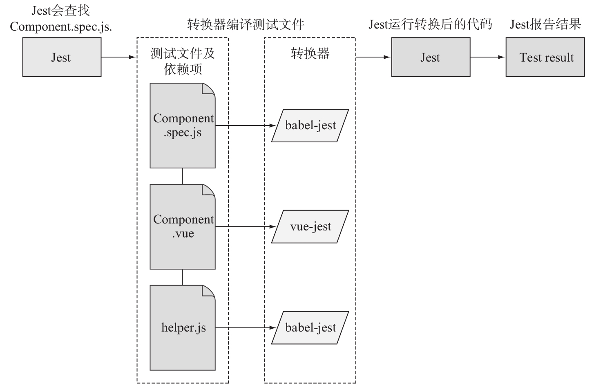

# Vue Test Utils 使用

> 原文出处：https://blog.csdn.net/qq_35812380/article/details/124685547

## Vue Test Utils 使用

### 在 Vue 应用中集成 Jest

* 方式一：使用 Vue CLI 创建项目的时候。
* 方式二：在一个已有的 Vue CLI 创建的项目中配置 Jest：`vue add unit-jest`
* 方式三：[手动配置](https://vue-test-utils.vuejs.org/zh/installation/)。

下面以方式一为例进行演示。

```
? Please pick a preset: Manually select features
? Check the features needed for your project: Choose Vue version, Babel, Linter, Unit
? Choose a version of Vue.js that you want to start the project with 2.x
? Pick a linter / formatter config: Standard
? Pick additional lint features: Lint on save, Lint and fix on commit
? Pick a unit testing solution: Jest
? Where do you prefer placing config for Babel, ESLint, etc.? In dedicated config files
? Save this as a preset for future projects? No
```

选择 “Manually select features” 和 “Unit Testing”，以及 “Jest” 作为 test runner。

一旦安装完成，cd 进入项目目录中并运行 `npm run test:unit`。如果一切顺利，你将看到：

```
 PASS  tests/unit/HelloWorld.spec.js
  HelloWorld.vue
    ✓ renders props.msg when passed (26ms)

Test Suites: 1 passed, 1 total
Tests:       1 passed, 1 total
Snapshots:   0 total
Time:        2.074s
```

恭喜，你已经运行了你的第一个通过的测试！

### Jest 默认配置说明

```
// node_modules/@vue/cli-plugin-unit-jest/presets/default/jest-preset.js
module.exports = {
  moduleFileExtensions: [ // 可以省略的模块扩展名
    'js',
    'jsx',
    'json',
    // tell Jest to handle *.vue files
    'vue'
  ],
  transform: { // 模块转换器
    // process *.vue files with vue-jest
    '^.+\\.vue$': require.resolve('vue-jest'), // .vue 模块使用 vue-jest 转换
    '.+\\.(css|styl|less|sass|scss|svg|png|jpg|ttf|woff|woff2)$':
    require.resolve('jest-transform-stub'), // css 等模块使用 jest-transform-stub 转换为字符串
    '^.+\\.jsx?$': require.resolve('babel-jest') // .jsx 模块使用 babel-jest 转换
  },
  transformIgnorePatterns: ['/node_modules/'], // 不转换第三方包资源模块
  // support the same @ -> src alias mapping in source code
  // 支持模块加载路径中的 @ 别名
  moduleNameMapper: {
    '^@/(.*)$': '<rootDir>/src/$1'
  },
  // 测试环境，Jest中的默认环境是通过jsdom的类似于浏览器的环境
  // 如果要构建 node 应用，则可以使用 node 选项来使用类似 node 的环境。
  // 通过在文件顶部添加 @jest-environment docblock，可以在该文件中指定另一个用于所有测试的环境
  testEnvironment: 'jest-environment-jsdom-fifteen',
  // serializer for snapshots

  // 序列化快照
  // 对 .vue 组件进行快照测试，快照存储为一个文件，文件内容需要格式化，这里使用 jest-serializer-vue 进行格式化处理
  snapshotSerializers: [
    'jest-serializer-vue'
  ],

  // 要测试的文件路径
  testMatch: [
    '**/tests/unit/**/*.spec.[jt]s?(x)',
    '**/__tests__/*.[jt]s?(x)'
  ],
  // 测试的浏览器环境地址
  // https://github.com/facebook/jest/issues/6766
  testURL: 'http://localhost/',

  // 监视运行测试的插件工具
  watchPlugins: [
    // 在监视模式下，为 p 方式筛选文件提供交互式选择文件功能
    require.resolve('jest-watch-typeahead/filename'),
    require.resolve('jest-watch-typeahead/testname')
  ]
}
```

详细的配置说明参考官方文档：https://jestjs.io/docs/zh-Hans/configuration。



* 当 Jest 加载 `.vue` 或 `.js` 文件时，会在正确的转换器中运行，并将文件转换为可在 Node 下运行的 JavaScript 代码。
* Jest 通过 vue-jest 和 babel-jest 编译一个组件。

Vue Test Utils 通过将它们隔离挂载，然后模拟必要的输入 (prop、注入和用户事件) 和对输出 (渲染结果、触发的自定义事件) 的断言来测试 Vue 组件。

被挂载的组件会返回到一个[包裹器](https://vue-test-utils.vuejs.org/zh/api/wrapper/)内，而包裹器会暴露很多封装、遍历和查询其内部的 Vue 组件实例的便捷的方法。

你可以通过 `mount` 方法来创建包裹器。让我们创建一个名叫 `test.js` 的文件：

```
// test.js

// 从测试实用工具集中导入 `mount()` 方法
// 同时导入你要测试的组件
import { mount } from '@vue/test-utils'
import Counter from './counter'

// 现在挂载组件，你便得到了这个包裹器
const wrapper = mount(Counter)

// 你可以通过 `wrapper.vm` 访问实际的 Vue 实例
const vm = wrapper.vm

// 在控制台将其记录下来即可深度审阅包裹器
// 我们对 Vue Test Utils 的探索也由此开始
console.log(wrapper)
import Greeting from '@/components/Greeting.vue'
import { mount } from '@vue/test-utils'

test('renders a greeting', () => {
  const wrapper = mount(Greeting)
  expect(wrapper.html()).toMatch('Vue and TDD')
})
```

### mount 和 shallowMount

`vue-test-utils` 提供了两种方式用于渲染，或者说 **加载（mount）** 一个组件 – `mount` 和 `shallowMount`。一个组件无论使用这两种方法的哪个都会返回一个 `wrapper`，也就是一个包含了 Vue 组件的对象，辅以一些对测试有用的方法。

让我们从两个简单的组件开始：

```
<!-- src\components\Child.vue -->
<template>
  <div>
    <h1>Child</h1>
  </div>
</template>
<!-- src\components\Parent.vue -->
<template>
  <div>
    <h1>Parent</h1>
    <Child/>
  </div>
</template>

<script>
import Child from './Child'

export default {
  components: {
    Child
  }
}
</script>
```

先来渲染 `Child` 并调用由 `vue-test-utils` 提供的用以核查置标语言的 `html` 方法。

```
const shallowWrapper = shallowMount(Child)
const mountWrapper = mount(Child)

console.log(shallowWrapper.html())
console.log(mountWrapper.html())
```

`mountWrapper.html()` 和 `shallowWrapper.html()` 都产生了如下输出：

```
<div>
	<h1>Child</h1>
</div>
```

此次并没有差别。换作 `Parent` 又如何呢？

```
const shallowWrapper = shallowMount(Parent)
const mountWrapper = mount(Parent)

console.log(shallowWrapper.html())
console.log(mountWrapper.html())
```

`mountWrapper.html()` 现在产生了：

```
<div>
  <h1>Parent</h1>
  <div>
    <h1>Child</h1>
  </div>
</div>
```

这完整地渲染了 `Parent` 和 `Child` 的标记。

而 `shallowWrapper.html()` 产生了如下输出：

```
<div>
  <h1>Parent</h1>
  <child-stub></child-stub>
</div>
```

原本 `<Child />` 应该出现的地方被替换成了 `<child-stub />`。`shallowMount` 会渲染常规的 HTML 元素，但将用 stub 替换掉 Vue 组件。

一个 stub 就是一种替代真实组件的 “假的” 对象

这会很管用。想象一下要测试你的 `App.vue` 组件，看起来是这样的：

```
<template>
  <div>
    <h1>My Vue App</h1>
    <fetch-data />
  </div>
</template>
```

并且我们只想测试 `<h1>My Vue App</h1>` 被正确地渲染了。但同时我们也有一个 `<fetch-data>` 组件，该组件在其 `mounted` 生命周期钩子中向外部 API 发起一个请求。

如果我们用了 `mount`，尽管我们只想断言一些文本被渲染，但 `<fetch-data />` 也将发起 API 请求。这将拖慢测试并容易出错。所以，我们 stub 掉外部依赖。通过使用 `shallowMount`，`<fetch-data />` 将会被替换为一个 `<vuecomponent-stub />`，并且 API 调用也不会被初始化了。

### 测试 Props

`propsData` 对于 `mount` 和 `shallowMount` 都可以使用。它经常被用于测试从父组件中接受属性（props）的组件。

`propsData` 会以下面的形式被传入 `shallowMount` 或 `mount` 的第二个参数中：

```
const wrapper = shallowMount(Foo, {
  propsData: {
    foo: 'bar'
  }
})
```

### 明白要测试的是什么

对于 UI 组件来说，我们不推荐一味追求行级覆盖率，因为它会导致我们过分关注组件的内部实现细节，从而导致琐碎的测试。

#### 组件测试不应该测什么

**1、单纯测组件模板中的 HTML**

比如，测试组件模板中有几个 `div`、`input`、`button`，以及元素的 `class`、`id` 属性等与业务逻辑无关的纯 UI 测试。这里并非说我们不需要关注组件的 UI，而是出于以下几个考量：

* 使用单元测试测试组件的 UI 会导致测试非常繁琐，为了测试覆盖的全面会导致针对一个组件写出大量的测试，不但降低了开发效率还体验非常差
* 这种单纯的 UI 测试是非常脆弱的，这类测试和组件模板是强耦合的，一旦我们对 HTML 结构进行调整，测试就会挂掉，这就造成了测试非常难以维护。而实际上我们往往并不关心组件模板中的具体 HTML 结构是怎样的，我们只关心组件呈现出来的样子
* 像 Jest 等前端测试框架已经提供了快照测试来帮助我们对比修改引起的 UI 变化，并且我们也可以使用Storybook这类工具实现可视化的 UI 测试

**2、测试组件的内部方法**

如果一些方法只是在组件内部调用其他方法而没有任何暴露给外部的行为（比如更改了组件的 UI、请求外部 API 等），那这些方法是不需要测试的。我们希望一个组件就像一个黑盒一样，我们不关心其内部的处理逻辑而只关注其外部呈现。

#### 组件测试应该测什么

取而代之的是，我们推荐把测试撰写为断言你的组件的公共接口，并在一个黑盒内部处理它。一个简单的测试用例将会断言一些输入 (用户的交互或 prop 的改变) 提供给某组件之后是否导致预期结果 (渲染结果或触发自定义事件)。

比如，对于每次点击按钮都会将计数加一的 `Counter` 组件来说，其测试用例将会模拟点击并断言渲染结果会加 1。该测试并没有关注 `Counter` 如何递增数值，而只关注其输入和输出。

该提议的好处在于，即便该组件的内部实现已经随时间发生了改变，只要你的组件的公共接口始终保持一致，测试就可以通过。

这个话题的细节在 [Matt O’Connell 一份非常棒的演讲](https://www.youtube.com/watch?v=OIpfWTThrK8)中有更多的讨论。

#### 如何进行组件测试

1、确定业务逻辑

2、确认输入和输出

3、不要超出输入和输出的界限

3、不要测试其它库的功能

#### 举个例子

### Vue Test Utils 常用技巧

参考：https://vue-test-utils.vuejs.org/zh/guides/common-tips.html。

### 配合 TypeScript 使用

参考：<https://vue-test-utils.vuejs.org/zh/guides/#%E9%85%8D%E5%90%88-typescript-%E4%BD%BF%E7%94%A8>。

### 参考链接

* https://vuejsdevelopers.com/2019/08/26/vue-what-to-unit-test-components/
* <https://laylawang17.github.io/2020/03/19/Vue%E7%BB%84%E4%BB%B6%E6%B5%8B%E8%AF%95%E6%B5%8B%E4%BB%80%E4%B9%88/>
* https://zhuanlan.zhihu.com/p/100555246
