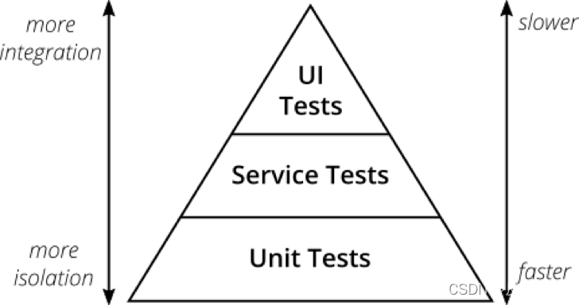
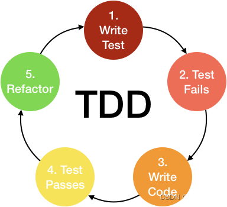

# 前端测试基础

> 原文出处：https://blog.csdn.net/qq_35812380/article/details/124662947

## 前端测试基础

### 一 代码测试

* 1. 手工测试
* 2. 自动化测试

探索自动化测试…

### 二 自动化测试基础

#### 2.1 单元测试

> 验证独立单元

独立的测试,无法保证多个单元一起是否正确

常用框架:

**Jest(推荐使用)**, Mocha, …

#### 2.2 集成测试

> 验证多个单元协同工作

#### 2.3 端到端测试 (E2E)

> 用浏览器验证用户交互, \* 手动测试

单击“1”按钮，单击加号“+”按钮，再次单击“1”按钮，单击等号“=”，最后检查屏幕是否显示正确结果“2”。

```
function testCalculator(browser) {
  browser
  .url('http://localhost:8080')
  .click('#button-1')
  .click('#button-plus')
  .click('#button-1')
  .click('#button-equal')
  .assert.containsText('#result'，'2')
  .end()
}
```

编写完一个端到端测试后，可以根据自己的需求随时运行它。想象一下，相比执行数百次同样的手动测试，这样一套测试代码可以节省多少时间！

优点：

* 真实的测试环境，更容易获得程序的信心

缺点：

* \*\*首先，端到端测试运行不够快。\*\*启动浏览器需要占用几秒钟，网站响应速度又慢。通常一套端到端测试需要 30 分钟的运行时间。如果应用程序完全依赖于端到端测试，那么测试套件将需要数小时的运行时间。
* \*\*端到端测试的另一个问题是调试起来比较困难。\*\*要调试端到端测试，需要打开浏览器并逐步完成用户操作以重现 bug。本地运行这个调试过程就已经够糟糕了，如果测试是在持续集成服务器上失败而不是本地计算机上失败，那么整个调试过程会变得更加糟糕。

一些流行的端到端测试框架：

* [Cypress](https://github.com/cypress-io/cypress) - 目前用的最多

  …

#### 2.4 快照测试

> 验证Ui变化,保证ui的稳定性

> `__snapshots__`

快照测试文件结构

```
----test
	|-------__snapshots__
	|-------xxxx.xx.js.snap
```

#### 2.5 测试金字塔



静态测试(ESLint, flow, ts) — 单元测试(Jest) > 集成测试 (Mock 网络, Jest, vuetest,reacttest)> UI测试

##### 个人建议

* 如果是开发纯函数库，建议写更多的单元测试 + 少量的集成测试
* 如果是开发组件库，建议写更多的单元测试、为每个组件编写快照测试、写少量的集成测试 + 端到端测试
* 如果是开发业务系统，建议参考奖杯模型，写更多的集成测试、为工具类库、算法写单元测试、写少量的端到端测试

#### 2.6 测试覆盖率

> 适可而止,够用即可

* **test coverage**

如何度量?

* 代码覆盖率------白盒测试,单元测试
* 需求覆盖率------黑盒测试,主要是功能测试,**人工计算**

经常做更改的活动页面我认为没必要必须趋近 100%，因为要不断的更改测试用例，维护成本太高。

大多数情况下，将 100% 代码覆盖率作为目标并没有意义。当然，如果你在开发一个**极其重要的支付**应用，存在的 Bug 可能会导致数百万美元的损失，那么 100% 代码覆盖率对你是有用的。

我认为测试覆盖率还是要和测试成本结合起来，**比如一个不会经常变的公共方法就尽可能的将测试覆盖率做到趋于 100%。**而对于一个完整项目，我建议前期先做**最短的时间覆盖 80% 的测试用例**，后期再慢慢完善。

### 三 测试开发方式

两个流派

TDD:测试驱动开发, 先写测试后实现功能

BDD:行为驱动开发, 先实现功能后测试

#### 3.1 TDD

结合功能开发

#### TDD 开发流程



1. 编写测试用例
2. 运行测试（失败）
3. 编写代码使测试通过
4. 重构/优化代码
5. 新增功能，重复上述步骤

#### TDD 的原则

> 各种边界条件, 需求场景逻辑

**独立测试**：不同代码的测试应该相互独立，一个类对应一个测试类（对于C代码或C++全局函数，则一个文件对应一个测试文件），一个函数对应一个测试函数。用例也应各自独立，每个用例不能使用其他用例的结果数据，结果也不能依赖于用例执行顺序。 一个角色：开发过程包含多种工作，如：编写测试代码、编写产品代码、代码重构等。做不同的工作时，应专注于当前的角色，不要过多考虑其他方面的细节。

**测试列表**：代码的功能点可能很多，并且需求可能是陆续出现的，任何阶段想添加功能时，应把相关功能点加到测试列表中，然后才能继续手头工作，避免疏漏。

**测试驱动**：即利用测试来驱动开发，是TDD的核心。要实现某个功能，要编写某个类或某个函数，应首先编写测试代码，明确这个类、这个函数如何使用，如何测试，然后在对其进行设计、编码。

**先写断言**：编写测试代码时，应该首先编写判断代码功能的断言语句，然后编写必要的辅助语句。

**可测试性**：产品代码设计、开发时的应尽可能提高可测试性。每个代码单元的功能应该比较单纯，“各家自扫门前雪”，每个类、每个函数应该只做它该做的事，不要弄成大杂烩。尤其是增加新功能时，不要为了图一时之便，随便在原有代码中添加功能，对于C++编程，应多考虑使用子类、继承、重载等方法。

**及时重构**：对结构不合理，重复等“味道”不好的代码，在测试通过后，应及时进行重构。

**小步前进**：软件开发是复杂性非常高的工作，小步前进是降低复杂性的好办法。

#### TDD 的优点

* 保证代码质量，因为先编写测试，所以可能出现的问题都被提前发现了；
* 促进开发人员思考，有利于程序的模块设计；
* 测试覆盖率高，因为后编写代码，因此测试用例基本都能照顾到；

#### TDD 的缺点

* 代码量增多，大多数情况下测试代码是功能代码的两倍甚至更多；
* 业务耦合度高，测试用例中使用了业务中一些模拟的数据，当业务代码变更的时候，要去重新组织测试用例；
* 关注点过于独立，由于单元测试只关注这一个单元的健康状况，无法保证多个单元组成的整体是否正常；

在前端应用实际开发过程中 TDD 更适合开发纯函数库、比如 Lodash、Vue、React 等。

#### 3.2 BDD

> * 测试场景的覆盖
> * 先实现功能后测试

面向行为功能,从产品角度出发

##### BDD 的开发流程

开发人员和非开发人员一起讨论确认需求，

探索、发现并商定预期要做的事情的细节。

#### 个人推荐

建议开发功能函数库使用 **TDD 方案**；
 建议开发业务系统使用 **BDD 方案**；

### 前端自动化测试的权衡利弊

当我们开始编写自动化测试时，可能想要测试所有的东西。因为不想再体验未经测试的应用程序带来的痛苦。但是我们又都知道**测试会减缓开发速度**。

在编写测试时，请务必牢记编写测试的目的。通常，**测试的目的是为了节省时间**。**如果你正在进行的项目是稳定的并且会长期开发，那么测试是可以带来收益的。**

但是**如果测试编写与维护的时间长于它们可以节省的时间，那么你根本不应该编写测试**。当然，在编写代码之前你很难知道通过测试可以节省多少时间，你会随着时间的推移去了解。但是，假设你正**在一个短期项目中创建原型，或者是在一个创业公司迭代一个想法，那你可能不会从编写测试中获得收益。**

凡事都有两面性，软件测试也不是银弹，好处虽然明显，却并不是所有的项目都值得引入测试框架，毕竟维护测试用例也是需要成本的。对于一些需求频繁变更、复用性较低的内容，**比如活动页面，让开发专门抽出人力来写测试用例确实得不偿失。**

而适合引入测试场景大概有这么几个：

**需要长期维护的项目**。它们需要测试来保障代码可维护性、功能的稳定性

**较为稳定的项目、或项目中较为稳定的部分**。给它们写测试用例，维护成本低

被多次复用的部分，**比如一些通用组件和库函数。因为多处复用，更要保障质量**

测试确实会带给你相当多的好处，但不是立刻体验出来。正如买重疾保险，交了很多保费，没病没痛，十几年甚至几十年都用不上，最好就是一辈子用不上理赔，身体健康最重要。测试也一样，写了可以买个放心，对代码的一种保障，有 bug 尽快测出来，没 bug 就最好，但不能说“写那么多测试，结果测不出 bug，浪费时间”吧。
