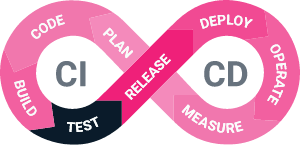
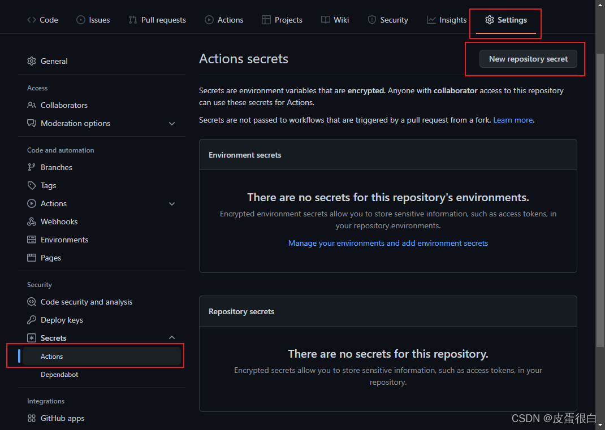
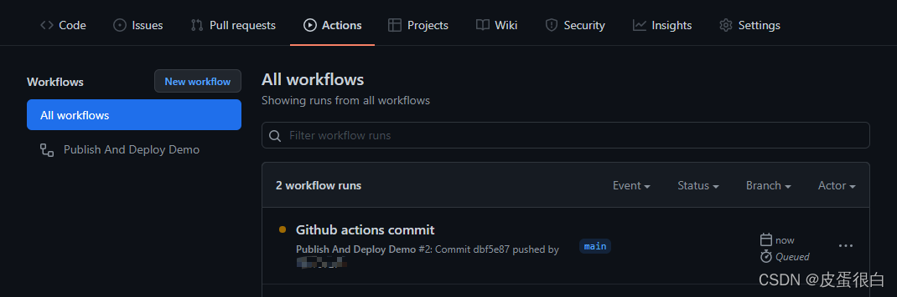
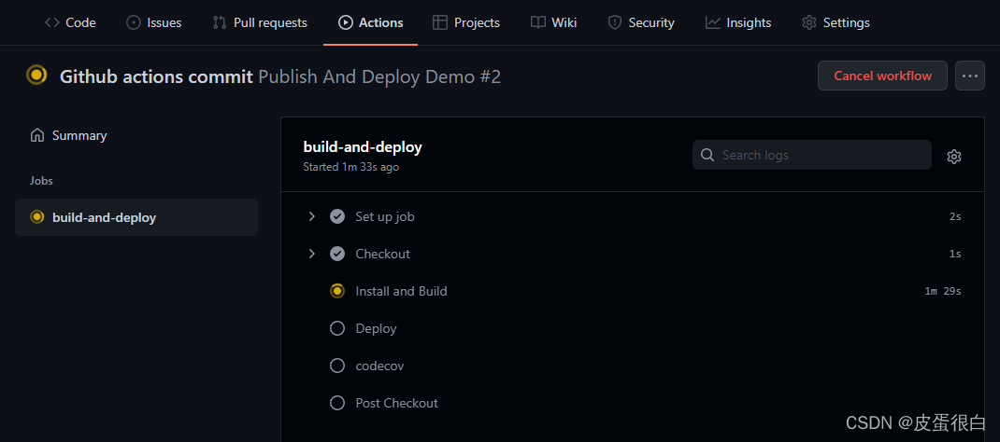
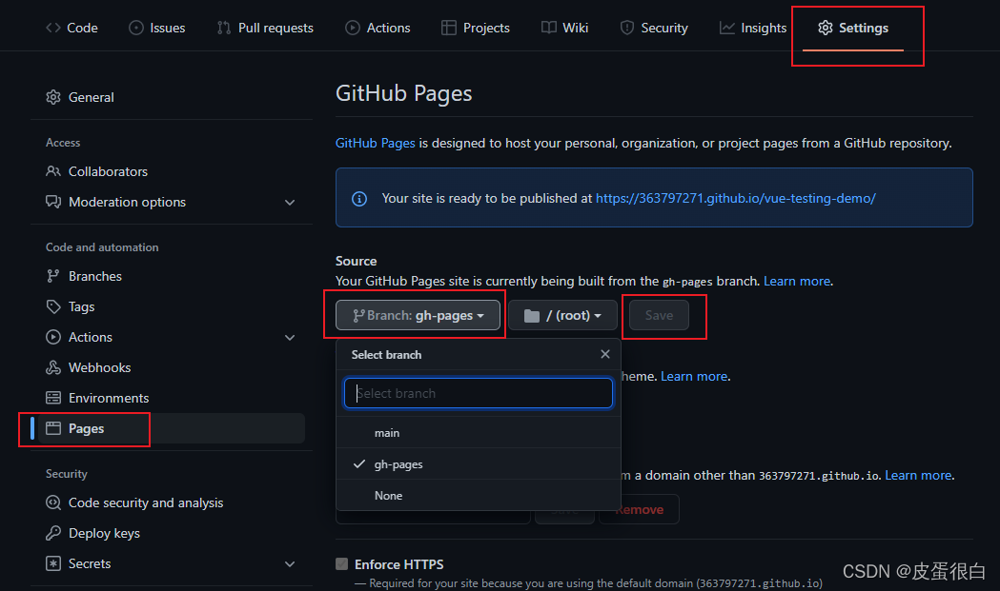
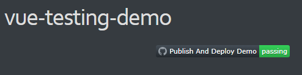

# 自动化测试和持续集成

> 原文出处：https://blog.csdn.net/qq_35812380/article/details/124685342

## 自动化测试和持续集成

如果每次修改代码之后，都手动进行单元测试，不仅加重工作量，而且容易出错，因此我们需要进行自动化测试，这就用到了持续集成。



持续集成是一种软件开发实践，每次集成都通过自动化的构建（包括编译，发布，测试等）来验证，从而尽早地发现代码中的错误。

此外项目如果接入持续集成在多人开发同一个仓库时候能起到很大的用途，比如每次 push 都能自动触发测试，测试没过会发生告警。或者如果需求采用 Issues + Merge Request 来管理，每个需求一个 Issue + 一个分支，开发完成后提交 Merge Request，由项目 Owner 负责合并，项目质量将更有保障。

### 配置 GitHub Actions

可供选择的持续集成工具有 Gitlab CI、 [Travis CI](https://travis-ci.org/) 、 [Circle CI](https://circleci.com/)、GitHub Actions 等。这里以 GitHub Actions 为例。

项目根目录新建目录和文件 `.github/workflows/main.yml`：

```
name: Publish And Deploy Demo

on:
  push:
    branches:
      - master
jobs:
  build-and-deploy:
    runs-on: ubuntu-latest
    steps:
      - name: Checkout
        uses: actions/checkout@master
      - name: Install and Build # 安装依赖 & 运行测试并生成覆盖率报告 & 项目打包
        run: |
          npm install
          npm run coverage
          npm run build
      - name: Deploy # 发布到 GitHub Pages
        uses: JamesIves/github-pages-deploy-action@4.1.0
        with:
          branch: gh-pages # The branch the action should deploy to.
          folder: dist # The folder the action should deploy.
      - name: codecov # 上传测试覆盖率报告到 codecov
        uses: codecov/codecov-action@v1
        with:
          token: ${{ secrets.CODECOV_TOKEN }}
```

如果测试失败，自动构建就会中断，不会部署 Github Pages 和上传覆盖率报告。

### Github 添加存储 codecov Token 的环境变量



### 修改打包路径

Github Pages 访问地址默认会带二级域名（仓库名），例如`http://xxx.github.io/vue-testing-demo/`，需要修改打包路径：

```
// vue.config.js
const { defineConfig } = require('@vue/cli-service')
module.exports = defineConfig({
  transpileDependencies: true,
  // 添加
  publicPath: '/vue-testing-demo'
})
```

### 提交代码

push 代码，触发 action





运行成功后，可以访问 Codecov 查看覆盖率报告。

### 指定托管 Github Pages 的分支



最后，将所有修改提交到远程仓库的 gh-pages 分支上，就可以看到 GitHub Actions 正在自动构建。

// 或者将对应部署分支改为master分支,那么就使用master分支进行修改,
 网站修改为master 进行部署

### 展示 GitHub Actions 徽章

当 CI 构建完成之后，我们可以通过访问 Travis CI 和 Codecov 的网站查看到详细结果，当然也可以将结果以徽章的形式放入 README，这样更清晰明了。

[GitHub Actions 的徽章](https://docs.github.com/cn/actions/managing-workflow-runs/adding-a-workflow-status-badge)这样获取：

```
https://github.com/<OWNER>/<REPOSITORY>/workflows/<WORKFLOW_NAME>/badge.svg
```

注意：如果您的工作流程使用 name 关键词，则必须按名称引用工作流程。 如果工作流程名称包含空格，您需要将空格替换为 URL 编码字符串 `%20`。 有关 name 关键词的更多信息，请参阅“GitHub Actions 的工作流程语法”。

或者，如果工作流程没有 name，则必须使用相对于仓库根目录的文件路径引用工作流程文件。

```
https://github.com/<OWNER>/<REPOSITORY>/workflows/<WORKFLOW_FILE_PATH>/badge.svg
```

每当 CI 构建完成，结果就会以徽章的形式，展示在你的项目文档中。



## 总结:

gitlabci:
 https://docs.github.com/cn/actions/creating-actions/about-custom-actions

这里所有的一切,
 都是为了构建完整的测试发布流程, ci/cd

从此前端可以发布静态网站, 万物互联.

构建完整测开流程,

至于测试, 和徽章,知识个玩具而已, 这里重要的是学会gitpage CI/ Travis CI, 掌握一门CI发布的工具
