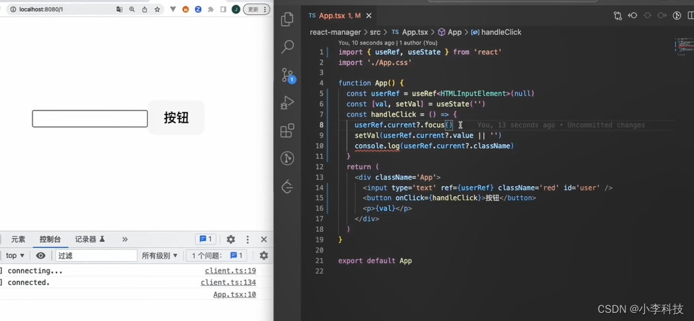

# useRef



#### useRef 用法

```js
import { useRef, useState } from 'react'
import './App.css'

function App() {
  const userRef = useRef<HTMLInputElement>(null)
  const [val, setVal] = useState('')
  const handleClick = () => {
    userRef.current?.focus()
    setVal(userRef.current?.value || '')
  }
  return (
    <div className='App'>
      <input type='text' ref={userRef} />
      <button onClick={handleClick}>按钮</button>
      <p>{val}</p>
    </div>
  )
}

export default App

```


