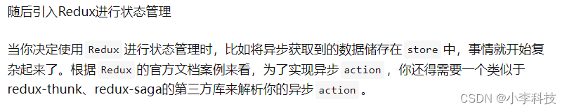
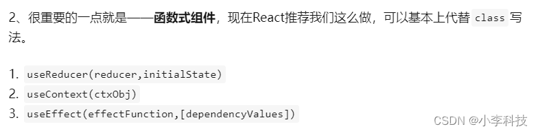

# react useReducer使用与常见问题
## useReducer函数
    1. useState的替代方案.接收一个(state, action)=>newState的reducer,
    并返回当前的state以及与其配套的dispatch方法

    2. 在某些场景下,useReducer会比useState更加适用,例如state逻辑较为复杂,
    且**包含多个子值**,或者下一个state依赖于之前的state等

`清楚useReducer场景? `
`与useState区别? `
`不足之处,只能处理同步 `
`如何实现异步,提供了两个案例?`

### 1. 用useState做登录
>  一组响应式数据有关联关系,可以做成一个整体,使用useReducer将其作为一个整体实现
```html
<body>
  <div id="app"></div>
  <script type="text/babel">
    let app = document.querySelector('#app');
    let root = ReactDOM.createRoot(app);
    let { useState } = React;

    // 用useState做登录
    // >  一组响应式数据有关联关系,可以做成一个整体,使用useReducer将其作为一个整体实现
    let Welcome = (props) => {  
      const [ isLogin, setLogin ] = useState(true);
      const [ isLogout, setLogout ] = useState(false);
      const handleLogin= () => {
        setLogin(true);
        setLogout(false);
      }

      const handleLogout= () => {
        setLogout(true);
        setLogin(false);
      }
      return (
        <div>
         {
          isLogin?
          <button onClick={handleLogout}>登出</button>:
          <button onClick={handleLogin}>登录</button>
         }
        </div>
      );
    }
    
    let element = (
      <Welcome />
    );
    root.render(element);
  </script>
</body>

```

### 2. 改为useReducer
```html
<body>
  <div id="app"></div>
  <script type="text/babel">
    /* 
    useReducer改写
    */

    let app = document.querySelector('#app');
    let root = ReactDOM.createRoot(app);
    let { useReducer } = React;


    let loginState = {
      isLogin: true,
      isLogout: false
    }

    // 不足: 处理同步action
    let loginReducer = (state, action) => {
      switch (action.type) {
        case 'login':
          return { isLogin: true, isLogout: false }
        case 'logout':
          return { isLogin: false, isLogout: true }
        default:
          throw new Error()
      }
    }
    // 用useReducer做登录
    // > 根据类型,决定不同的state处理变化
    let Welcome = (props) => {
      const [state, loginDispatch] = useReducer(loginReducer, loginState);
      const handleLogin = () => {
        loginDispatch({ type: 'login' })
      }

      const handleLogout = () => {
        loginDispatch({ type: 'logout' })
        // loginDispatch({ type: 'logout' ,payload:''})
      }
      return (
        <div>
          {
            state.isLogin ?
              <button onClick={handleLogout}>登出</button> :
              <button onClick={handleLogin}>登录</button>
          }
        </div>
      );
    }

    let element = (
      <Welcome />
    );
    root.render(element);
  </script>
</body>
```

## 不足
useReduer只处理同步请求,对异步请求如何处理?
[https://zhuanlan.zhihu.com/p/114367502](https://zhuanlan.zhihu.com/p/114367502)




### 3.1 异步封装
```js
组件页面
const init = { dataList:[] };//初始化dataState
 
const [state,dispatch] = useReducer(reducer,init);
 
useEffect(() => {
    //发送网络请求
    axios.get("/user?ID=123").then(res => {
        dispatch({
            type:ACTION_TYPE.GETDATA,
            payload:res.data //后端返回的数据
        })
    })
},[]);
 
//使用 state.dataList 渲染页面
```

```js
在reducer页面

function reducer(state,action){
    switch(action.type){
        case "getData":
            return { //根据需求对数据做出操作，这里将返回的数据与初始化的数据合并
                ...state,
                dataList:action.payload 
            };
}    
 
export default reducer;
```
### 3.2 异步封装
> 初始化直接执行获取数据
```js
import React, { useEffect, useState, useReducer } from "react";
import ReactDom from "react-dom";
import $ from "jquery";

const useProduct = () => {
  const [data, dispatch] = useReducer((state, action) => {
    switch (action.type) {
      case "a":
        return action.value;
      default:
        return [];
    }
  }, []);

  useEffect(() => {
    $.ajax({
      url: "http://suggest.taobao.com/sug?code=utf-8&q=袜子",
      dataType: "jsonp",
      jsonp: "callback",
      success: (data) => {
        dispatch({
          type: 'a',
          value: data.result
        });
      },
      error: data => dispatch({type: 'error', msg: data})
    });
  }, []);

  return data;
};

const Index = () => {
  const data = useProduct();

  return <>{data.length}</>;
};

ReactDom.render(<Index />, document.getElementById("root"));
```

官网:
[1. https://zh-hans.legacy.reactjs.org/docs/hooks-reference.html#usereducer](https://zh-hans.legacy.reactjs.org/docs/hooks-reference.html#usereducer)