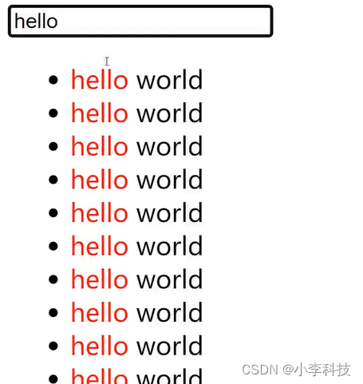
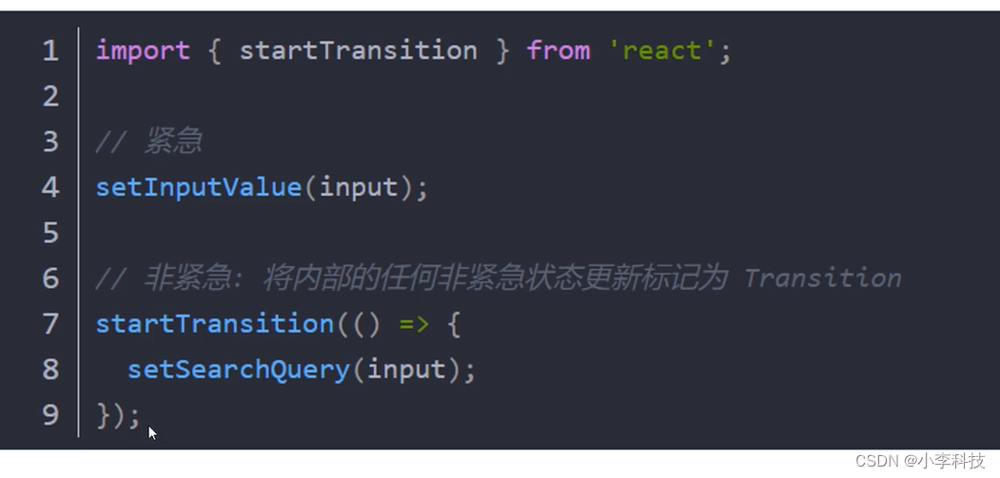

 # react18并发模式与startTransition(搜索高亮思路)
 - React 18 之前,渲染是一个单一的,不间断的,同步的事务,一旦渲染开始,就不能被中断
 
 - React 18引入并发模式,它允许你将标记更新作为一个transitions,这会告诉React他们可以被中断执行.这样可以将紧急任务先更新,不紧急任务后更新.
`将任务给紧急任务先执行,  优先级低的任务后执行`


```html
 <body>
    <div id="app"></div>
    <script type="text/babel">
      let app = document.querySelector('#app');
      let root = ReactDOM.createRoot(app);
      let { memo, useState, startTransition } = React;

      let List = memo(({query})=>{
        const text = 'hello world'
        const items = []
        // 匹配输入的选项并且高亮
        if( query !== '' && text.includes(query) ){
          const arr = text.split(query);
          for(let i=0;i<10000;i++){
            items.push(<li key={i}>{arr[0]}<span style={{color:'red'}}>{query}</span>{arr[1]}</li>)
          }
        }
        else{
          for(let i=0;i<10000;i++){
            items.push(<li key={i}>{text}</li>);
          }
        }

        return (
          <ul>
            { items }
          </ul>
        )
      })

      let Welcome = memo(()=>{
        const [ searchWord, setSearchWord ] = useState('');
        const [ query, setQuery ] = useState('');
        const handleChange = (ev) => {
          setSearchWord(ev.target.value)  //第一个任务

          // 添加延时过渡
          startTransition(()=>{
            setQuery(ev.target.value)   //第二个任务(不紧急的任务)
          })
        }
        return (
          <div>
            <input type="text" value={searchWord} onChange={handleChange} />
            <List query={query} />
          </div>
        )
      })

      let Element = (
        <Welcome />
      );
      
      root.render(Element)
    </script>
  </body>
```


