# Chrome-MCP配置教程

## 概述

Chrome MCP Server 是一个基于Chrome扩展的Model Context Protocol (MCP)服务器，它将您的Chrome浏览器功能暴露给AI助手（如Claude），实现复杂的浏览器自动化、内容分析和语义搜索。

与传统的浏览器自动化工具（如Playwright）不同，Chrome MCP Server 直接使用您日常的Chrome浏览器，利用现有的用户习惯、配置和登录状态，让各种大模型或聊天机器人能够控制您的浏览器，真正成为您的日常助手。


## 环境要求

- Node.js >= 18.19.0
- Chrome/Chromium浏览器
- pnpm或npm包管理器

## 安装步骤

### 1. 下载Chrome扩展

1. 访问GitHub发布页面：https://github.com/hangwin/mcp-chrome/releases
2. 下载最新的Chrome扩展文件（zip格式，无需解压）

### 2. 安装mcp-chrome-bridge

#### 使用npm安装：
```bash
npm install -g mcp-chrome-bridge
```

#### 使用pnpm安装：
```bash
# 方法1：启用全局脚本（推荐）
pnpm config set enable-pre-post-scripts true
pnpm install -g mcp-chrome-bridge

# 方法2：手动注册（如果postinstall未运行）
pnpm install -g mcp-chrome-bridge
mcp-chrome-bridge register
```


### 3. 加载Chrome扩展

1. 打开Chrome浏览器，访问 `chrome://extensions/`
2. 启用"开发者模式"
3. 点击"加载已解压的扩展程序"
4. 选择您下载的扩展文件夹
5. 点击扩展图标打开插件，然后点击"连接"查看MCP配置

## 配置MCP客户端

### 使用CherryStudio连接

将以下配置添加到您的MCP客户端配置中（以CherryStudio为例）：

```json
{
  "mcpServers": {
    "streamable-mcp-server": {
      "type": "streamable-http",
      "url": "http://127.0.0.1:12306/mcp"
    }
  }
}
```
`https://github.com/hangwin/mcp-chrome/releases`

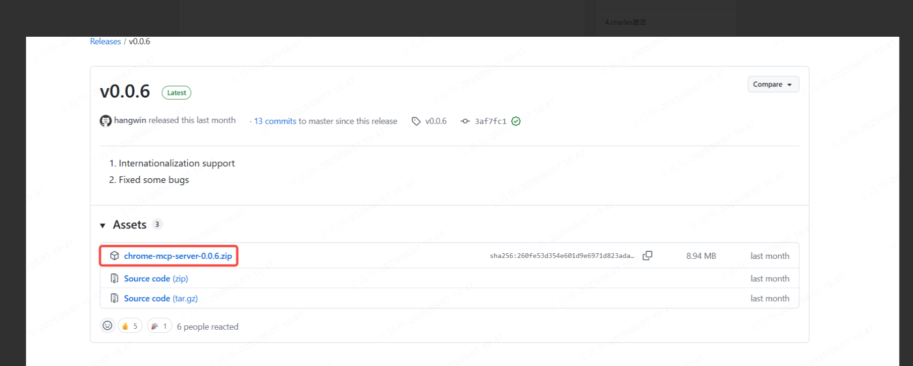 
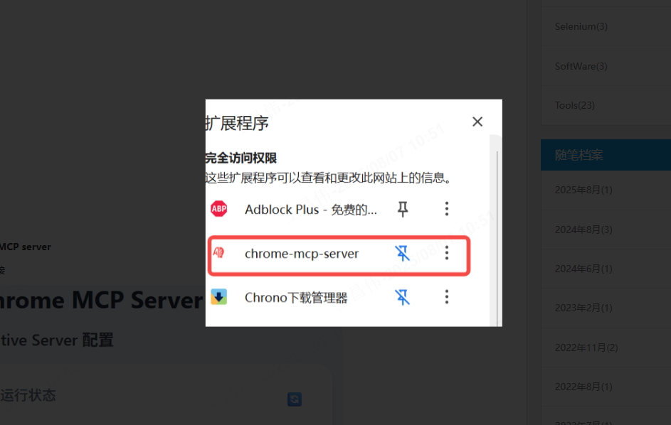
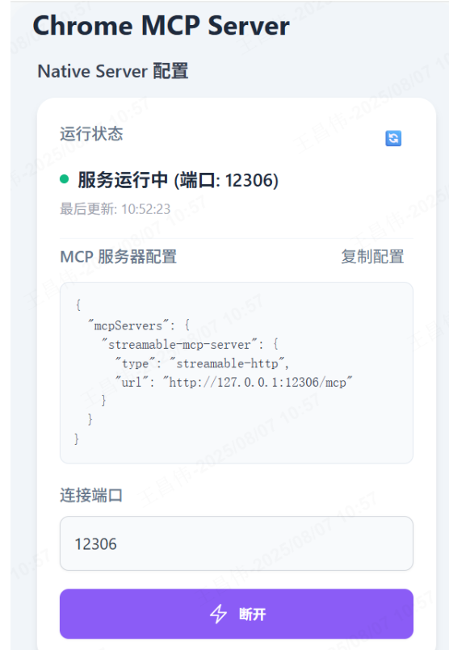 
 
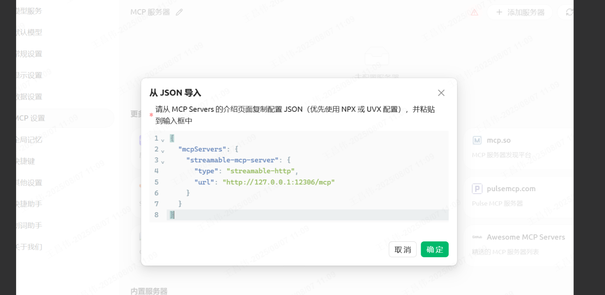 
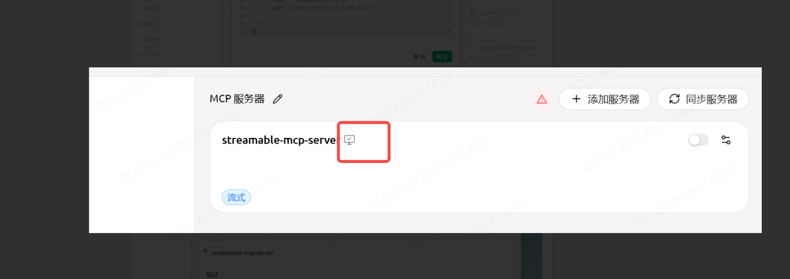 
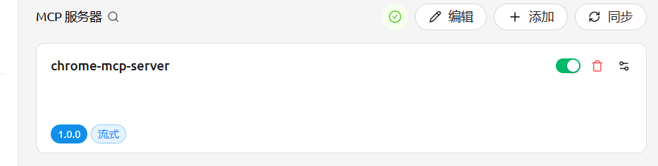
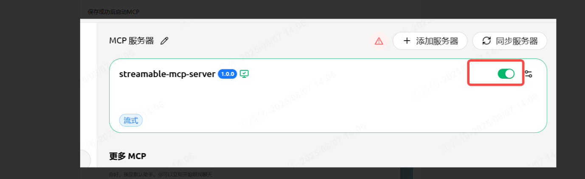 
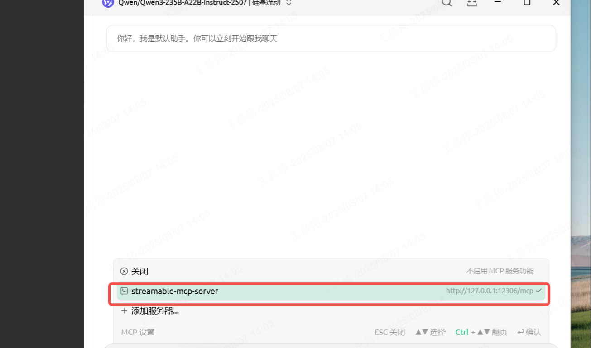 
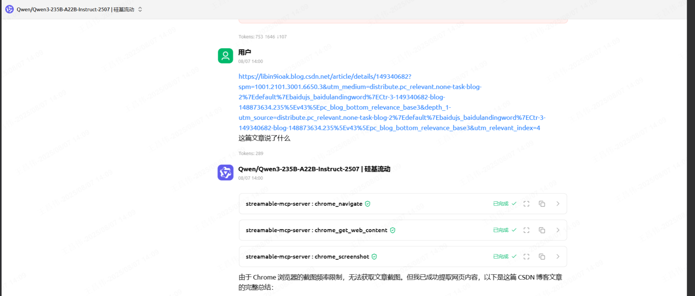


### 使用Trae连接（👍🏻 推荐）
复制这个
```json
{
  "mcpServers": {
    "streamable-mcp-server": {
      "type": "streamable-http",
      "url": "http://127.0.0.1:12306/mcp"
    }
  }
}
```


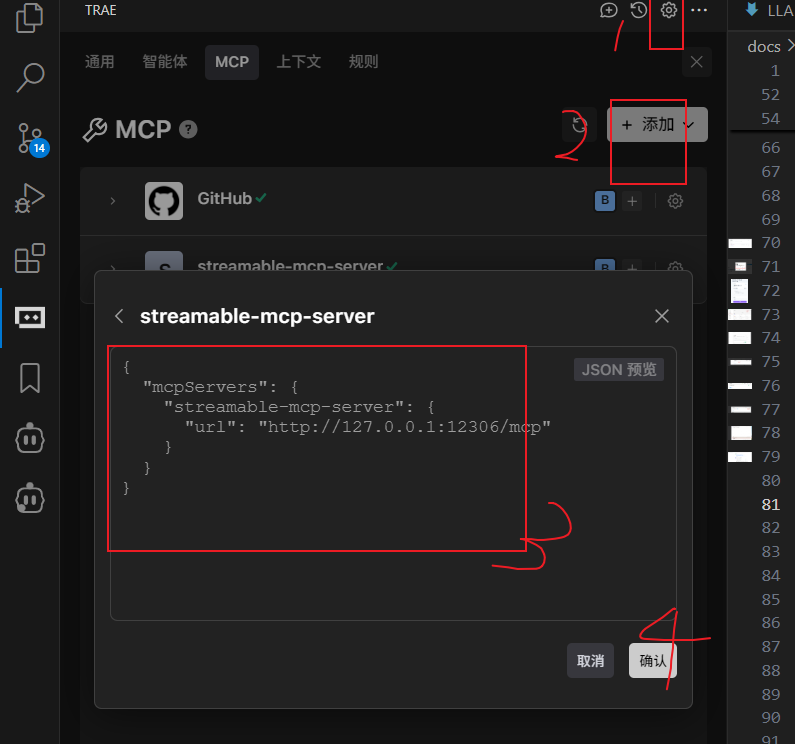

`切换到mcp builder`
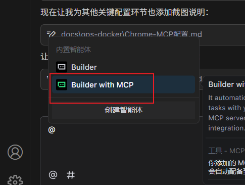 

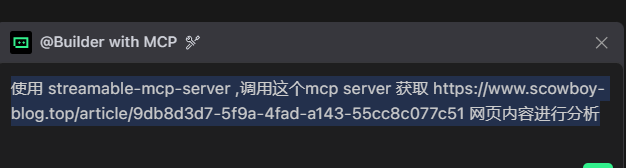

```
使用 streamable-mcp-server ,调用这个mcp server 获取 https://www.scowboy-blog.top/article/9db8d3d7-5f9a-4fad-a143-55cc8c077c51 网页内容进行分析
```

`查看分析的结果`
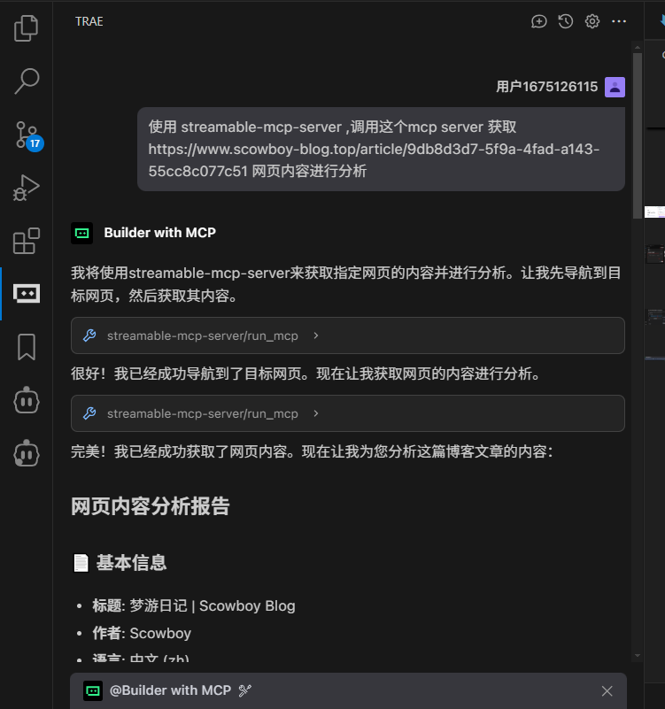


### 🔍 内容分析（4个工具）
- `search_tabs_content` - AI驱动的跨浏览器标签页语义搜索
- `chrome_get_web_content` - 从页面提取HTML/文本内容
- `chrome_get_interactive_elements` - 查找可点击元素
- `chrome_console` - 捕获和检索浏览器标签页的控制台输出


## 使用示例

### 示例1：AI帮助您总结网页内容并自动控制Excalidraw绘图

**提示**：帮助我总结当前页面内容，然后绘制图表帮助我理解。

### 示例2：分析图像内容后自动复制图像

**提示**：首先分析图像内容，然后结合分析结果和图像内容复制图像。

### 示例3：AI自动注入脚本并修改网页样式

**提示**：帮助我修改当前页面的样式并移除广告。

### 示例4：AI自动捕获网络请求

**查询**：我想知道小红书的搜索API是什么，响应结构是什么样的。

### 示例5：AI帮助分析浏览历史

**查询**：分析我过去一个月的浏览历史。

### 示例6：网页对话

**查询**：翻译并总结当前网页。

### 示例7：AI自动截图

**查询**：截取Hugging Face首页的截图。

### 示例8：AI帮助管理书签

**查询**：将当前页面添加到书签并放入适当的文件夹。

### 示例9：自动关闭网页

**查询**：关闭所有与shadcn相关的网页。

## 常见问题解决

### 问题1：启动MCP服务器时报错

**错误信息**：`error invoking remote method 'mcp:list-tools':Error:[mcp] error activating server streamable-mac-server:invalid server type`

**解决方案**：
原因是Cherry对导入的JSON文件解析后未正常配置成功，需要手动配置。

### 问题2：浏览器的Chrome MCP Server未启动

**解决方案**：
确保已正确安装mcp-chrome-bridge并完成注册。

### 问题3：浏览器启动后自动关闭

**解决方案**：
原因是系统设置了使用低版本的Node.js，切换回高版本即可。

## 故障排除

1. **检查Node.js版本**：确保Node.js版本 >= 18.19.0
2. **验证扩展安装**：确认Chrome扩展已正确加载
3. **检查端口占用**：确保端口12306未被其他程序占用
4. **查看日志信息**：检查浏览器控制台和MCP服务器日志

## 视频教程

1. [Chrome MCP Server 配置与使用教程 - Bilibili](https://www.bilibili.com/video/BV1Z9hTz7EX2)

---

*本教程基于以下资源编写，感谢开源社区的贡献：*

- [hangwin/mcp-chrome](https://github.com/hangwin/mcp-chrome) - Chrome MCP Server 项目
- [博客园文章](https://www.cnblogs.com/pandaly/p/19026799) - Chrome-MCP插件安装与配置
- [Bilibili视频教程](https://www.bilibili.com/video/BV1Z9hTz7EX2) - Chrome MCP Server 配置与使用教程