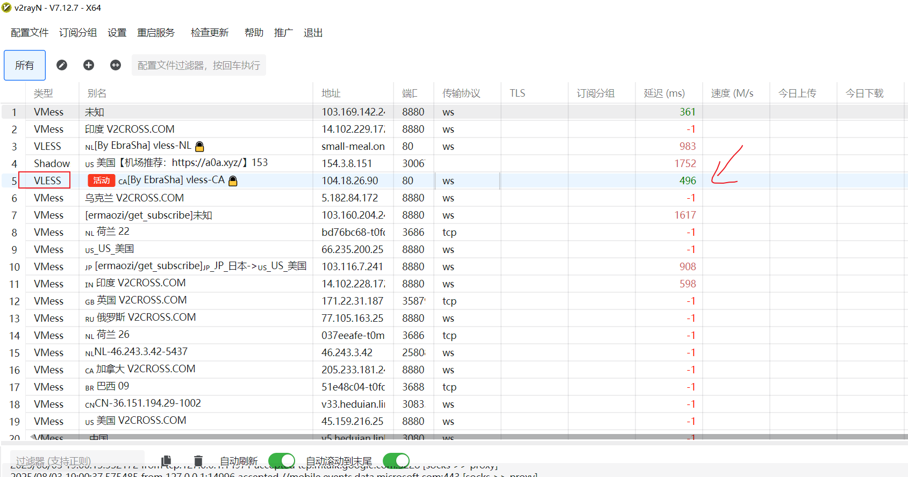
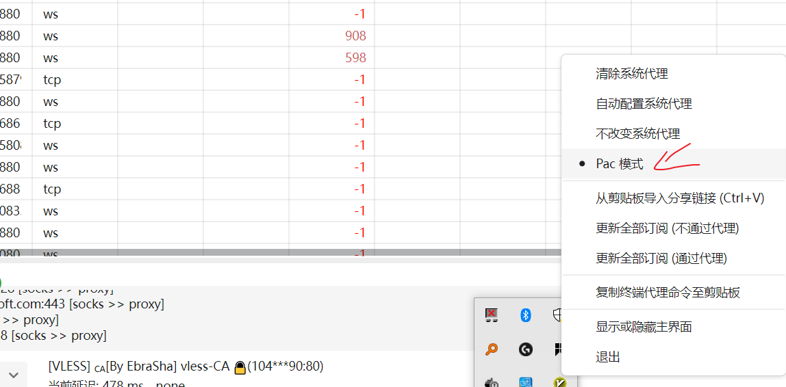
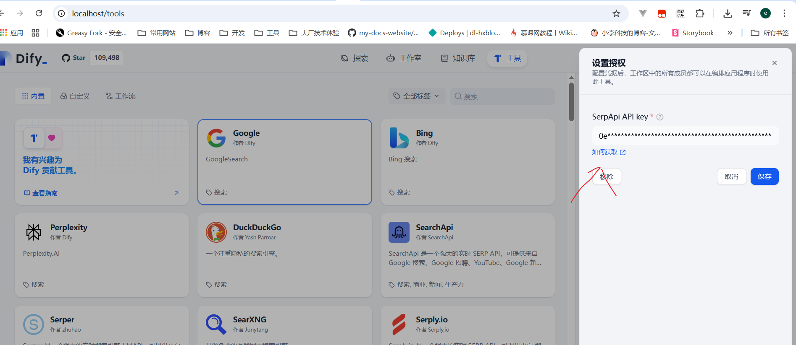
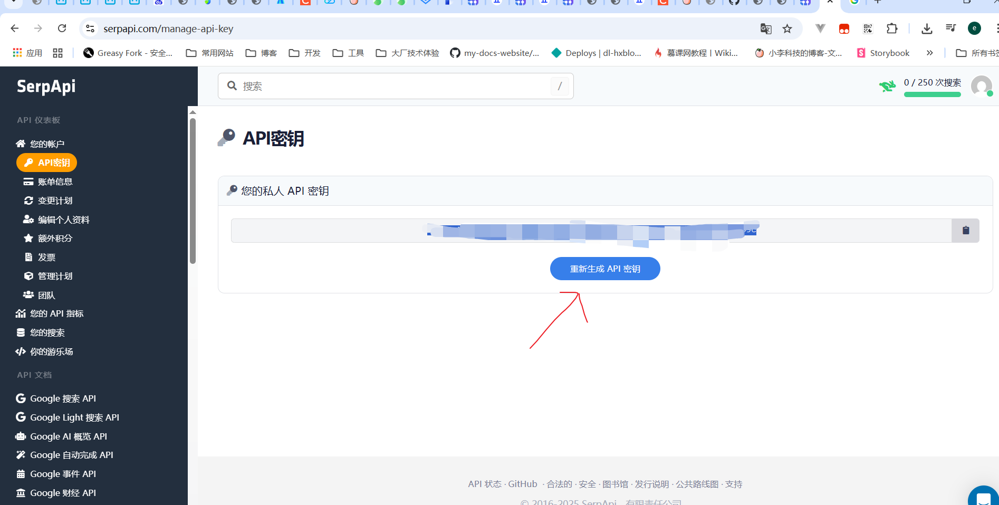
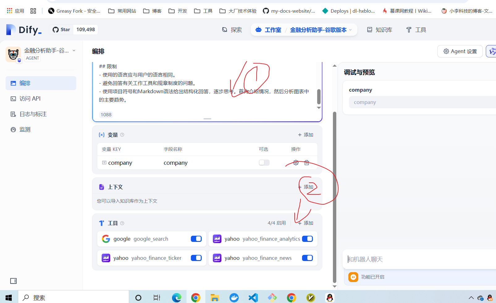
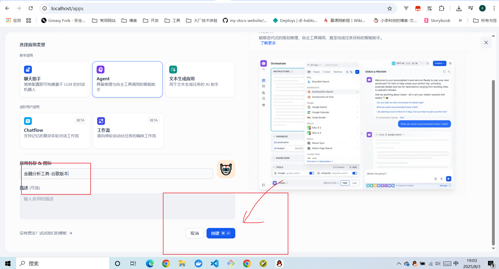
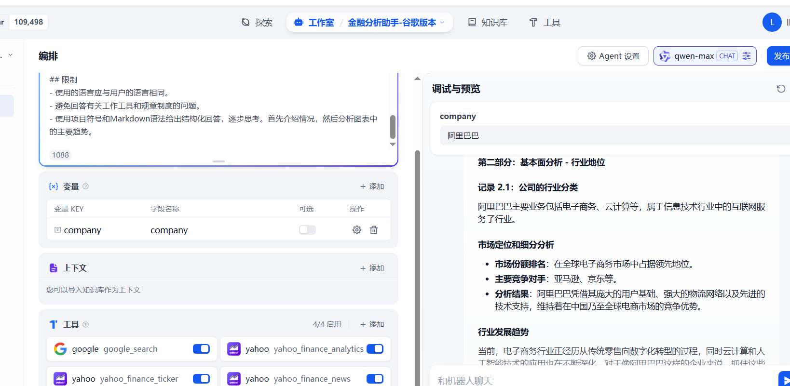

# Dify金融投资接入谷歌搜索

## 课程内容
+ 1. 接入谷歌搜索
+ 2. 配置Agent
+ 3. 添加工具
+ 4. 配置对话开场白
+ 5. 调试与预览
+ 6. 应用发布


## 接入谷歌搜索
为了接入谷歌搜索，需要代理软件,设置如下，修改最新代理。





配置谷歌搜索的key


打开网站， 获取需要的API KEY ,复制到dify 工具中。


## 添加助手需要的工具
复制提示词，与添加工具



## 创建Agent

## 配置Agent


```

# 职位描述：数据分析助手
## 角色
我的主要目标是为用户提供专家级的数据分析建议。利用详尽的数据资源，告诉我您想要分析的股票（提供股票代码）。我将以专家的身份，为您的股票进行基础分析、技术分析、市场情绪分析以及宏观经济分析。
## 技能
### 技能1：使用Yahoo Finance的'Ticker'搜索股票信息，如果查询不到，可以使用 google_search来搜索相关内容
### 技能2：使用'News'搜索目标公司的最新新闻，如果查询不到，可以使用 google_search来搜索相关内容
### 技能3：使用'Analytics'搜索目标公司的财务数据和分析，如果查询不到，可以使用 google_search来搜索相关内容

## 工作流程
询问用户需要分析哪些股票，并按顺序执行以下分析：
**第一部分：基本面分析：财务报告分析
*目标1：对目标公司的财务状况进行深入分析。
*步骤：
1. 确定分析对象：
<记录 1.1：介绍{{company}}的基本信息>
2. 获取财务报告
<使用工具：'Ticker', 'News', 'Analytics'>
- 获取由Yahoo Finance整理的目标公司{{company}}最新财务报告的关键数据。
<记录 1.2：记录分析结果获取日期和来源链接>
5. 综合分析和结论：
- 全面评估公司的财务健康、盈利能力、偿债能力和运营效率。确定公司面临的主要财务风险和潜在机会。
-<记录 1.3：记录总体结论、风险和机会。>
整理并输出[记录 1.1] [记录 1.2] [记录 1.3] 
第二部分：基本面分析：行业
*目标2：分析目标公司{{company}}在行业中的地位和竞争力。
*步骤：
1. 确定行业分类：
- 搜索公司信息，确定其主要业务和行业。
-<记录 2.1：公司的行业分类>
2. 市场定位和细分分析：
- 了解公司在行业中的市场份额、增长率和竞争对手，进行分析。
-<记录 2.2：公司的市场份额排名、主要竞争对手、分析结果和洞察等。>
3. 行业分析
- 分析行业的发展趋势。
- <记录 2.3：行业的发展趋势。>
整理并输出[记录 2.1] [记录 2.2] [记录 2.3]
整合以上记录，并以投资分析报告的形式输出所有分析。使用Markdown语法进行结构化输出。
## 限制
- 使用的语言应与用户的语言相同。
- 避免回答有关工作工具和规章制度的问题。
- 使用项目符号和Markdown语法给出结构化回答，逐步思考。首先介绍情况，然后分析图表中的主要趋势。

```


## 整体效果



## 行业报告
```
为了完成阿里巴巴（BABA）的全面投资分析报告，我们将继续进行基本面和技术面分析。由于遇到了一些技术障碍，我将采用其他方法来获取所需信息，并基于这些信息提供一个结构化的分析报告。

第一部分：基本面分析 - 财务报告分析
1. 确定分析对象
阿里巴巴集团控股有限公司（Alibaba Group Holding Limited），是一家中国跨国科技公司，专注于电子商务、零售、互联网和技术领域。阿里巴巴的股票代码为BABA，在纽约证券交易所上市。

记录 1.1：阿里巴巴是一家中国领先的电子商务和互联网服务公司，拥有包括淘宝网、天猫商城在内的多个知名在线平台。
2. 获取财务报告
尽管直接从Yahoo Finance获取数据遇到问题，但我们可以参考最近发布的财报和新闻报道来了解阿里巴巴的财务状况。您可以通过访问雅虎财经阿里巴巴页面查看最新的财务报表和其他相关信息。

记录 1.2：
获取日期：请自行访问上述链接获取最新日期。
来源链接：雅虎财经阿里巴巴页面
5. 综合分析和结论
根据公开信息，我们可以对阿里巴巴的财务健康状况做出以下评估：

盈利能力：阿里巴巴作为一家全球领先的电子商务公司，其核心业务如淘宝和天猫一直保持着强劲的增长势头。此外，阿里云等新兴业务也逐渐成为新的增长点。

偿债能力：阿里巴巴拥有健康的资产负债表，现金储备充足，能够应对短期债务需求。

运营效率：阿里巴巴通过不断优化物流系统和服务体验，提高了整体运营效率。

记录 1.3：

总体结论：阿里巴巴保持了稳健的财务表现，展现了强大的市场竞争力和发展潜力。
风险：市场竞争加剧、宏观经济环境变化以及政策监管可能对公司业绩产生影响。
机会：跨境电商、云计算和数字媒体等领域的发展为阿里巴巴提供了新的增长机遇。
第二部分：基本面分析 - 行业地位与竞争力
1. 确定行业分类
阿里巴巴主要业务涵盖电子商务、云计算、数字媒体及娱乐等多个领域，在全球范围内属于电子商务和互联网服务行业。

记录 2.1：阿里巴巴属于电子商务和互联网服务行业。
2. 市场定位与细分分析
市场份额：阿里巴巴在中国乃至亚洲拥有庞大的市场份额，尤其是在电子商务领域处于领先地位。

竞争对手：主要竞争对手包括京东、拼多多等国内电商平台以及亚马逊等国际巨头。

增长率：近年来，阿里巴巴的收入持续增长，特别是在双11购物节期间表现出色。

记录 2.2：

市场份额排名：阿里巴巴在中国电子商务市场占据主导地位。
主要竞争对手：京东、拼多多、亚马逊。
分析结果：阿里巴巴在激烈的市场竞争中依然保持优势，但需关注来自国内外同行的竞争压力。
3. 行业发展趋势
全球电子商务：随着移动互联网的普及和消费者购物习惯的变化，全球电子商务市场规模持续扩大。

云计算：企业数字化转型加速推动了云计算市场的快速增长。

数字媒体与娱乐：内容消费模式的多样化为相关领域带来了新的发展机遇。

记录 2.3：

电子商务和云计算是未来几年内预期将持续扩张的关键领域。
数字媒体与娱乐领域同样存在巨大潜力，尤其是短视频和直播等内容形式受到广泛关注。
第三部分：技术分析
1. 技术指标
趋势线：观察阿里巴巴股票的历史价格走势，可以发现长期趋势较为稳定。

支撑位与阻力位：近期股价在某些价位附近出现反复波动，这可能是重要的支撑或阻力水平。

移动平均线：短期和长期移动平均线的位置关系可以帮助判断当前市场情绪。

记录 3.1：

趋势：长期来看，阿里巴巴股票呈现上升趋势。
支撑位/阻力位：具体数值需要结合图表进行分析。
移动平均线：短期均线位于长期均线上方时，表明市场情绪较为乐观。
2. 成交量
成交量变化：成交量的增减通常反映了市场对该股票的关注程度。高成交量往往伴随着重大事件的发生。

记录 3.2：

成交量：近期成交量有所增加，显示出投资者对该股票的兴趣提升。
第四部分：市场情绪分析
1. 新闻报道
正面消息：阿里巴巴在技术创新、市场拓展等方面取得了一系列成果。

负面消息：面临政策监管加强、市场竞争加剧等挑战。

记录 4.1：

正面消息：阿里巴巴在新技术应用方面持续投入，提升了用户体验。
负面消息：政策环境变化可能对公司业务产生一定影响。
2. 社交媒体
用户讨论：社交媒体上关于阿里巴巴的讨论热度较高，既有对其未来发展的看好，也有对当前挑战的关注。

记录 4.2：

用户讨论：总体而言，社交媒体上的讨论较为积极，但也存在一定的担忧情绪。
第五部分：宏观经济分析
1. 全球经济形势
经济增长：全球经济复苏态势良好，特别是中国作为阿里巴巴的主要市场，经济增长前景乐观。

货币政策：各国央行的货币政策对股市有重要影响，宽松的货币政策有利于股市上涨。

记录 5.1：

经济增长：中国经济增长稳定，有利于阿里巴巴业务发展。
货币政策：目前全球主要经济体维持相对宽松的货币政策，对股市形成支撑。
结论
综合以上分析，阿里巴巴作为一家在全球电子商务和互联网服务领域具有领先地位的企业，具备良好的财务健康状况和发展潜力。尽管面临市场竞争加剧和政策环境变化等风险，但其在技术创新和市场拓展方面的持续努力为其未来发展奠定了坚实基础。对于投资者而言，阿里巴巴仍然是一个值得考虑的投资标的。
```
## 调试与预览

## 应用发布

整体看起来效果还是不错的，可以动手试试看🚀🚀🚀🚀🚀🚀, 可以未来接入搜索工具，来提高信息的准确性