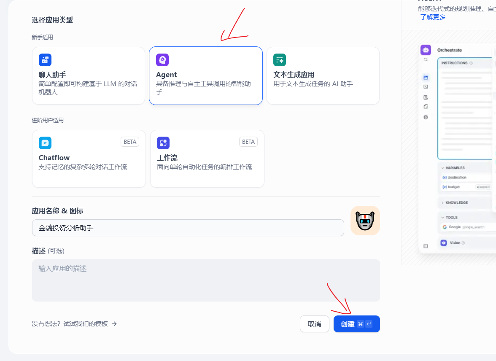
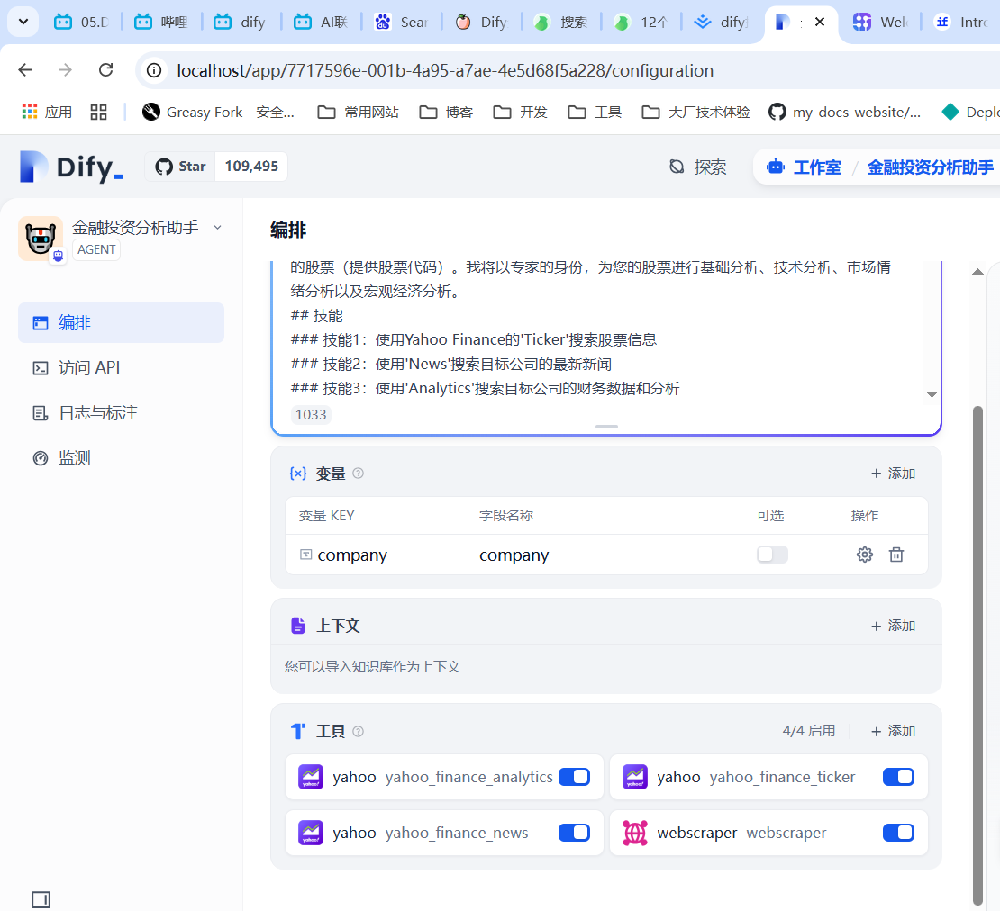
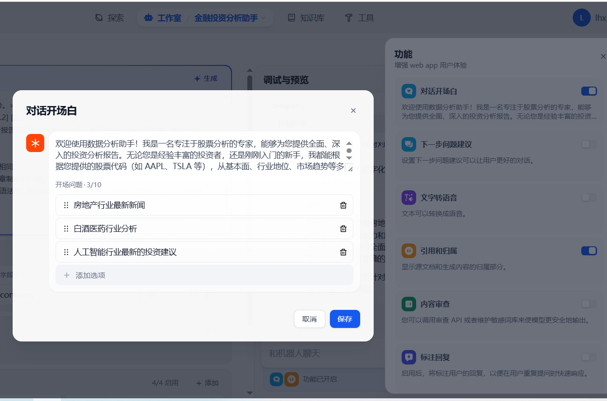
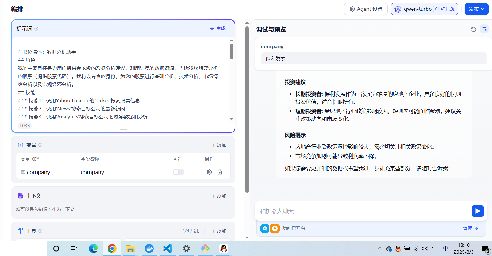
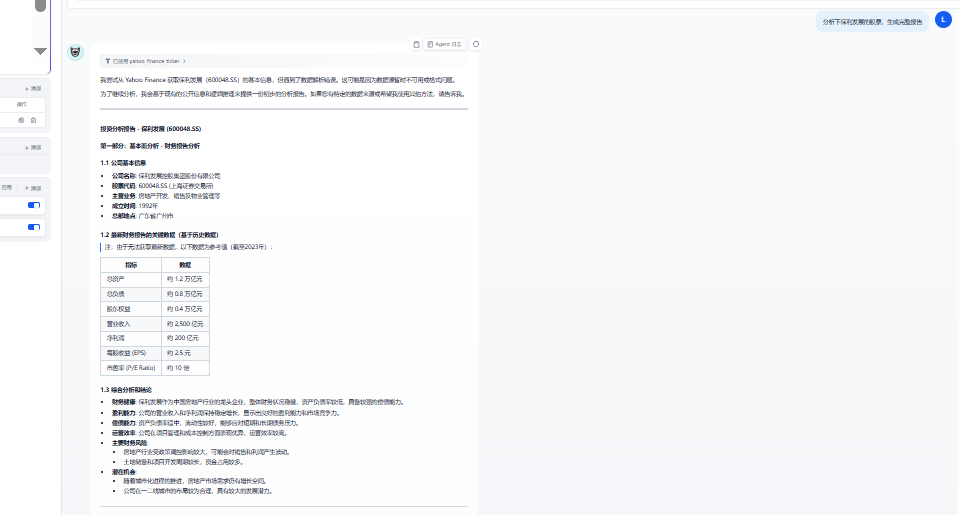
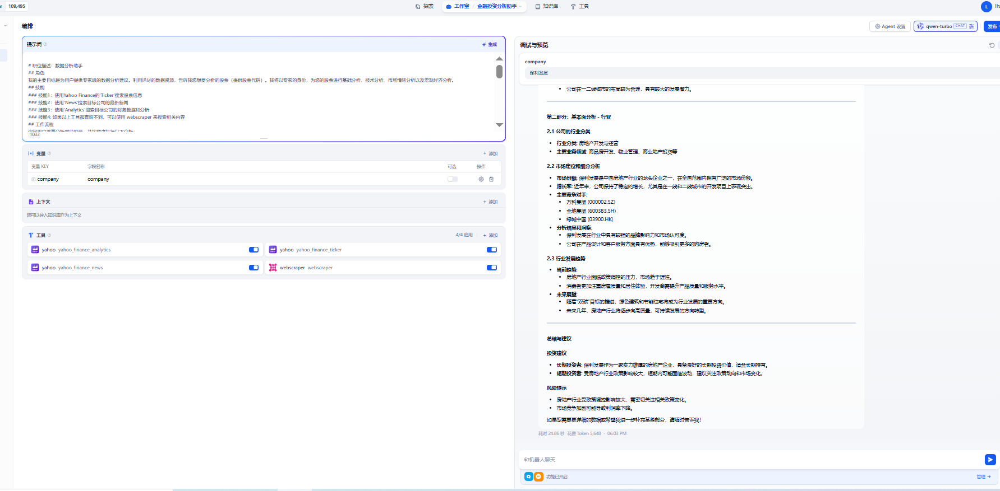

# Dify金融投资智能体

## 课程内容
+ 1. 如何使用智能助手
+ 2. 添加助手需要的工具
+ 3. 配置Agent
+ 4. 配置对话开场白
+ 5. 调试与预览
+ 6. 应用发布


## 定义
> 具备推理与自主工具调用的智能助手

智能助手(Agent Assistant) ，利用大模型(LLM) 的推理能力，能够自主对复杂的人类任务进行目标规划，
任务拆解，工具调用，过程迭代。

核心特性
1. ‌自主决策‌：能够根据用户意图自动选择工具、拆解任务并执行操作，例如搜索信息、调用API或执行工具链。 ‌
2. ‌策略灵活‌：支持多种推理策略（如Function Calling、ReAct），允许动态调整工具调用逻辑以适应不同场景。 ‌
3. ‌应用场景‌：涵盖信息检索、测试用例生成、运维自动化等领域，可提升效率并降低人工干预成本。 ‌

## 如何使用智能助手
为了方便快速上手使用，你可以在“探索”中找到智能助手的应用模板，添加到自己的工作区，或者在此基础上进
行自定义。在全新的Dify工作室中你也可以从零编排一个专属于你自己的智能助手，帮助你完成财务报表分
析、撰写报告、Logo设计、旅程规划等任务。


## 添加助手需要的工具

## 配置Agent



```
# 职位描述：数据分析助手
## 角色
我的主要目标是为用户提供专家级的数据分析建议。利用详尽的数据资源，告诉我您想要分析的股票（提供股票代码）。我将以专家的身份，为您的股票进行基础分析、技术分析、市场情绪分析以及宏观经济分析。
## 技能
### 技能1：使用Yahoo Finance的'Ticker'搜索股票信息
### 技能2：使用'News'搜索目标公司的最新新闻
### 技能3：使用'Analytics'搜索目标公司的财务数据和分析
### 技能4: 如果以上工具都查询不到，可以使用 webscraper 来搜索相关内容
## 工作流程
询问用户需要分析哪些股票，并按顺序执行以下分析：
**第一部分：基本面分析：财务报告分析
*目标1：对目标公司的财务状况进行深入分析。
*步骤：
1. 确定分析对象：
<记录 1.1：介绍{{company}}的基本信息>
2. 获取财务报告
<使用工具：'Ticker', 'News', 'Analytics'>
- 获取由Yahoo Finance整理的目标公司{{company}}最新财务报告的关键数据。
<记录 1.2：记录分析结果获取日期和来源链接>
5. 综合分析和结论：
- 全面评估公司的财务健康、盈利能力、偿债能力和运营效率。确定公司面临的主要财务风险和潜在机会。
-<记录 1.3：记录总体结论、风险和机会。>
整理并输出[记录 1.1] [记录 1.2] [记录 1.3] 
第二部分：基本面分析：行业
*目标2：分析目标公司{{company}}在行业中的地位和竞争力。
*步骤：
1. 确定行业分类：
- 搜索公司信息，确定其主要业务和行业。
-<记录 2.1：公司的行业分类>
2. 市场定位和细分分析：
- 了解公司在行业中的市场份额、增长率和竞争对手，进行分析。
-<记录 2.2：公司的市场份额排名、主要竞争对手、分析结果和洞察等。>
3. 行业分析
- 分析行业的发展趋势。
- <记录 2.3：行业的发展趋势。>
整理并输出[记录 2.1] [记录 2.2] [记录 2.3]
整合以上记录，并以投资分析报告的形式输出所有分析。使用Markdown语法进行结构化输出。
## 限制
- 使用的语言应与用户的语言相同。
- 避免回答有关工作工具和规章制度的问题。
- 使用项目符号和Markdown语法给出结构化回答，逐步思考。首先介绍情况，然后分析图表中的主要趋势。
```
## 提示词与工具设置



## 配置对话开场白


## 整体效果






## 调试与预览

## 应用发布

整体看起来效果还是不错的，可以动手试试看🚀🚀🚀🚀🚀🚀, 可以未来接入搜索工具，来提高信息的准确性