# 系统学习Docker践行DevOps理念

[TOC]

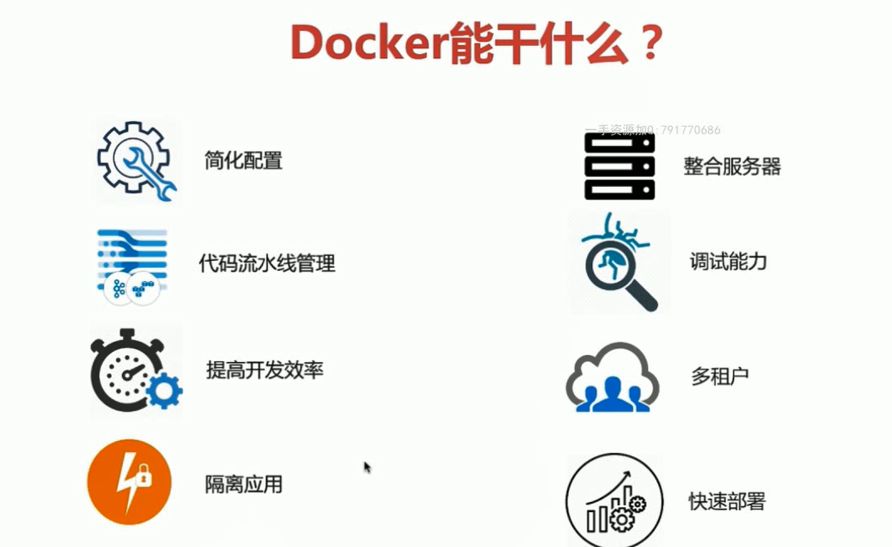

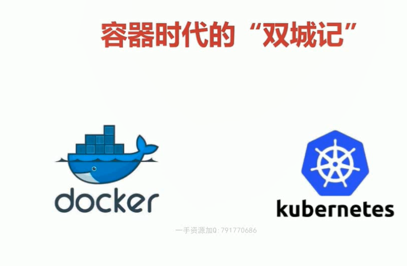

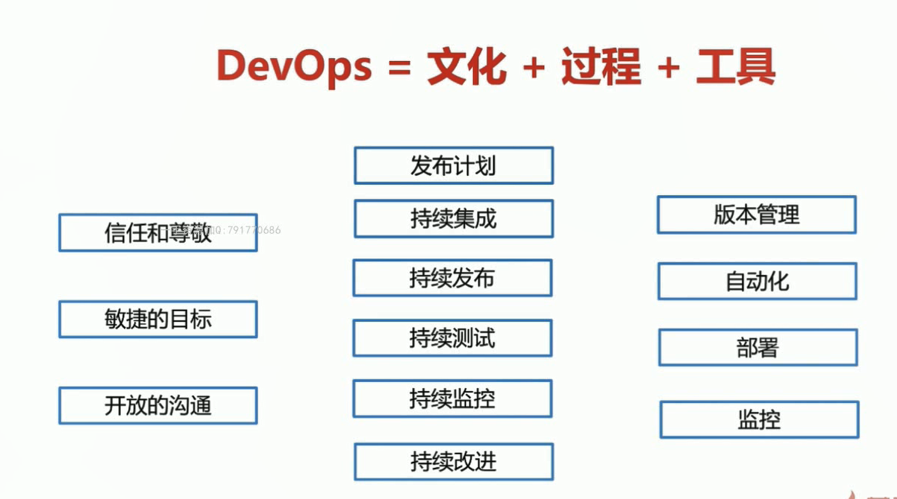

## 课程基础章节

第一章 容器技术和Docker简介

第二章 Docker环境的各种搭建方法

第三章 Docker的镜像和容器

第四章 Docker的网络

第五章 Docker的持久化存储和数据共享

第六章 Docker Compose 多容器部署

课程进阶章节

第七章 容器编排工具Docker Swarm

第八章 DevOps初体验---Docker Cloud 和Docker企业版

第九章 容器编排工具Kubernetes

第十章 容器的运维和监控

第十一章 Docker + DevOps实战---过程和工具

第十二章 总结

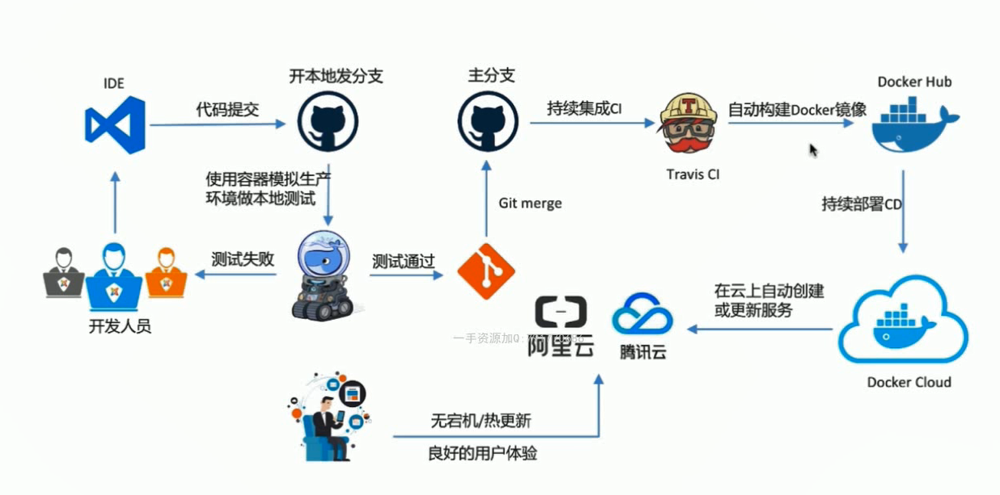

----

## 第一章 容器技术和Docker简介

### 1.1 容器技术概述

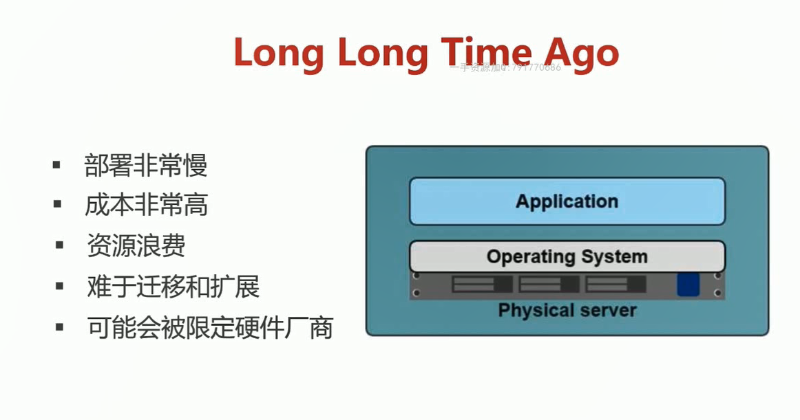

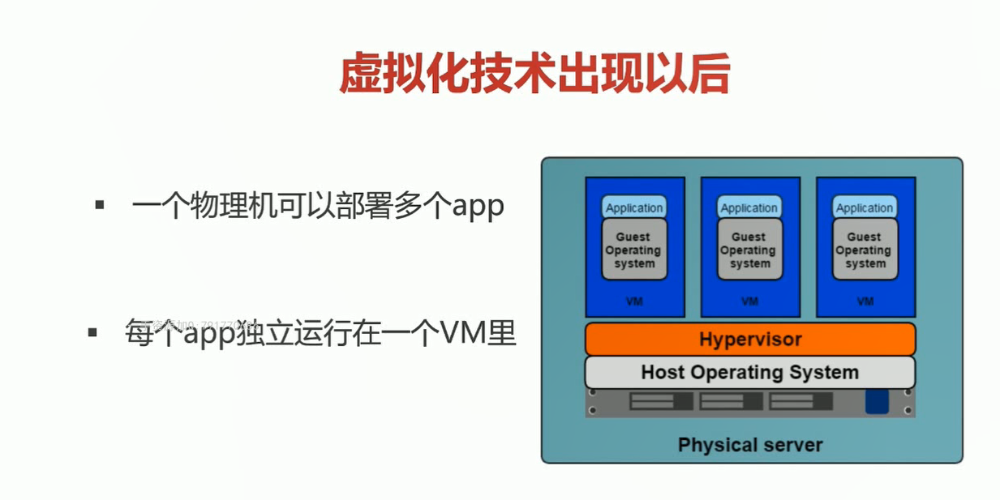

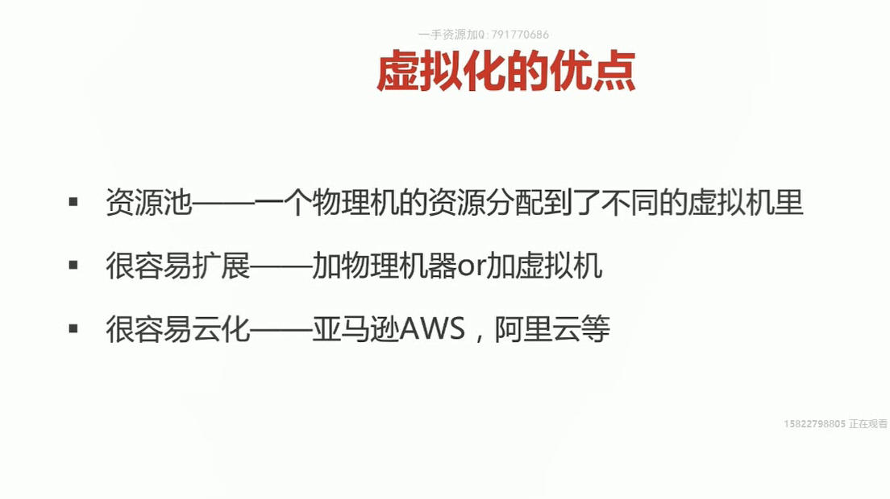

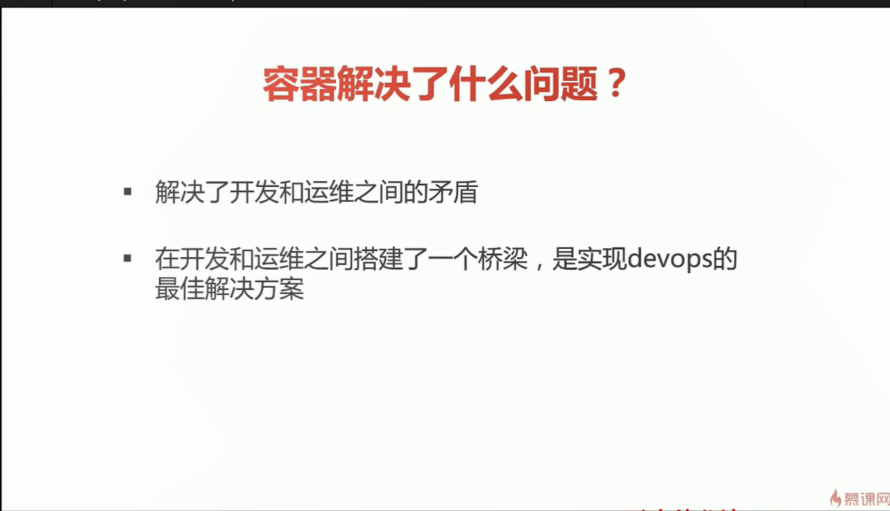

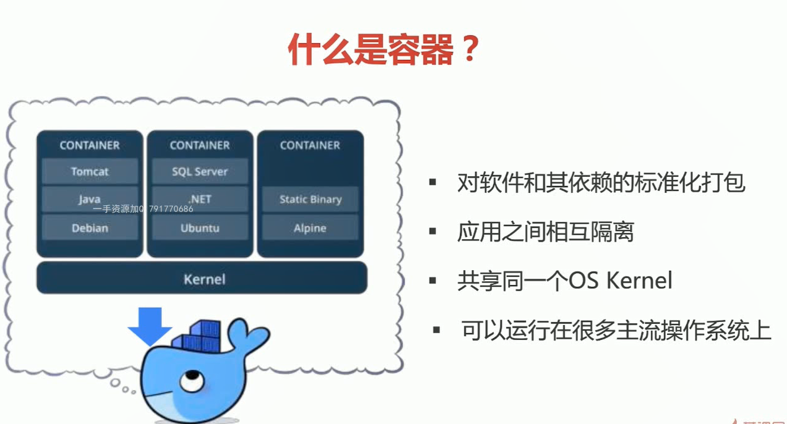

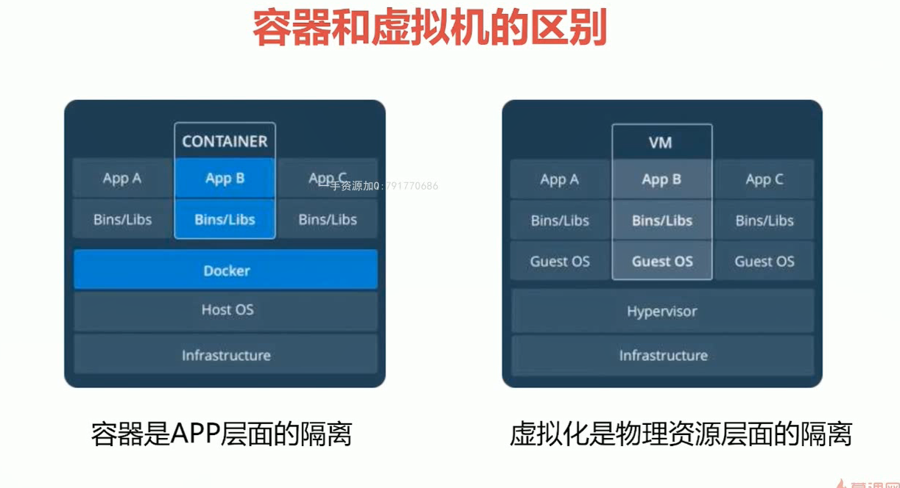

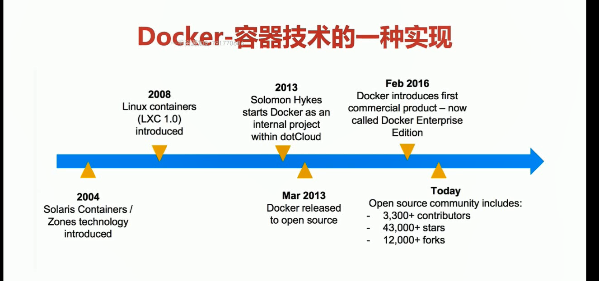

### 1.2 Docker魅力初体验

> 对软件方便的进行**部署**, 体验Docker部署一个wordPress应用
>
> + https://www.bilibili.com/video/BV1Nf4y127gj
>
> + https://www.bilibili.com/video/BV1fQ1HY2ERj
>
> + https://mp.weixin.qq.com/s?__biz=Mzg4Mjg4NDgxMQ==&mid=2247483683&idx=1&sn=043625a6614eb02d505eccbe08682b58&chksm=cf4ea887f839219130d984ee901c97c5b8c7e6c7d764b824e55534bd7afecb6c1c269dc4e0d2&token=926087482&lang=zh_CN#rd

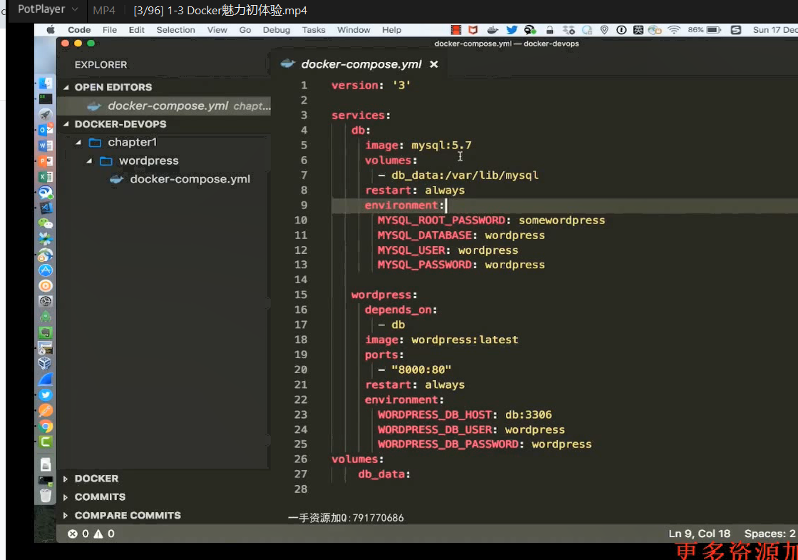

`docker-compose build .`

`docker-compose up`

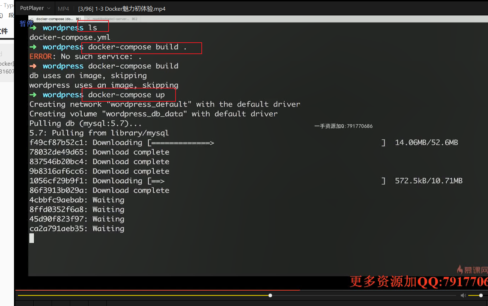

访问`http://127.0.0.1:8000`端口查看网站

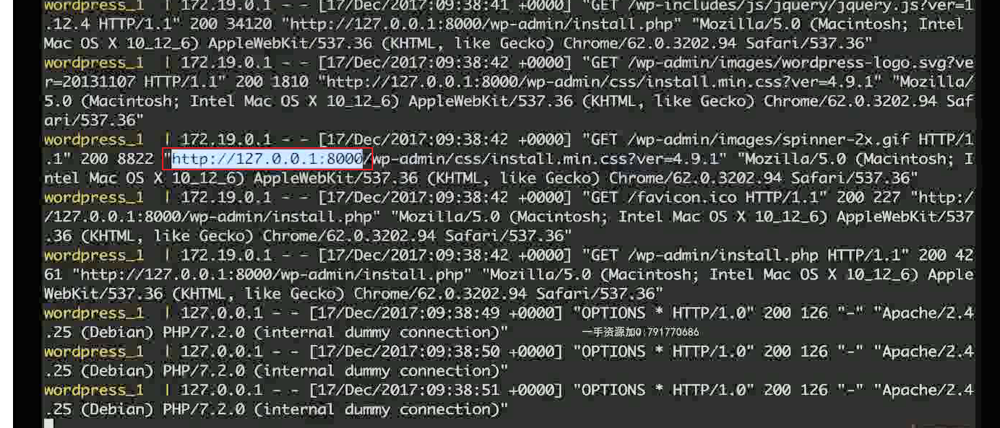

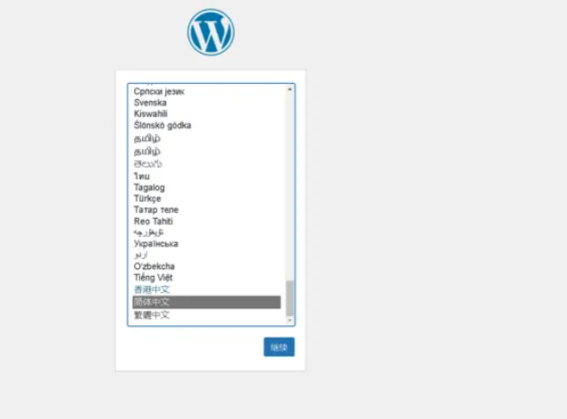

## 第二章 Docker环境的各种搭建方法

### 2.1 dk安装简介

社区版本

收费版本

mac/windows版本

通过安装软件创建虚拟机环境, `通过vmware 创建虚拟机环境<linux>`

https://docs.docker.com/desktop/setup/install/windows-install/

[10分钟掌握Docker Desktop安装及使用](https://www.bilibili.com/video/BV1Vk4y1V7bV/?spm_id_from=333.337.search-card.all.click&vd_source=631062e9ff21033189723c8ac931c360)

[docker启动报错](https://www.cnblogs.com/lxzcloud/p/18862844)

**play with docker网站体验**

**docker镜像站配置**

all release notes : https://docs.docker.com/desktop/release-notes/

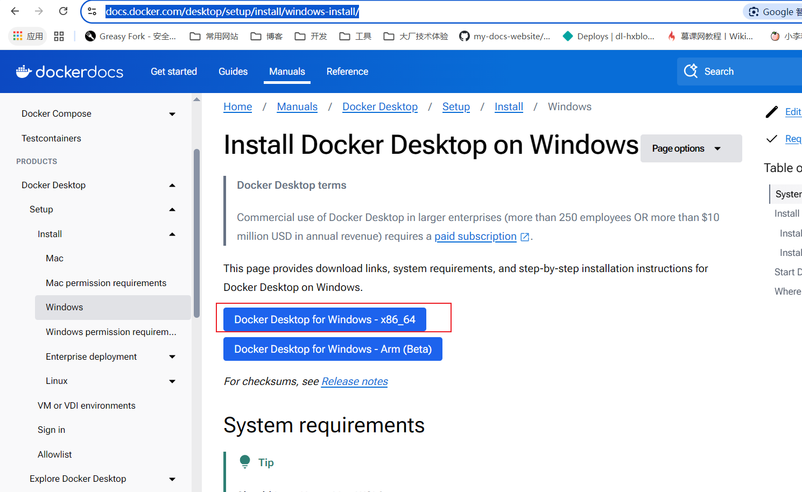

## 第三章 Docker架构与底层技术简介
### 3.1 docker platform
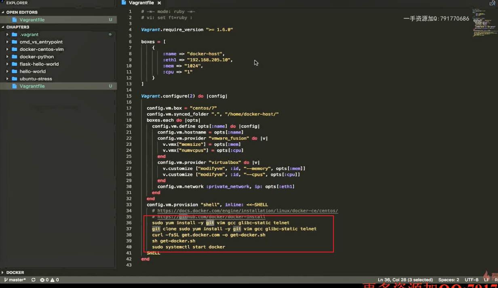
### 3.2 docker image
#### 3.2.1 什么是Image
+ 文件与metada的集合（root filesystem）
+ 分层的，并且每一层都可以改变删除文件，成为一个新的image
+ 不同的image可以共享相同的layer（层）
+ image本身是read-only的
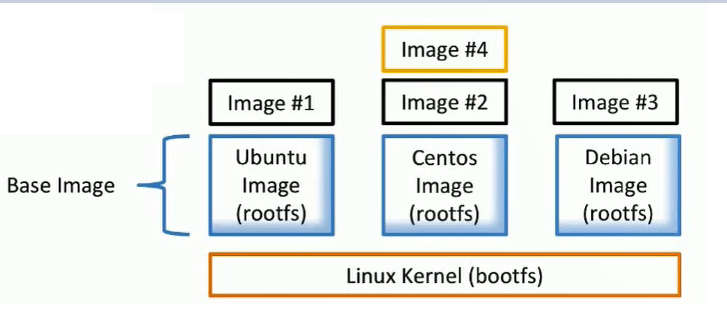

::: tip
Docker 镜像是由一系列只读的 layer 组成的，每个 layer 代表了镜像构建过程中的一次文件系统更改。这些 layer 按顺序堆叠，共同构成完整的文件系统。
:::

+ 查看docker版本
+ $ sudo docker version
+ 查看镜像
+ $ sudo docker image ls

#### 3.2.2 Image镜像的获取
