# AI Agent 开发新范式 MCP从入门到多场景全链路实战

## 1.1 MCP新手 快速上手指南

### 什么是MCP? 为什么每个人必须掌握？

+ MCP的概念
+ 一种通信协议， 实现大模型（LLM）与**外部数据源** 和**工具**的无缝集成的协议。


### 传统方式与大模型的交互方式

+ **原有的交互方式**：大模型仅依赖内部训练数据进行响应，相当于"闭卷考试"——无法主动获取外部信息，也不能调用工具执行任务。例如：
  - 无法获取实时数据（如天气、股票行情）
  - 无法调用API完成操作（如发送邮件、查询数据库）
  - 无法处理计算密集型任务（如复杂数学运算、数据分析）


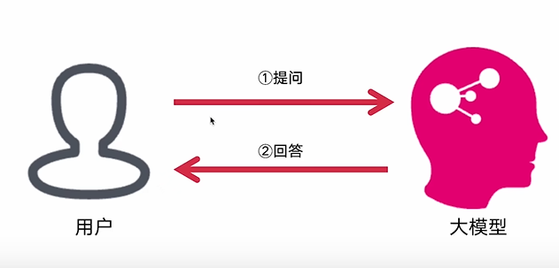


通过引入**MCP**之后，大模型具有了调用**工具**，**获取数据**的能力，大模型的能力进一步加强
+ **MCP带来的新范式**：相当于给大模型配备了"开放接口"，实现三大突破：
  - **能力扩展**：从纯文本交互升级为"思考→调用工具→获取结果→继续思考"的闭环能力
  - **实时性**：通过工具调用获取动态数据（如实时新闻、API返回值），打破训练数据时效性限制
  - **标准化**：统一的JSON-RPC 2.0协议让不同工具/数据源可被大模型无缝调用，形成可复用的工具生态


### 涉及到的知识点

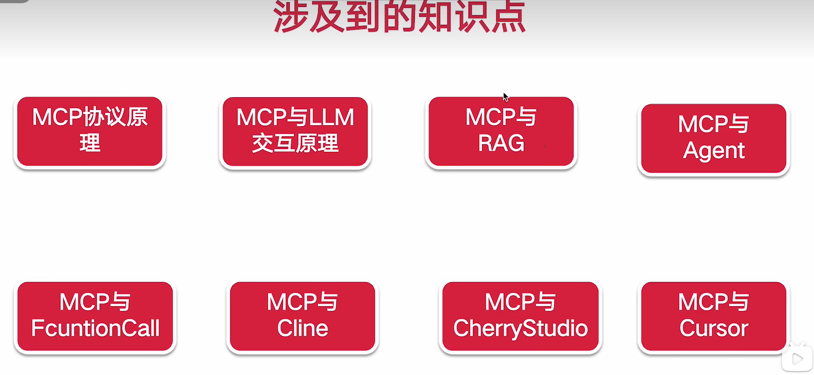


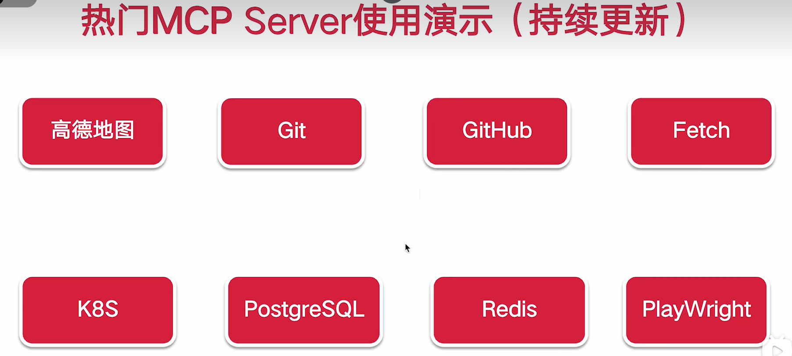


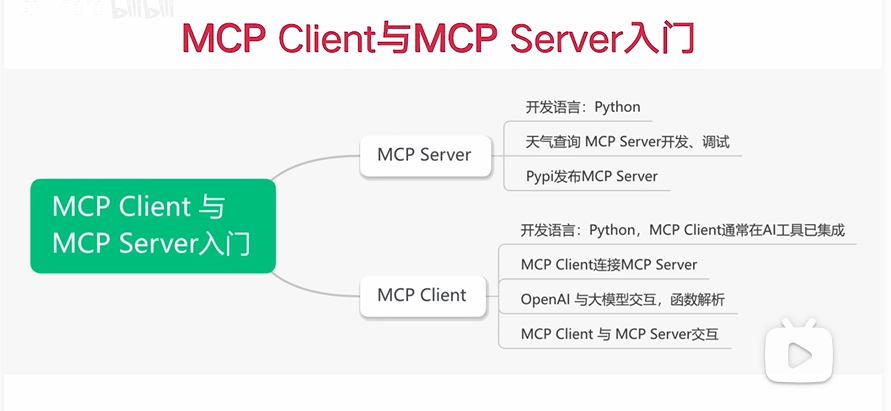


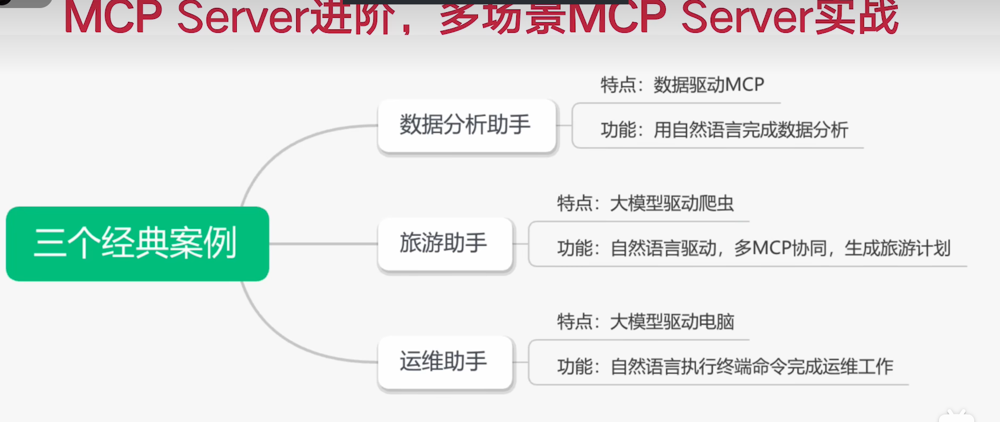


### 学习路线规划

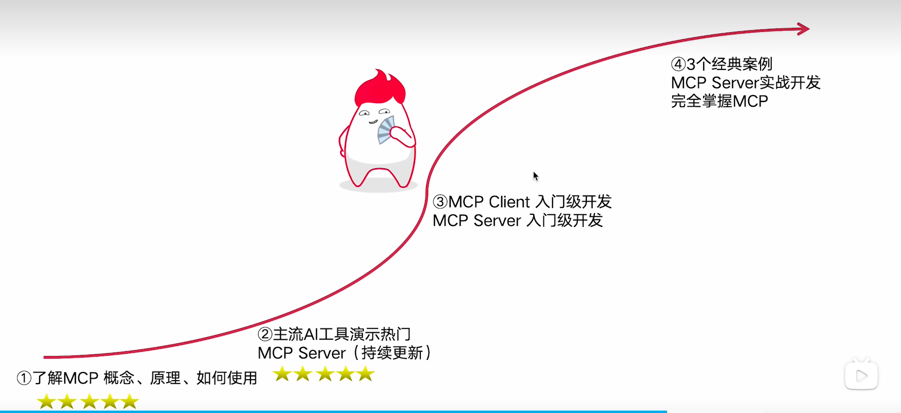

### 实战效果
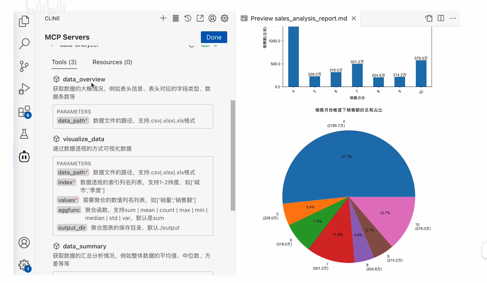


### 适宜人群
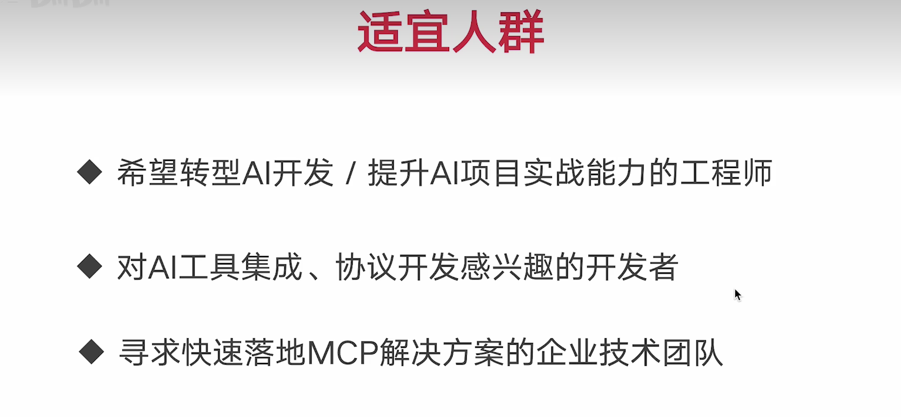


### 技术储备

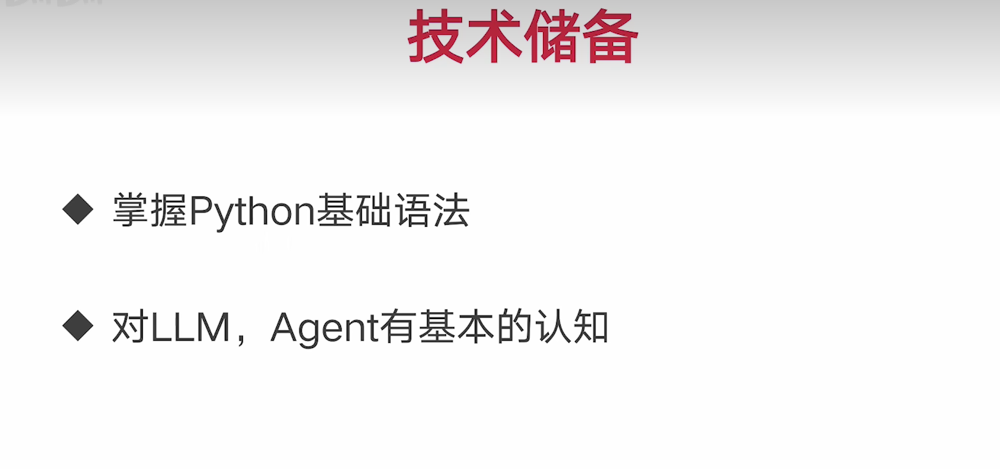


## 1.2 MCP的概念
+ **会使用MCP Server**
+ **会开发MCP Server**

+ **client部分， 很多服务已经实现，不做要求**

+ 大模型能力不足，   为了更好让大模型利用外部资源， **使用MPC协议**， 实现大模型（LLM）与**外部数据源** 和**工具**的无缝集成的协议。


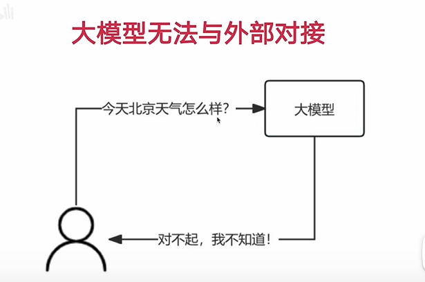

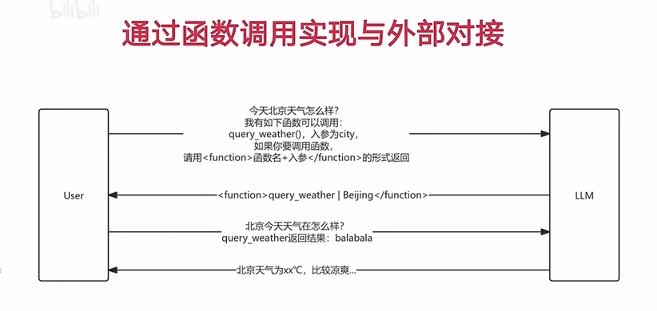


**大模型**与**外部数据**对接

[http://mcp.so/](http://mcp.so/)

mcp服务的导航网站，集成了**大量的MCP服务器**


在**客户端**配置**MCP Server** ,与**大模型**交互


## 1.3 MCP 工作原理

+ **枚举函数**
+ **入参 + 出参 function Call**

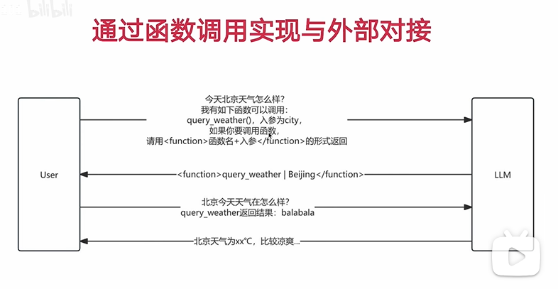

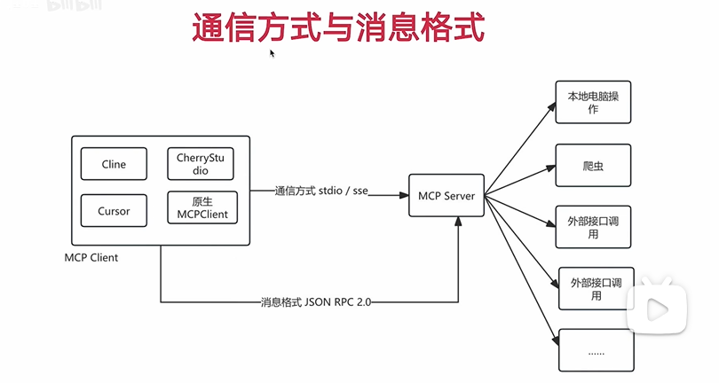


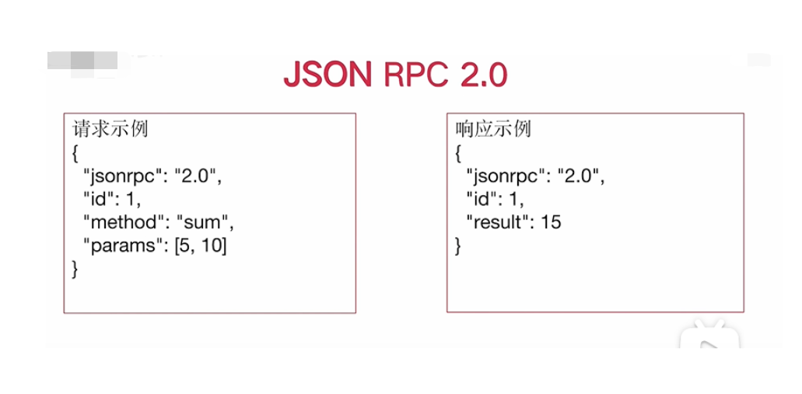


+ JSON-RPC 2.0 是一种使用 JSON 格式的轻量级远程过程调用 (RPC) 协议 **(一种数据格式)**

[https://www.cnblogs.com/zengzuo613/p/18931527](https://www.cnblogs.com/zengzuo613/p/18931527)

+ jsonrpc : 必须为 "2.0"。

+ method: 调用的方法名（字符串）。

+ params: 参数（可省略），支持对象（命名参数）或数组（位置参数）。

+ id: 请求标识符。


## 2.1 MCP与RAG 的区别

+ 共同点：都是在模型的上下文之中携带更多信息，让模型更好输出
+ 不同点：
  + **功能定位不同**：MCP是"工具连接器"，核心是让模型调用外部工具/服务（如API、计算器）；RAG是"文档检索器"，核心是从知识库找静态文档片段
  + **交互方式不同**：MCP能"双向对话"（模型调用工具→工具返回结果→模型继续处理）；RAG只能"单向传递"（仅把文档片段塞进上下文，不能持续互动）
  + **应用场景不同**：MCP适合"做事"（查实时天气、订机票， 数据分析，自动化办公，运维）；RAG适合"答题"（查历史知识、产品手册）


## 2.2 MCP 与 Agent的联系

+ **联系**：MCP是Agent实现工具调用能力的核心组件，相当于Agent的"通信接口"——Agent通过MCP协议连接外部工具/服务，获取执行任务所需的资源和能力
+ **区别**：
  + Agent是"智能体"：具备任务规划、工具选择、结果整合的完整能力，像一个"智能助手"
  + MCP是"通信翻译官"：专注于标准化工具调用的格式和流程，像一个"接口转换器"
  + 范围不同：Agent包含完整的任务处理逻辑（思考→调用→总结）；MCP仅负责调用环节的通信规范

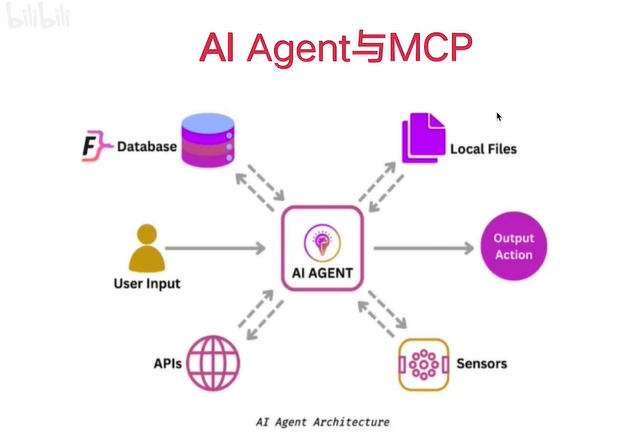

+ 所为的新范式， 是指不需要通过过去的一个个**函数**方式进行调用，而是通过**引入 MCP协议**，获取数据的一种方式。

  ## 2.3 MCP 与 Fuction Call的关系

  > 都是为了解决**大模型无法连接外部数据的问题**

  > 总结： **MCP** 让 **Fuction Call**变得更加标准


  

  > 如何解决这些问题： **告诉大模型， 如何与外界通信**，引入**函数概念**。


> **MCP** 解决函数封装，调用的问题, 通过 MCP更方便的调用大模型


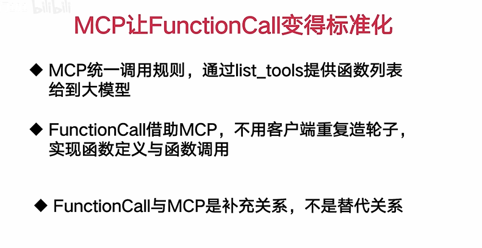


> 总结： **MCP** 是大模型与外部数据的桥梁，通过 **MCP** 可以让大模型调用外部数据， 也可以让外部数据调用大模型。


  ## 2.4 实际演示 MCP 与 Fuction Call的关系


  ## 3.1 热门的MCP客户端工具有哪些

  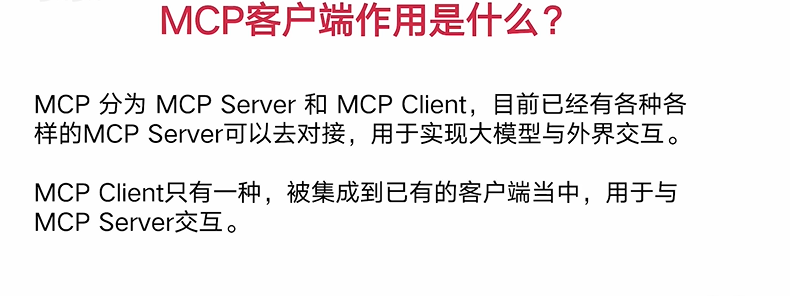

  更好与 **MCP server端对接**

  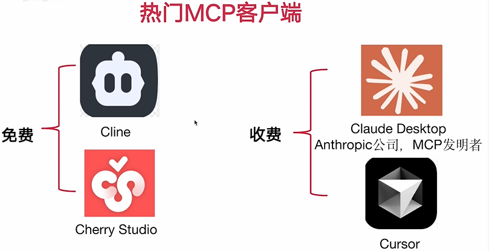


 ## 3.2 VSCode 插件 Cline演示 MCP的调用

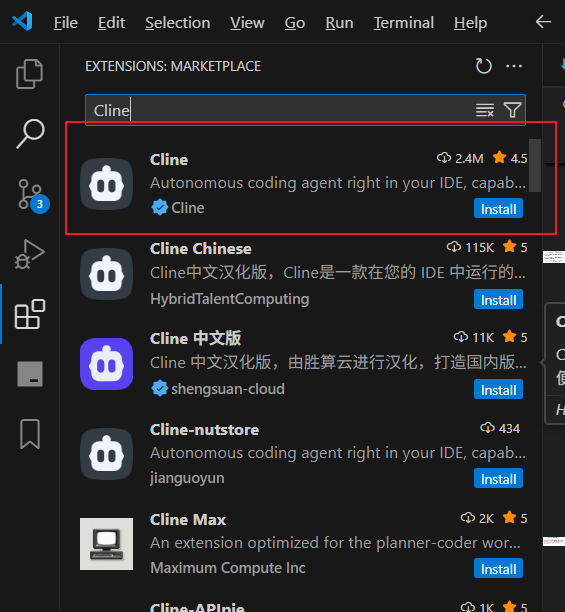

[https://blog.csdn.net/qq_41035650/article/details/147838142](https://blog.csdn.net/qq_41035650/article/details/147838142)

因为国内网络的原因， 还有windows系统的环境问题，所以需要再找办法解决调用不通的问题。

## 3.3 LiteLLM代理API 分析Cline与大模型的交互原理(上)

## 3.4 LiteLLM代理API 分析Cline与大模型的交互原理(下)

## 3.5 Cherry Studio演示MCP Server调用


## 3.6 LiteLLM代理API分析CherryStudio与大模型的交互原理

## 3.7 Cherry Studio 基于 sse 协议演示MCP Server调用


## 3.8 Cursor演示MCP Server调用


## 3.9 MCP 客户端使用总结

## 4.0 热门实用的 MCP Server 使用分享（持续更新）

## 4.2 时下热门的MCP Server来源梳理

## 4.3 高德地图MCP Server演示

## 4.4 PostgreSQL MCP Server演示

## 4.5 Git MCP Server演示

## 4.6 Github MCP Server演示
```json
{
  "mcpServers": {
    "github": {
      "disabled": false,
      "timeout": 60,
      "type": "stdio",
      "command": "npx",
      "args": [
        "-y",
        "@modelcontextprotocol/server-github"
      ],
      "env": {
        "GITHUB_PERSONAL_ACCESS_TOKEN": "...."
      }
    }
  }
}
```

```
帮我查询，我的github项目
```


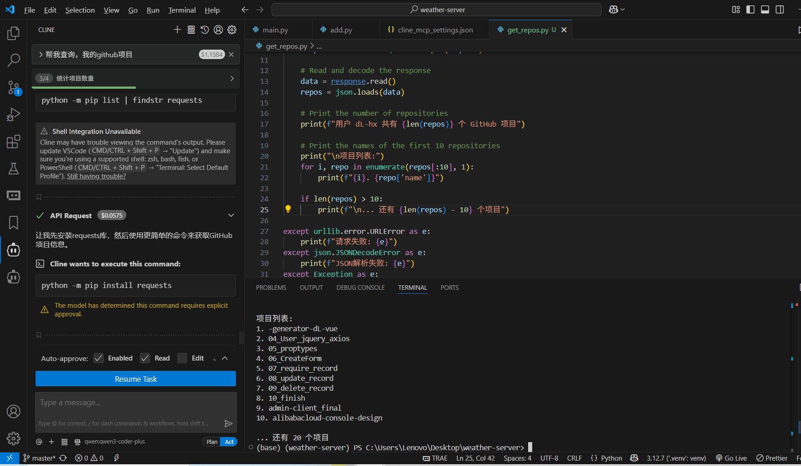

## 4.7 Fetch MCP Server演示

## 4.8 Redis MCP Server踩坑演示

## 4.9 Puppeteer+PlayWright MCP Server演示

## 4.10 Kubernetes MCP Server演示

## 4.11 FireCrawl爬虫MCP Server演示

## 4.12 Zapier MCP Server 演示


## 5.0 自定义MCP Server与MCP Client入门级开发实战

## 5.1 自定义MCP Server开发

尝试自己开发mcp server , 语言 选择 python

+ uv安装

```shell
$ pip install uv

// 天气查询的mcp server 初始化
$ uv init weather-server

$ uv add "mcp[cli]" httpx
```


在python 项目目录下运行, 启动mcp server 调试
```shell
$ python main.py 
或
$ mcp dev main.py
```

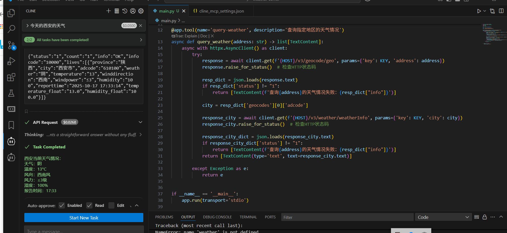

```python
from mcp.server import FastMCP
from mcp.types import TextContent
import httpx
import json

app = FastMCP('weather-server')

HOST = 'https://restapi.amap.com'
KEY = 'ee50d4053a18506d66a0f826de884cd1'


@app.tool(name='query-weather', description='查询指定地区的天气情况')
async def query_weather(address: str) -> list[TextContent]:
    async with httpx.AsyncClient() as client:
        try:
            response = await client.get(f'{HOST}/v3/geocode/geo', params={'key': KEY, 'address': address})
            response.raise_for_status()  # 检查HTTP状态码

            resp_dict = json.loads(response.text)
            if resp_dict['status'] != "1":
                return [TextContent(f'查询{address}的天气情况失败：{resp_dict["info"]}')]

            city = resp_dict['geocodes'][0]['adcode']

            response_city = await client.get(f'{HOST}/v3/weather/weatherInfo', params={'key': KEY, 'city': city})
            response_city.raise_for_status()  # 检查HTTP状态码

            response_city_dict = json.loads(response_city.text)
            if response_city_dict['status'] != "1":
                return [TextContent(f'查询{address}的天气情况失败：{resp_dict["info"]}')]
            return [TextContent(type='text', text=response_city.text)]

        except Exception as e:
            return e


if __name__ == '__main__':
    app.run(transport='stdio')
```

```json
{
  "mcpServers": {
    "weather-server": {
      "disabled": false,
      "timeout": 60,
      "type": "stdio",
      "command": "uv",
      "args": [
        "--directory",
        "C:\\Users\\Lenovo\\Desktop\\weather-server",
        "run",
        "main.py"
      ]
    }
  }
}
```


## 5.2 自定义实现MCP 加法计算

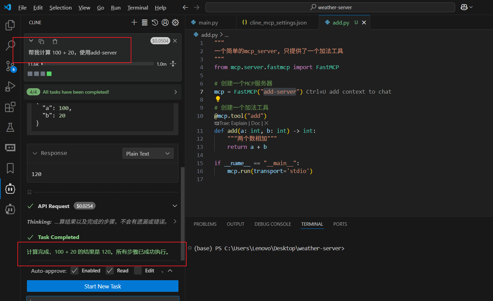

```python
"""
一个简单的mcp_server, 只提供了一个加法工具
"""
from mcp.server.fastmcp import FastMCP

# 创建一个MCP服务器
mcp = FastMCP("add-server")

# 创建一个加法工具
@mcp.tool("add")
def add(a: int, b: int) -> int:
    """两个数相加"""
    return a + b

if __name__ == "__main__":
    mcp.run(transport='stdio')


```

```json
{
  "mcpServers": {
    "add-server": {
      "disabled": false,
      "timeout": 60,
      "type": "stdio",
      "command": "uv",
      "args": [
        "--directory",
        "C:\\Users\\Lenovo\\Desktop\\weather-server",
        "run",
        "add.py"
      ]
    }
  }
}
```


## 5.2 自定义实现 MCP Client开发


