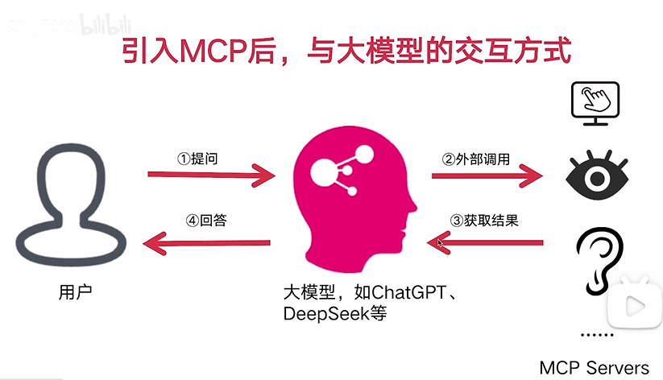
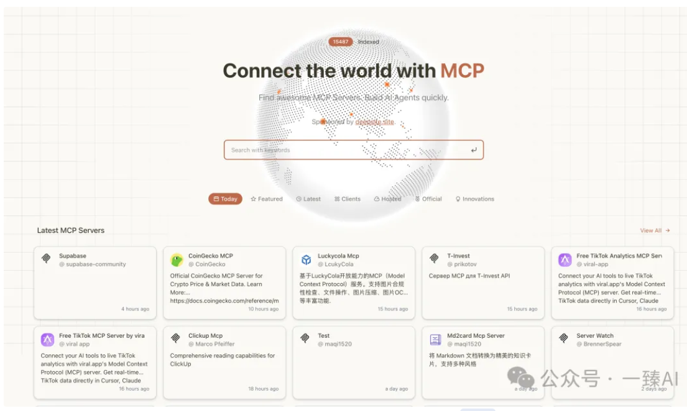

# AI Agent 开发新范式 MCP从入门到多场景全链路实战

## 1.1 MCP新手 快速上手指南

### 什么是MCP? 为什么每个人必须掌握？

+ MCP的概念
+ 一种通信协议， 实现大模型（LLM）与**外部数据源** 和**工具**的无缝集成的协议。

### 传统方式与大模型的交互方式

+ **原有的交互方式**：大模型仅依赖内部训练数据进行响应，相当于"闭卷考试"——无法主动获取外部信息，也不能调用工具执行任务。例如：
  - 无法获取实时数据（如天气、股票行情）
  - 无法调用API完成操作（如发送邮件、查询数据库）
  - 无法处理计算密集型任务（如复杂数学运算、数据分析）

通过引入**MCP**之后，大模型具有了调用**工具**，**获取数据**的能力，大模型的能力进一步加强
+ **MCP带来的新范式**：相当于给大模型配备了"开放接口"，实现三大突破：
  - **能力扩展**：从纯文本交互升级为"思考→调用工具→获取结果→继续思考"的闭环能力
  - **实时性**：通过工具调用获取动态数据（如实时新闻、API返回值），打破训练数据时效性限制
  - **标准化**：统一的JSON-RPC 2.0协议让不同工具/数据源可被大模型无缝调用，形成可复用的工具生态

### 涉及到的知识点

### 学习路线规划

### 实战效果

### 适宜人群

### 技术储备

## 1.2 MCP的概念
+ **会使用MCP Server**
+ **会开发MCP Server**

+ **client部分， 很多服务已经实现，不做要求**

+ 大模型能力不足，   为了更好让大模型利用外部资源， **使用MPC协议**， 实现大模型（LLM）与**外部数据源** 和**工具**的无缝集成的协议。

**大模型**与**外部数据**对接

[http://mcp.so/](http://mcp.so/)

mcp服务的导航网站，集成了**大量的MCP服务器**

在**客户端**配置**MCP Server** ,与**大模型**交互

## 1.3 MCP 工作原理

**枚举函数**
**入参 + 出参 function Call**

+ JSON-RPC 2.0 是一种使用 JSON 格式的轻量级远程过程调用 (RPC) 协议 **(一种数据格式)**

[https://www.cnblogs.com/zengzuo613/p/18931527](https://www.cnblogs.com/zengzuo613/p/18931527)

+ jsonrpc : 必须为 "2.0"。

+ method: 调用的方法名（字符串）。

+ params: 参数（可省略），支持对象（命名参数）或数组（位置参数）。

+ id: 请求标识符。

## 2.1 MCP与RAG 的区别

+ 共同点：都是在模型的上下文之中携带更多信息，让模型更好输出
+ 不同点：
  + **功能定位不同**：MCP是"工具连接器"，核心是让模型调用外部工具/服务（如API、计算器）；RAG是"文档检索器"，核心是从知识库找静态文档片段
  + **交互方式不同**：MCP能"双向对话"（模型调用工具→工具返回结果→模型继续处理）；RAG只能"单向传递"（仅把文档片段塞进上下文，不能持续互动）
  + **应用场景不同**：MCP适合"做事"（查实时天气、订机票， 数据分析，自动化办公，运维）；RAG适合"答题"（查历史知识、产品手册）

## 2.2 MCP 与 Agent的联系

+ **联系**：MCP是Agent实现工具调用能力的核心组件，相当于Agent的"通信接口"——Agent通过MCP协议连接外部工具/服务，获取执行任务所需的资源和能力
+ **区别**：
  + Agent是"智能体"：具备任务规划、工具选择、结果整合的完整能力，像一个"智能助手"
  + MCP是"通信翻译官"：专注于标准化工具调用的格式和流程，像一个"接口转换器"
  + 范围不同：Agent包含完整的任务处理逻辑（思考→调用→总结）；MCP仅负责调用环节的通信规范

+ 所为的新范式， 是指不需要通过过去的一个个**函数**方式进行调用，而是通过**引入 MCP协议**，获取数据的一种方式。

  ## 2.3 MCP 与 Fuction Call的关系

  > 都是为了解决**大模型无法连接外部数据的问题**

  

  > 如何解决这些问题： **告诉大模型， 如何与外界通信**，引入**函数概念**。

> **MCP** 解决函数封装，调用的问题

