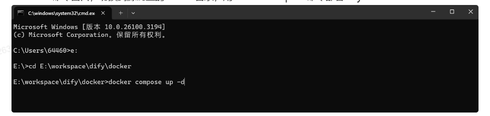

# 私有化部署dify 入门


## 课程内容
+ 1. Dify介绍
+ 2. Dify私有化部署
+ 3. Dify接入大模型
+ 4. 构建应用
+ 5. 创建一个聊天程序


## Dify介绍
官网 https://www.dify.ai/

Dify 是一款面向开发者的开源大语言模型（LLM）应用开发平台，定位为“生成式 AI 应用创新引擎”。其核心目标是通过低代码/无代码方式，提供从模型集成、工作流编排到应用部署的全流程管理，降低企业级 AI 应用开发门槛


## Dify私有化部署
1. 下载dify源代码
``` bash
$ git clone https://github.com/langgenius/dify.git
``` 

2. 部署dify源代码目录如下


Windows命令窗口，切换到源码里的docker目录，用docker compose命令部署Dify：


``` bash
$ cd E:\workspace\dify\docker
$ docker compose up -d
``` 


`docker compose up -d`命令会启动在 ` docker-compose.yml` 中定义的所有服务，等待所有服务都下载好

## 访问验证

打开浏览器，访问 http://127.0.0.1/，默认打开Dify的设置管理员账户页


用上面设置的邮箱、密码登录


## Dify接入大模型
## 构建应用
## 创建一个聊天程序


https://www.bilibili.com/video/BV1N634zcEgM