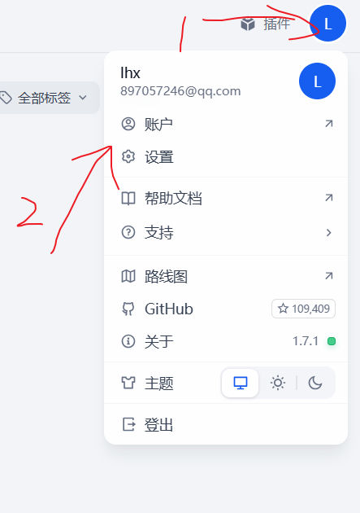

# 私有化部署dify 入门


## 课程内容
+ 1. Dify介绍
+ 2. Dify私有化部署
+ 3. Dify接入大模型
+ 4. 构建应用
+ 5. 创建一个聊天程序


## Dify介绍
官网 https://www.dify.ai/

Dify 是一款面向开发者的开源大语言模型（LLM）应用开发平台，定位为“生成式 AI 应用创新引擎”。其核心目标是通过低代码/无代码方式，提供从模型集成、工作流编排到应用部署的全流程管理，降低企业级 AI 应用开发门槛


## Dify私有化部署
1. 下载dify源代码 dify版本为 0.15.7
``` bash
$ git clone https://github.com/langgenius/dify.git
``` 

2. 部署dify源代码目录如下


Windows命令窗口，切换到源码里的docker目录，用docker compose命令部署Dify：

``` bash

cd dify/docker
cp .env.example .env
docker compose -p dify up -d

``` 


`docker compose up -d`命令会启动在 ` docker-compose.yml` 中定义的所有服务，等待所有服务都下载好


## 访问验证

安装完成过后，验证一下
`docker compose ps`


打开浏览器，访问  http://127.0.0.1/install

默认打开Dify的设置管理员账户页

用上面设置的邮箱、密码登录


## Dify接入大模型
点击设置配置大模型



安装qianwen 大模型
（选择qianwen 安装）


设置API KEY


去百炼平台获取API KEY


## 构建应用


工作室-创建应用-选择聊天助手-点击创建


## 创建一个聊天程序


输入提示词之后，点击应用


## 效果
在对话框中，可以与机器人聊天


## 关闭本地的dify服务


## 总结
还是遇到了很多的坑， 比如dify版本为 0.15.7 ，要配置qianwen大模型的Key等。


https://www.bilibili.com/video/BV1N634zcEgM


https://blog.csdn.net/qq_58602552/article/details/147443007

还可以接入更多的模型

https://www.cnblogs.com/ckfuture/p/18754969