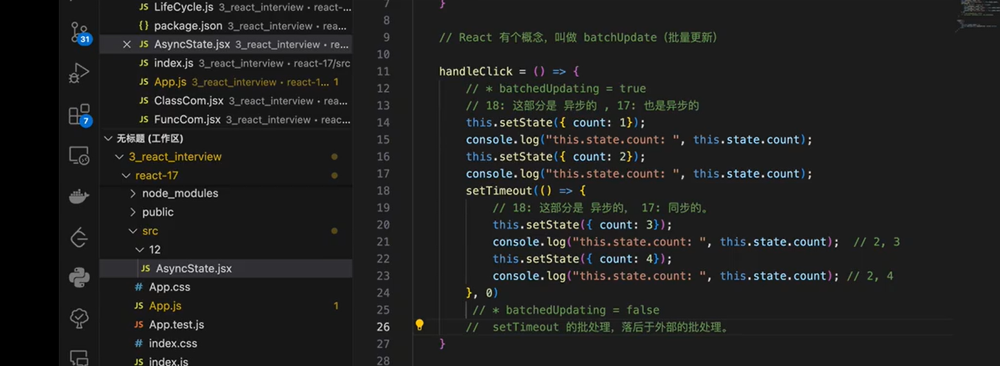

# React 面试题

## 1. react 组件声明方式
- 函数组件
- 类组件

## 2. 常见Hook?
- useEffect
    - 模拟一些生命周期，处理状态副作用， 请求接口

- useState
    - 更新UI, useState，定义状态数据

- useMemo
    - 缓存函数的值

- useCallback
    - 缓存函数

- useRef
    - 定义全局不变的变量
    - 定位具体元素
    - 调用子组件方法

- useReducer
    - 状态变化更加可控
    - reducer 明确具体action

- useContext
    - 提供全局上下文

- useImperativeHandle
    - 与forwordRef

### 第三方hooks
- ahooks

## 3. react 常见的生命周期有哪些？
### 初始化
- componentWillMount
- componentDidMount

### 更新阶段
- componentWillReceiveProps

- shouldComponentUpdate

- componentWillUpdate

- render

- componentDidUpdate

### 销毁阶段
- componentWillUnmount
- 闭包，定时器，事件管理，做一些销毁操作

## 中等题
## 11. 使用React的哪些版本， 版本的区别
### 16.8 之前
- stack reconciler
- 是没有fiber reconciler
- 更多的是class 写法

### 17
- fiber reconciler
    -   解决了递归产生的堆栈问题
- 17.0.2 为主
    -   legacy模式， create-react-app 创建的项目 默认的模式
    -   concurrent模式， 支持高优先级任务先执行

### 18
- `useTransition`

## 12. setState是同步还是异步？
setTimeOut的批处理，落后于betchUpdate的批处理

## 13. useLayoutEffect与useEffect区别？
- useEffect是异步更新， 会等主线程DOM更新，JS执行完成之后，图像绘制后完成，才执行
- useLayoutEffect  ，同步执行， DOM更新， 图像绘制之前执行

**如果需要更改DOM, 用useLayoutEffect， 其他都用useEffect**

### useInsertionEffect
useInsertionEffect比useLayoutEffect更早， DOM还没有更新

**解决CSS-in-JS在渲染时候注入样式的性能问题**

### 那个和componentDidMount， componentDidUpdate更接近
**componentDidMount， componentDidUpdate是同步的，所以useLayoutEffect更接近**

## 14. HOC,常见方式？
- 属性代理： 为原组件扩展属性
- 反向继承： 侵入原组件的生命周期

## 15. 如何实现withRouter
- HOC
- Context

## 16. react-router-dom v6提供了哪些API?
- Outlet占位符，对标Vue `<router-view>`
- useAPI
    - useNavigage

## 17. 什么是闭包陷阱？
- useState 闭包

- useEffect 闭包

## 18. 闭包陷阱的成因与解法？
- setInterval形成了一个闭包

- 解法：
    - state 以函数形式执行
    - 使用ref 作为”全局变量“去处理

## 19. 什么是Fiber?
- React 16.x 引入的数据结构，一个对象

const FiberNode = {
    tag,
    key,
    type,

    return,
    children,
    sibling,

    pendingProps,
};
