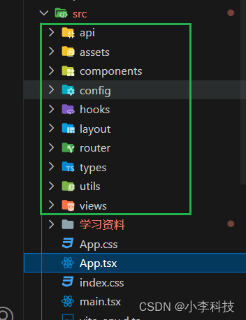
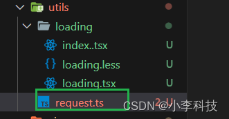
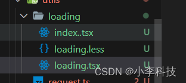
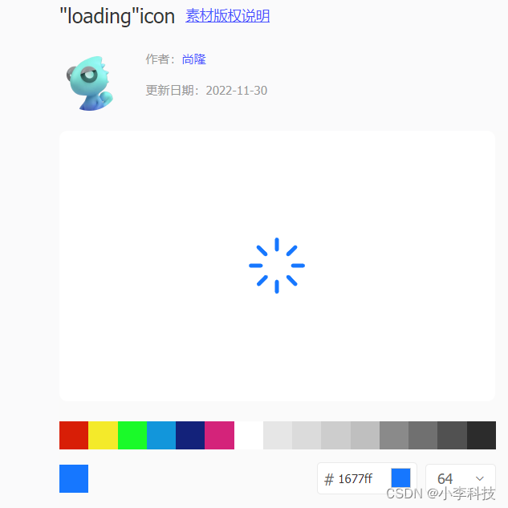
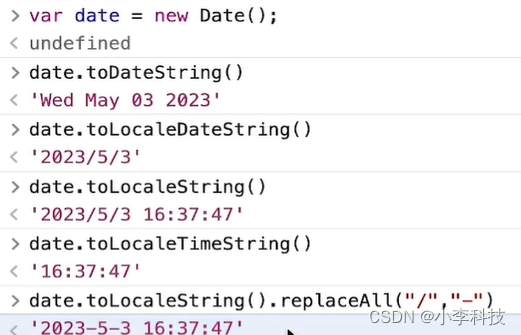

## 1.目录结构定义


## 2. 路由封装
> react-router6

### 2.1 API路由定义
[2.1 API路由定义](https://github.com/dL-hx/manager-fe/commit/e4511dfd63da7972272f31d330f5bffa2de7bfc5)
`router/index.ts`
```ts
import { Navigate, createHashRouter, createBrowserRouter } from 'react-router-dom'
import Login from '@/views/Login'
import Welcome from '@/views/Welcome'
import Error403 from '@/views/403'
import Error404 from '@/views/404'

export const router = [
    {
        path: '/',
        element: <Welcome />
    },
    {
        path: '/login',
        element: <Login />
    },
    {
        path: '*',// 匹配路由不到路由, 跳转404. 用Navigate组件重定向到404
        element: <Navigate to='/404' />
    },
    {
        path: '/404',
        element: <Error404 />
    },
    {
        path: '/403',
        element: <Error403 />
    },
]
export default createBrowserRouter(router)
```
`App/index.ts`
```ts
import { RouterProvider } from 'react-router'
import router from './router';
import './App.css'
import { BrowserRouter } from 'react-router-dom';

function App() {
  return (
    <RouterProvider router={router} />
  )
  
}

export default App

```
### 2.2 组件路由定义
`router/index.ts`
```ts
import { Navigate, createHashRouter, createBrowserRouter, useRoutes } from 'react-router-dom'
import Login from '@/views/Login'
import Welcome from '@/views/Welcome'
import Error403 from '@/views/403'
import Error404 from '@/views/404'

export const router = [
    {
        path: '/',
        element: <Welcome />
    },
    {
        path: '/login',
        element: <Login />
    },
    {
        path: '*',// 匹配路由不到路由, 跳转404. 用Navigate组件重定向到404
        element: <Navigate to='/404' />
    },
    {
        path: '/404',
        element: <Error404 />
    },
    {
        path: '/403',
        element: <Error403 />
    },
]

// API路由
// export default createBrowserRouter(router)

// 组件路由
export default function Router(){
    return useRoutes(router)
}
```


`App/index.ts`
```ts
import { RouterProvider } from 'react-router'
import Router from './router';
import './App.css'
import { BrowserRouter, HashRouter } from 'react-router-dom';

function App() {
  return (
    <BrowserRouter>
      <Router />
    </BrowserRouter>
  )
  // return <RouterProvider router={router} />
}

export default App

```

## 3. Axios请求开发
[npm:axios](https://www.npmjs.com/package/axios)


```ts
import { message } from 'antd'
import axios, { AxiosError } from 'axios'
import { hideLoading, showLoading } from './loading/index.'
// 创建实例对象
const instance = axios.create({
  baseURL: '/api',
  timeout: 8000,
  timeoutErrorMessage: '请求超时, 请稍后再试',
  withCredentials: true,
  headers: {}
})
// 请求拦截器
instance.interceptors.request.use(
  config => {
    showLoading()
    const token = localStorage.get('token')
    if (token) {
      config.headers.Authorization = 'Token::' + token
    }
    return {
      ...config
    }
  },
  (error: AxiosError) => {
    return Promise.reject(error)
  }
)

// 响应拦截器
instance.interceptors.response.use(
  response => {
    const data = response.data
    hideLoading()
    if (data.code === 500001) {
      message.error(data.msg)
      localStorage.removeItem('token')
      location.href = '/login?callback=' + encodeURIComponent(location.href)
    } else if (data.code != 0) {
      message.error(data.msg)
      return Promise.reject(data)
    }
    return data.data
  },
  error => {
    hideLoading()

    message.error(error.message)
    return Promise.reject(error.message)
  }
)

export default {
  get(url: string, params: any) {
    return instance.get(url, { params })
  },
  post(url: string, data: any) {
    return instance.post(url, data)
  }
}

```

## 4. Loading封装
code: [https://hub.fgit.cf/dL-hx/manager-fe/commit/d60929d13b2dcf69f2563dba5f8e6fb47e4a057f](https://hub.fgit.cf/dL-hx/manager-fe/commit/d60929d13b2dcf69f2563dba5f8e6fb47e4a057f)
### 方案一
> 动态创建loading节点在html页面上

`src\utils\loading\loading.tsx`
```js
import { Spin } from 'antd'
import './loading.less'
export default function Loading({tip = 'Loading'}: { tip?: string}) {
    return <Spin tip={tip} size='large' className='request-loading' >
        <div className="content" />
    </Spin>
}
```
`src\utils\loading\loading.less`
```css
#loading {
    position: fixed;
    top: 0;
    left: 0;
    bottom: 0;
    right: 0;
    display: flex;
    flex-direction: column;
    align-items: center;
    justify-content: center;
    font-size: 20px;
  }
```
`src\utils\loading\index.tsx`
```js
// import axios from 'axios'
import ReactDOM from 'react-dom/client'

import Loading from './loading'
let count = 0
export const showLoading = () => {
    if (count === 0) {
        const loading = document.createElement('div')
        loading.setAttribute('id', 'loading')
        document.body.append(loading)
        // const loading = document.getElementById('loading') as HTMLDivElement
        ReactDOM.createRoot(loading).render(<Loading />)
    }
    count++
}


export const hideLoading = () => {
    if (count < 0) return
        count--
    if (count === 0)
        document.body.removeChild(document.getElementById('loading') as HTMLDivElement)
}


```

### 方案二
code: [https://hub.fgit.cf/dL-hx/manager-fe/commit/b39cf0f128942b2703576d66dd220775ec59e165](https://hub.fgit.cf/dL-hx/manager-fe/commit/b39cf0f128942b2703576d66dd220775ec59e165)


在icon font网站复制svg代码插入页面，通过控制SVG元素的`显示隐藏进行Loading`
[https://www.iconfont.cn/search/index?searchType=icon&q=loading](https://www.iconfont.cn/search/index?searchType=icon&q=loading)


`index.html`

```html
<!doctype html>
<html lang="en">

<head>
  <meta charset="UTF-8" />
  <link rel="icon" type="image/svg+xml" href="/vite.svg" />
  <meta name="viewport" content="width=device-width, initial-scale=1.0" />
  <title>Vite + React + TS</title>
+  <style>
+   .loading {
+     animation: rotate linear 1.5s infinite;
+    }

+    @keyframes rotate {
+      from {
+       transform: rotate(0deg);
+     }

+      to {
+        transform: rotate(360deg);
+     }
+   }
+  </style>
</head>

<body>
  <div id="root"></div>
+  <div id="loading" style="display: none">
+   <svg t="1704641757928" class="icon loading" viewBox="0 0 1024 1024" version="1.1" xmlns="http://www.w3.org/2000/svg"
+     p-id="4360" width="64" height="64">
+     <path
+      d=""
+       fill="#1677ff" p-id="4361"></path>
+   </svg>
+   <p>Loading...</p>
+ </div>
  <script type="module" src="/src/main.tsx"></script>
</body>

</html>
```


`src\utils\loading\index.tsx`
```js

import './loading.less'

let count = 0

export const showLoading = () => {
    if (count === 0) {
        const loading = document.getElementById('loading')
        loading?.style.setProperty('display', 'flex')
    }
    count++
}

export const hideLoading = () => {
    count--
    if (count === 0) {
        const loading = document.getElementById('loading')
        loading?.style.setProperty('display', 'none')
    }
}

```
## 5. 环境变量封装
> 运行时, 编译时

## 6. storage模块封装(sessionStorage, localStorage)
`src\utils\storage.ts`
```ts
/**
 * localStorage模块封装
 * 引用:
 * import storage from '@/utils/storage';
 * storage.set()
 */
export default {
  /**
   * storage存储
   * @param key {string} 参数名称
   * @param value {any} 写入值
   */
  set(key: string, value: any) {
    localStorage.setItem(key, JSON.stringify(value))
  },
  /**
   * storage读取
   * @param key {string} 参数名称
   * @return storage值
   */
  get(key: string) {
    const value = localStorage.getItem(key)
    if (!value) {
      return ''
    }
    try {
      return JSON.parse(value)
    } catch (error) {
      return value
    }
  },
  /**
   * 删除localStorage值
   * @param key {string} 参数名称
   */
  remove(key: string) {
    localStorage.removeItem(key)
  },
  /**
   * 清空localStorage值
   */
  clear() {
    localStorage.clear()
  }
}


```
`src\views\Welcome.tsx`
```js
import request from "@/utils/request";
import storage from "@/utils/storage";
import { Button } from "antd";


export default function Welcome(){

    const handleStorage = (type: number): void =>{
        if (type === 1) {
            storage.set('age', 30)
            storage.set('user',{name: 'jack', gender: '1'})
        }
        if (type === 2) {
            console.log(storage.get('age'));
            console.log(storage.get('user'));
        }
        if (type === 3) {
            console.log(storage.remove('age'));
        }
        if (type === 4) {
            storage.clear()
        }
    }

    return <div className='welcome'>
        <p>Welcome</p>
        <p>
            <Button onClick={()=>handleStorage(1)}>写入值</Button>
            <Button onClick={()=>handleStorage(2)}>读取值</Button>
            <Button onClick={()=>handleStorage(3)}>删除值</Button>
            <Button onClick={()=>handleStorage(4)}>清空所有</Button>
        </p> 
    </div>
}
```

## 7. 环境获取
> 分为： 编译时环境， 运行时环境

### 运行时候环境
[https://github.com/dL-hx/manager-fe/commit/61b15833b74bd214fbf7df86b6481df996becd22](https://github.com/dL-hx/manager-fe/commit/61b15833b74bd214fbf7df86b6481df996becd22)
> 通过在html元素根节点`<html lang="en" data-env="stg">`注入元素属性` data-env="stg"` 完成环境切换
> 
`src\config\index.ts`
```js
/**
 * 运行时：判断环境变量
 * 环境配置封装
 */

type ENV = 'dev' | 'stg' | 'prd'

// let env: ENV = 'dev'
// if (location.host.indexOf('localhost') > -1) {
//   env = 'dev'
// } else if (location.host === 'driver-stg.marsview.cc') {
//   env = 'stg'
// } else {
//   env = 'prd'
// }

// 运行时候环境获取， 在html元素根元素上注入该元素， 通过下面方式获取当前环境
// <html lang="en" data-env="stg">
const env = (document.documentElement.dataset.env as ENV) || 'stg'

const config = {
  dev: {
    baseApi: '/api',
    uploadApi: 'http://api-driver-dev.marsview.cc',
    cdn: 'http://xxx.aliyun.com',
    mock: false,
    mockApi: 'https://www.fastmock.site/mock/5841b82d5672783b6fd62bb2a06aeb1f/api'
  },
  stg: {
    baseApi: '/api',
    uploadApi: 'http://api-driver-stg.marsview.cc',
    cdn: 'http://xxx.aliyun.com',
    mock: false,
    mockApi: 'https://www.fastmock.site/mock/5841b82d5672783b6fd62bb2a06aeb1f/api'
  },
  prd: {
    baseApi: '/api',
    uploadApi: 'http://api-driver.marsview.cc',
    cdn: 'http://xxx.aliyun.com',
    mock: false,
    mockApi: 'https://www.fastmock.site/mock/5841b82d5672783b6fd62bb2a06aeb1f/api'
  }
}

export default {
  env,
  ...config['prd']
}

```
`src\utils\request.ts`
```js
import { message } from 'antd'
import axios, { AxiosError } from 'axios'
import { hideLoading, showLoading } from './loading/index.'
import storage from './storage'
import env from '@/config'

// 创建实例对象
const instance = axios.create({
  baseURL: env.baseApi,
  timeout: 8000,
  timeoutErrorMessage: '请求超时, 请稍后再试',
  withCredentials: true,
  headers: {
    // icode: ''
  }
})
// 请求拦截器
instance.interceptors.request.use(
  config => {
    showLoading()
    const token = storage.get('token')
     if (token) {
       config.headers.Authorization = 'Bearer ' + token
     }

    // 配置环境变量的两种方式

    // 运行时环境
    if (env.mock) {
      config.baseURL = env.mockApi
    } else {
      config.baseURL = env.baseApi
    }
    return {
      ...config
    }
  },
  (error: AxiosError) => {
    return Promise.reject(error)
  }
)

// 响应拦截器
instance.interceptors.response.use(
  response => {
    const data = response.data
    hideLoading()
    if (data.code === 500001) {
      message.error(data.msg)
      localStorage.removeItem('token')
      location.href = '/login?callback=' + encodeURIComponent(location.href)
    } else if (data.code != 0) {
      message.error(data.msg)
      return Promise.reject(data)
    }
    return data.data
  },
  error => {
    hideLoading()

    message.error(error.message)
    return Promise.reject(error.message)
  }
)

export default {
  get<T>(url: string, params?: object):Promise<T> {
    return instance.get(url, { params })
  },
  post<T>(url: string, data?: object):Promise<T>  {
    return instance.post(url, data)
  }
}

```
## 8. 公共函数封装(日期,金额,权限..)
### 公共函数


`src\utils\index.ts`
```js
/**
 * 工具函数封装
 * MDN: https://developer.mozilla.org/zh-CN/
 */
import moment from 'moment';
/**
 * 格式化金额
 * 转换为金额千分位
 * formatMoney('123456789.55666') => ¥123,456,789.56
 * @param num
 * @returns
 */
export const formatMoney = (num: number | string) => {
  const a = parseFloat(num.toString())

  return a.toLocaleString('zh-CN', { style: 'currency', currency: 'CNY' })
}

/**
 * 格式化数字
 * 转换为金额千分位
 *
 * 通过正则处理数字千分位格式化
 * formatMoney('123456789.55666') => ¥123,456,789.56
 * @param num
 * @returns
 */
export const formatNum = (num?: number | string) => {
  if (!num) return 0
  const a = num.toString()
  if (a.indexOf('.') > -1) return a.replace(/(\d)(?=(\d{3})+\.)/g, '$1,')
  return a.replace(/(\d)(?=(\d{3})+$)/g, '$1,')
}

// 格式化日期
// toLocalDate(new Date())
export const toLocalDate = (date?: Date, rule?: string) => {
  let curDate = new Date()
  if (date) curDate = date
  if (rule === 'yyyy-MM-dd') return curDate.toLocaleDateString().replaceAll('/', '-')
  if (rule === 'HH:mm:ss') return curDate.toLocaleTimeString().replaceAll('/', '-')
  return curDate.toLocaleString().replaceAll('/', '-')
}

// 格式化日期
export const formatDate = (date?: Date | string, rule?: string) => {
  let curDate = new Date()
  if (date instanceof Date) curDate = date
  else if (date) curDate = new Date(date)

  let fmt = rule || 'yyyy-MM-dd HH:mm:ss'
  fmt = fmt.replace(/(y+)/, curDate.getFullYear().toString())
  type OType = {
    [key: string]: number
  }
  const O: OType = {
    'M+': curDate.getMonth() + 1,
    'd+': curDate.getDate(),
    'H+': curDate.getHours(),
    'm+': curDate.getMinutes(),
    's+': curDate.getSeconds()
  }
  for (const k in O) {
    const val = O[k].toString()
    fmt = fmt.replace(new RegExp(`(${k})`), O[k] > 9 ? O[k].toString() : '0' + O[k].toString())
  }
  return fmt
}
// @ts-ignore
Date.prototype.Format = function (timestamp, fmt) {
  const date = new Date(timestamp - 28800000)
  const o = {
    'M+': date.getMonth() + 1, //月份
    'd+': date.getDate(), //日
    'H+': date.getHours(), //小时
    'm+': date.getMinutes(), //分
    's+': date.getSeconds(), //秒
    'q+': Math.floor((date.getMonth() + 3) / 3), //季度
    S: date.getMilliseconds() //毫秒
  }
  if (/(y+)/.test(fmt)) fmt = fmt.replace(RegExp.$1, (date.getFullYear() + '').substr(4 - RegExp.$1.length))
  for (const k in o)
    if (new RegExp('(' + k + ')').test(fmt))
      fmt = fmt.replace(RegExp.$1, RegExp.$1.length == 1 ? o[k] : ('00' + o[k]).substr(('' + o[k]).length))
  return fmt
}

/**
 * Object Serialize: 对象序列化方法
 */

export const objSerialize = params => {
  params = { ...params } // wd=111&cb=222

  const arrs: any[] = [] // 数组序列化
  for (const key in params) {
    if (params[key]) {
      arrs.push(`${key}=${params[key]}`)
    }
  }
  return `?${arrs.join('&')}`
}

export const getTime = () => {
  const time = moment(new Date())
    .add('year', 0)
    .format('YYYY-MM-DD')
    .split('-')
    .map(item => parseInt(item, 10))
  return {
    year: time[0],
    month: time[1] - 1,
    day: time[2]
  }
}

/**
 * 获取当前日期的时间戳
 */
export const getTimestamp = () => {
  const timestamp = Date.parse((new Date().toString()))
  return timestamp
}
/**
 * moment 转 日期字符串
 * @param text
 * @param format
 * @returns {string} 日期字符串
 */
export const formatTime = (text, format = 'YYYY-MM-DD HH:mm:ss') => {
  return moment(text).format(format)
}

/**
 * 时间戳转换成指定格式日期
 * eg.dateFormat(11111111111111, 'Y年m月d日 H时i分')
 * → "2322年02月06日 03时45分"
 */
export const dateFormat = (timestamp, fmt = 'yyyy-MM-dd HH:mm:ss') => {
  if (!timestamp) {
    return
  }
  // @ts-ignore
  return new Date().Format(timestamp, fmt)
}

```

## 9. 通用交互定义(删除二次确认,类别,面包屑...)

## 10. 接口全貌概览
