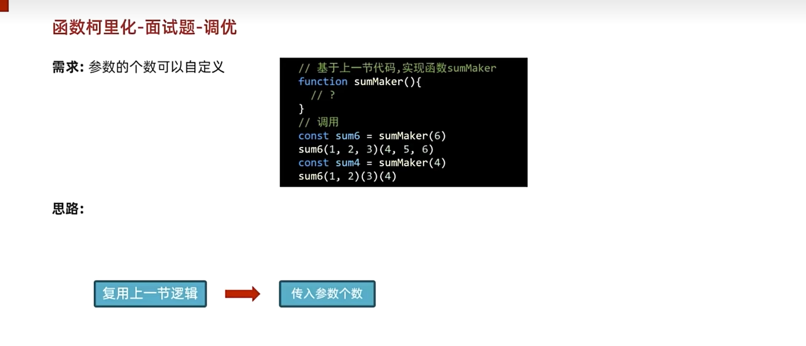
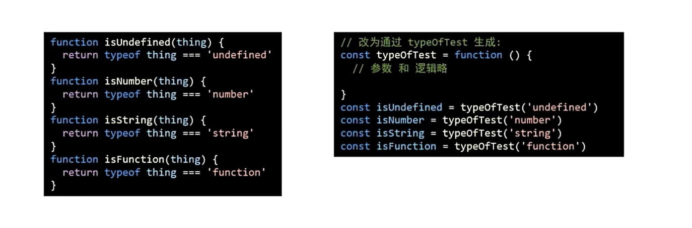
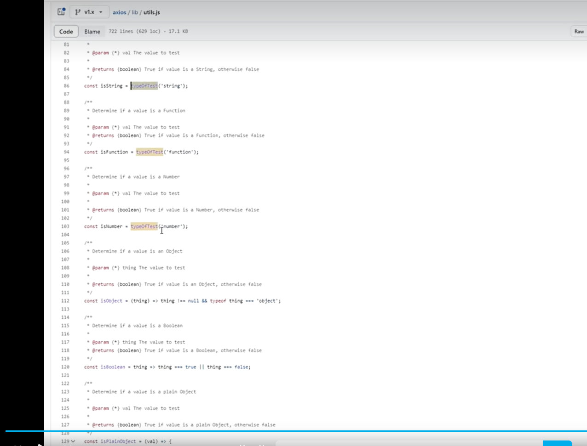

# 前端面试手写题集合

## 0. 实现 lazy 链式调用 :
person.eat().sleep(2).eat()

```js
// 函数的链式调用

```

## 1. 实现find方法，根据id 查找data树中的任意一项
```js
// 实现find方法，根据id 查找data树中的任意一项
const data = [
  {
    id: "1000",
    name: "深圳",
    children: [
      {
        id: "1001",
        name: "宝安区",
      },
      {
        id: "1002",
        name: "南山区",
      },
    ],
  },
  {
    id: "2000",
    name: "广州",
    children: [
      {
        id: "2001",
        name: "越秀区",
        children: [
          {
            id: "2002",
            name: "大东街道办事处",
          },
        ],
      },
      {
        id: "2003",
        name: "荔湾区",
      },
    
    ],
  }
];

const find = (data, id) => {
  for (let item of data) {
    if (item.id === id) {
      return item.name
    }
    if (item.children?.length) {
      const res = find(item.children, id)
      if (res && res !== "未找到") {
        return res
      } 
    }
  }
  return "未找到"
}


const r1 = find(data, "1000") // 深圳
const r2 = find(data, "1001") // 宝安区
const r3 = find(data, "2001") // 越秀区
const r4 = find(data, "2002") // 大东街道办事处
const r5 = find(data, "3003") // 未找到

console.log(r1)
console.log(r2)
console.log(r3)
console.log(r4)
console.log(r5)
```


## 链式调用函数的方式， 进行加减乘除运算
```js
// 链式调用函数的方式， 进行加减乘除运算
class MyCalculator {
  constructor(number) {
    this.number = number;
  }
  add(num) {
    this.number =  this.number + num
    return this;
  }
  minus(num) {
    this.number =  this.number - num
    return this;
  }
  multi(num) {
    this.number =  this.number * num

    return this;
  }
  div(num) {
    this.number =  this.number / num
    return this;
  }

  toString(){// 比较时候会触发隐式转换，需要自定义toString方法进行输出
    return this.number;
  }
}

const calculator = new MyCalculator(121);
if (calculator.add(1).minus(2).multi(3).div(4) == 90) {
  console.log("恭喜， 回答正确");
}

```
## 1. 发布订阅模式

```js

```

## 2. 防抖函数

```js
const func = function (e) {
  // @TODO
  console.log(e.target.value);
  rederCity(this.value);
};
const debounce = function (func, wait) {
  let timerId;
  return function (...args) {
    let _this = this;
    clearTimeout(timerId);
    timerId = setTimeout(() => {
      func.apply(_this, args);
    }, wait);
  };
};

const debounceFunc = debounce(func, 500);

document.getElementById("search-input").addEventListener("input", debounceFunc);
```

## 3. 节流函数

```js
const func = function (e) {
  console.log("timeupdate触发");
  console.log("e:", e);
  localStorage.setItem("currentTime", this.currentTime);
};

function throttle(func, wait = 0) {
  // TODO
  let timeId;
  return function (...args) {
    let _this = this;
    if (timeId) {
      return;
    }

    timeId = setTimeout(() => {
      func.apply(_this, args);
      timeId = undefined;
    }, wait);
  };
}

const throttleFn = throttle(func, 1000);
video.addEventListener("timeupdate", throttleFn);
```

## 4. 数组去重

### 方法一：使用 Set

```js
function uniqueArray(arr) {
  // @TODO
  return [...new Set(arr)];
}
```

### 方法二：使用 filter

```js
function uniqueArray(arr) {
  // @TODO
  return arr.filter((item, index, self) => {
    return self.indexOf(item) === index;
  });
}
```

### 方法三：使用 reduce

```js
function uniqueArray(arr) {
  // @TODO
  return arr.reduce((prev, curr) => {
    return prev.includes(curr) ? prev : [...prev, curr];
  }, []);
}
```


### 4.1 实现数组的myMap方法
```js
Array.prototype.myMap = function(fn, ctx) {
 let ret = []

 for(let i = 0; i< this.length; i++){
    ret.push(fn.call(ctx, this[i], i, this))
 }

 return ret
};


// 测试代码
const nums = [1, 2, 3, 4, 5];
console.log('Map:', nums.myMap(x => x * 2), [1,2]);
```

### 4.2 实现数组的myFilter方法
```js
Array.prototype.myFilter = function(fn, ctx) {
 let ret = []

 for(let i = 0; i< this.length; i++){
    const ret1 = fn.call(ctx, this[i], i, this)
    if (ret1) {
       ret.push(this[i])
    }
 }

 return ret
};


// 测试代码
const nums = [1, 2, 3, 4, 5];
console.log('Filter:', nums.myFilter(x => x > 2));

```

## 5. 数组扁平化

```js
function flatten(arr) {
  // @TODO
  const result = [];

  function flat(arr) {
    for (let i = 0; i < arr.length; i++) {
      if (Array.isArray(arr[i])) {
        flat(arr[i]);
      } else {
        result.push(arr[i]);
      }
    }
  }

  flat(arr);
  return result;
}

// 简化版本
function flattenES6(arr) {
  return arr.flat(Infinity);
}
```

## 6. 手写 Promise.all

```js
Promise.myAll = function (promises) {
  // @TODO
};
```

## 7. 手写 Promise.allSettled

```js
Promise.myAllSettled = function (promises) {
  // @TODO
};
```

## 8. 手写 call 方法

```js
const person = {
  name: '张三',
  age: 18,
  sex: '男'
}

Function.prototype.myCall = function (context = window, ...args) {
  // @TODO
  const key = Symbol()
  context[key] = this
  const res = context[key](...args) 
  delete  context[key]
  return res
};


const res = func.myCall(person, 10, 20);
console.log("res 返回值:", res);
```

## 9. 手写 apply 方法
与`myCall`方法一致，只是参数不同
```js
Function.prototype.myApply = function (context = window, args = []) {
  // @TODO
  const key = Symbol()
  context[key] = this
  const res = context[key](...args) 
  delete  context[key]
  return res
};
```

## 10. 手写 bind 方法

```js
// 1. 定义myBind方法
// 2. 返回绑定this的新函数
// 3. 合并绑定和新传入的参数

Function.prototype.myBind = function (context = window, ...args1) {
  // @TODO
  return (...regsArgs) => this.call(context, ...args1, ...regsArgs)
};

const bindFunc1 = func1.myBind(person, 10, 20);
const res1 = bindFunc1(30)
console.log("res1 返回值:", res1);

```

`apply实现`

```js
Function.prototype.myBind = function (context = window, ...args1) {
  // @TODO
  return (...regsArgs) => this.apply(context, [...args1, ...regsArgs])
};

// 调用并获取返回值
const bindFunc1 = func1.myBind(person, 10, 20);
const res1 = bindFunc1(30)
console.log("res1 返回值:", res1);
```

## 11. 手写 new 操作符

```js
function myNew(constructor, ...args) {
  // @TODO
}
```

## 12. 手写 instanceof

```js
function myInstanceof(obj, constructor) {
  // @TODO
}
```

## 13. 函数柯里化

将多个参数的函数，转换为单个参数的函数

```js
function curriedAdd(a) {
  // @TODO
  return function (b) {
    return function (c) {
      return a + b + c;
    };
  };
}

console.log(curriedAdd(1)(2)(3)); // 6
```

```js
// 需求： 改写函数，实现如下效果

// 思路：
// 1. 保存不定长参数 array
// 2. 是否达到长度
// 3. 累加5个参数， 返回函数

let nums = [];
function sum(...args) {
  // @TODO
  nums.push(...args);
  if (nums.length >= 5) {
    const res = nums.slice(0, 5).reduce((p, v) => p + v, 0);
    nums = []; // 注意累加之后需要清空数组，保证下次累加的值是正确的
    return res;
  } else {
    return sum;
  }
}

// 使用示例
function sum(a, b, c, d, e) {
  return a + b + c + d + e;
}
sum(1)(2)(3)(4)(5);
sum(1)(2, 3)(4)(5);
sum(1)(2, 3, 4)(5);
sum(1, 2, 3)(4, 5);
```



### 优化版本

```js
function sumMaker(length) {
  let nums = [];
  function sum(...args) {
    // @TODO
    nums.push(...args);
    if (nums.length >= length) {
      const res = nums.slice(0, length).reduce((p, v) => p + v, 0);
      nums = []; // 注意累加之后需要清空数组，保证下次累加的值是正确的
      return res;
    } else {
      return sum;
    }
  }
  return sum;
}

const sum6 = sumMaker(6);
sum6(1)(2)(3)(4)(5);

const sum4 = sumMaker(4);
sum4(1)(2)(3)(4);
```

### 柯里化应用--判断类型

**参数复用：** 为函数预制通用参数，供给多次重复调用





```js
const typeOfTest = function (type) {
  return function (obj) {
    // return Object.prototype.toString.call(obj) === `[object ${type}]`
    return typeof obj === type;
  };
};

const typeOfTest = (type) => (thing) => typeof thing === type;

const isString = typeOfTest("string");
const isNumber = typeOfTest("number");
const isBoolean = typeOfTest("boolean");
const isUndefined = typeOfTest("undefined");
const isFunction = typeOfTest("function");

const isObject = (type) => (thing) =>
  thing !== null && typeof thing === "object";
```

## 14. 实现深拷贝

```js
function cloneDeep(oldObj) {
  // TODO
  let newObj = Array.isArray(oldObj) ? [] : {};

  for (let k in oldObj) {
    if (typeof oldObj[k] === "object") {
      newObj[k] = cloneDeep(oldObj[k]);
    } else {
      newObj[k] = oldObj[k];
    }
  }

  return newObj;
}
```

## 15. 最大并发数限制的请求调度器

```js

```

## 16. 实现异步队列

```js

```

## 17. 实现 LRU 缓存

```js

```

## 18. 解析 URL 参数

```js
function parseURLParams(url) {
  // @TODO
  const params = {};
  // 提取URL中的查询字符串部分
  const queryString = url.split("?")[1];
  if (!queryString) return params;

  // 分割参数
  const pairs = queryString.split("&");

  for (const pair of pairs) {
    // 处理有等号和无等号的情况
    const [key, value = ""] = pair.split("=");
    // 解码URL编码的字符
    params[decodeURIComponent(key)] = decodeURIComponent(value);
  }

  return params;
}

// 使用URLSearchParams API的简化版本
function parseURLParamsModern(url) {
  const params = new URLSearchParams(url.split("?")[1]);
  return Object.fromEntries(params.entries());
}
```

## 19. 实现睡眠函数

```js
function sleep(ms) {
  // @TODO
  return new Promise((resolve) => setTimeout(resolve, ms));
}

// 使用示例
async function demo() {
  console.log("开始");
  await sleep(1000);
  console.log("延迟1秒后");
}
```

## 20. 实现数组原型方法

### forEach

```js
Array.prototype.myForEach = function (callback, thisArg) {
  // @TODO
  for (let i = 0; i < this.length; i++) {
    callback.call(thisArg, this[i], i, this);
  }
};
```

### map

```js
Array.prototype.myMap = function (callback, thisArg) {
  const result = [];
  for (let i = 0; i < this.length; i++) {
    result.push(callback.call(thisArg, this[i], i, this));
  }
  return result;
};
```

### filter

```js
Array.prototype.myFilter = function (callback, thisArg) {
  const result = [];
  for (let i = 0; i < this.length; i++) {
    if (callback.call(thisArg, this[i], i, this)) {
      result.push(this[i]);
    }
  }
  return result;
};
```

## 21 jquery 渲染表格，模拟虚拟 DOM

```html
<script src="https://cdn.bootcdn.net/ajax/libs/jquery/1.10.0/jquery.min.js"></script>

<body>
  <div id="container"></div>
  <button id="change-btn">change</button>

  <script>
    var data = [
      {
        name: "张三",
        age: 18,
        sex: "男",
      },
      {
        name: "李四",
        age: 19,
        sex: "男",
      },
      {
        name: "王五",
        age: 20,
        sex: "男",
      },
    ];

    // 渲染函数*/
    var render = function (data) {
      // todo
      var $container = $("#container");

      // 清空容器
      $container.empty();

      // 使用字符串拼接创建整个表格
      var tableHTML = "<table>";

      // 添加表头
      tableHTML +=
        "<thead><tr><th>姓名</th><th>年龄</th><th>性别</th></tr></thead>";

      // 添加表格内容
      tableHTML += "<tbody>";
      data.forEach(function (item, index) {
        tableHTML += "<tr>";
        tableHTML += "<td>" + item.name + "</td>";
        tableHTML += "<td>" + item.age + "</td>";
        tableHTML += "<td>" + item.sex + "</td>";
        tableHTML += "</tr>";
      });
      tableHTML += "</tbody>";
      tableHTML += "</table>";

      // 将整个表格HTML添加到容器
      $container.append(tableHTML);
    };

    $("#change-btn").click(function () {
      data[0].name = "zhangsan";
      data[1].age = 21;
      render(data);
    });

    render(data);
  </script>
</body>
```


