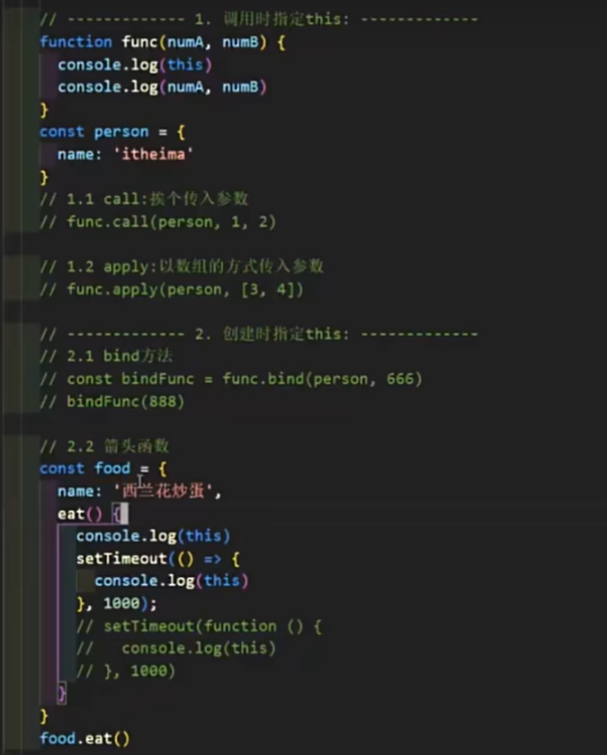
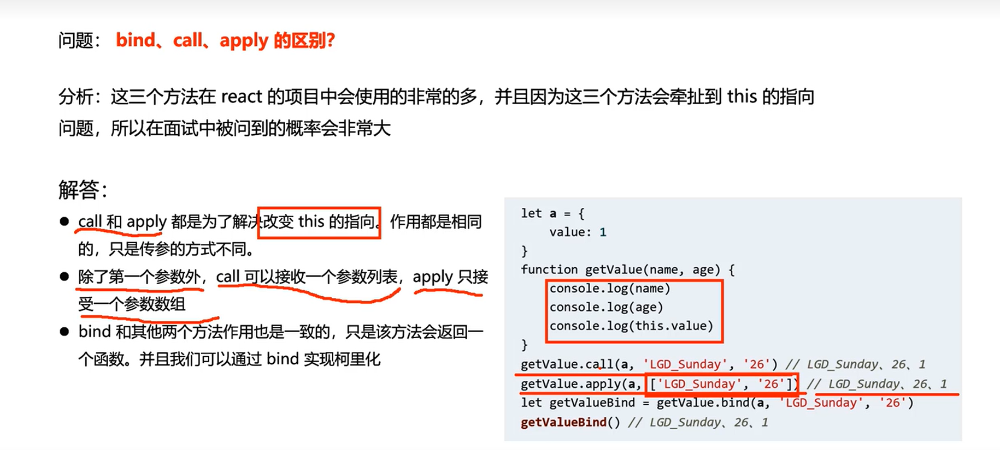
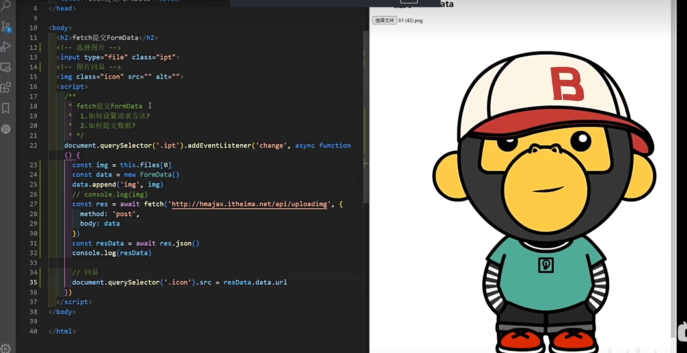
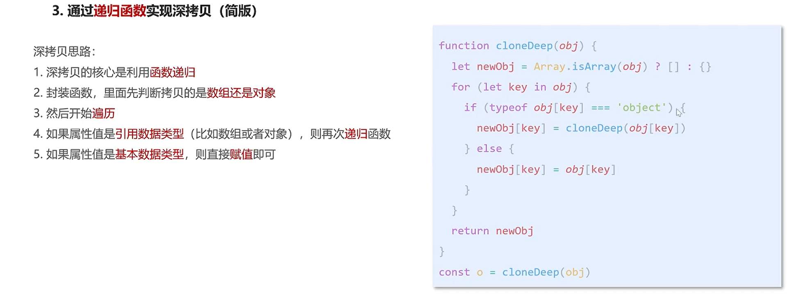
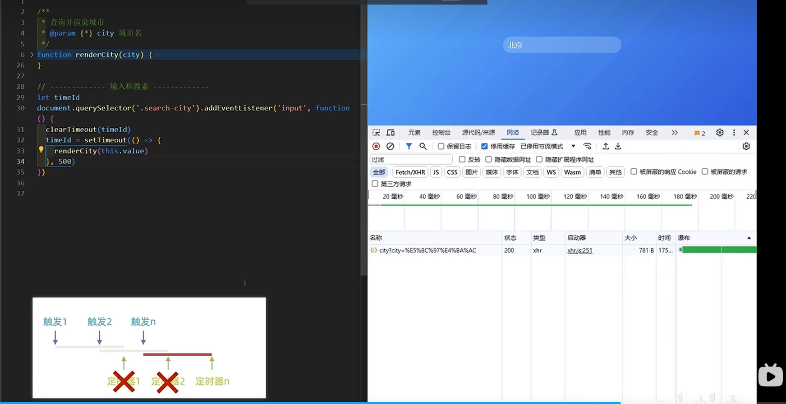
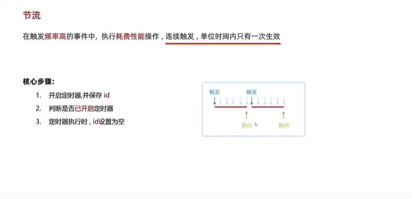
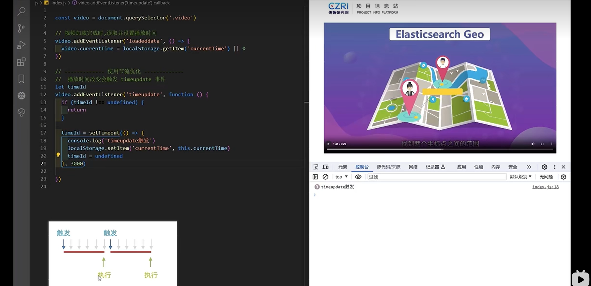
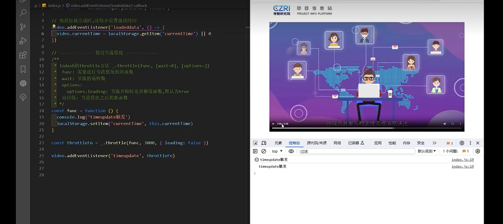

# 黑马程序员前端面试必看视频教程目录
[黑马程序员前端面试必看视频教程](https://www.bilibili.com/video/BV1mH4y1Q7Z7)
## Day 01: JavaScript 核心基础

2. **如何确认 this 的值** - 13:57 
指向一个对象

```js
// 1. 全局执行对象 window


// 2. 函数执行对象
function test() {
  console.log(this); // window
}

test()

// 2.1 方法执行对象
const obj = {
  name: '张三',
  age: 18,
  sex: '男',
}

function test() {
  console.log(this); // obj
}

test.call(obj)

```
3. **如何指定 this 的值** - 12:22
```js
// 1. 调用时指定：
//  - 1. call 方法， 参数依次传入， func.call(thisArg, 参数arg1, 参数arg2, ...)
//  - 2. apply 方法 ，参数数组, func.apply(thisArg, [参数arg1, 参数arg2, ...])


// 2. 创建时指定：
//  - 1. bind 方法， const bindFunc = func.bind(thisArg, 绑定参数arg1, 绑定参数arg2, ...)
//  - 2. 箭头函数 this指向，从父级的作用域上找

```





4. **手写 call 方法 01-核心功能** - 19:27
实现一个myCall方法，功能和调用形式与call一致
```js
const person = {
  name: '张三',
  age: 18,
  sex: '男'
}

function func(numA, numB) {
  console.log(this);
  console.log(numA, numB);
  return numA + numB;
}


function func1(numA, numB, numC) {
    console.log(this);
    console.log(numA, numB, numC);
    return numA + numB + numC;
  }

// 1. 定义myCall方法
// 2. 设置this并调用原函数
// 3. 接收剩余参数并返回结果
// 4. 使用 Symbol 调优
Function.prototype.myCall = function (thisArg, ...args) {
 // 2. 设置this并调用原函数
 thisArg.f = this
 // 3. 接收剩余参数并返回结果
 const res = thisArg.f(...args)

 delete thisArg.f

 return res
}


// 调用并获取返回值
const res = func.myCall(person, 10, 20);
console.log("res 返回值:", res);

const res1 = func1.myCall(person, 10, 20, 30);
console.log("res1 返回值:", res1);
```
5. **手写 call 方法 02-Symbol 调优** - 08:49

`f`属性改为`Symbol`
```js
// 1. 定义myCall方法
// 2. 设置this并调用原函数
// 3. 接收剩余参数并返回结果
// 4. 使用 Symbol 调优
Function.prototype.myCall = function (thisArg, ...args) {
 // 2. 设置this并调用原函数
 const key = Symbol()
 thisArg[key] = this
 // 3. 接收剩余参数并返回结果
 const res = thisArg[key](...args)

 delete thisArg[key]

 return res
}

```
6. **手写 apply 方法** - 09:49
```js
Function.prototype.myApply = function (thisArg, args=[]) {
  // @TODO
  const key = Symbol()
  context[key] = this // this是原函数
  const res = context[key](...args) 
  delete  context[key]
  return res
}


```
7. **手写 bind 方法** - 12:22
实现一个myBind方法，功能和调用形式与bind一致

```js
const person = {
  name: '张三',
  age: 18,
  sex: '男'
}

function func(numA, numB) {
  console.log(this);
  console.log(numA, numB);
  return numA + numB;
}


function func1(numA, numB, numC) {
    console.log(this);
    console.log(numA, numB, numC);
    return numA + numB + numC;
  }

// 1. 定义myBind方法
// 2. 返回绑定this的新函数
// 3. 合并绑定和新传入的参数

Function.prototype.myBind = function (thisArg, ...args) {


 return (...reArgs)=>{
  // this ： func1.myBind， this是原函数
  return this.call(thisArg,  ...args, ...reArgs)
 }
}


// 调用并获取返回值


const bindFunc1 = func1.myBind(person, 10, 20);
const res1 = bindFunc1(30)
console.log("res1 返回值:", res1);
```


8. **class 核心语法** - 14:49
9. **class 实现继承** - 10:22
10. **class 静态属性和私有属性** - 12:04
11. **寄生组合继承** - 14:24
12. **fetch 核心语法** - 15:50


```html
<!DOCTYPE html>
<html lang="zh-CN">
<head>
  <meta charset="UTF-8">
  <meta name="viewport" content="width=device-width, initial-scale=1.0">
  <title>fetch核心语法</title>
</head>
<body>
  <h2>fetch核心语法</h2>
  <button class="btn">测试</button>
  
  <script>
    /*
    fetch核心语法
    1.如何发请求?
    2.如何处理响应(JSON)?
    3.如何处理异常?
    */
    
    document.querySelector('.btn').addEventListener('click', async () => {
      // 创建查询参数
      const p = new URLSearchParams({ name: '广东省', cname: '深圳市' });
      
      // 1.如何发请求？默认GET方法，参数1 url地址，返回Promise
      const res = await fetch('http://hmajax.itheima.net/api/area' + p.toString());
      // const res = await fetch('http://hmajax.itheima.net/api/area12345');
      
      // 2.如何处理响应(JSON)? .json()方法解析json，返回Promise
      if (res.status >= 200 && res.status < 300) {
        const data = await res.json();
        console.log(data);
      } else {
        // 3.如何处理异常
        console.log('请求异常', res.status);
      }
    });
  </script>
</body>
</html>
```


13. **fetch 提交 FormData** - 08:36


```html
<!DOCTYPE html>
<html lang="en">
<head>
  <meta charset="UTF-8">
  <meta name="viewport" content="width=device-width, initial-scale=1.0">
  <title>Document</title>
</head>
<body>
  <h2>fetch提交FormData</h2>
  <!-- 选择图片 -->
  <input type="file" class="ipt">
  <!-- 图片显示 -->
  
  
  <script>
    /*
    fetch提交FormData
    1.如何设置请求方法?
    2.如何提交数据?
    */
    
    document.querySelector('.ipt').addEventListener('change', async function() {
      // 获取选择的文件
      const img = this.files[0];
      // 创建FormData对象
      const data = new FormData();
      // 添加文件到FormData
      data.append('img', img);
      
      // 发送fetch请求
      const res = await fetch('http://hmajax.itheima.net/api/uploading', {
        method: 'post',
        body: data  // FormData对象直接作为请求体
      });
      
      // 解析响应数据
      const resData = await res.json();
      console.log(resData);
      
      // 显示上传后的图片
      document.querySelector('.icon').src = resData.data.url;
    });
  </script>
</body>
</html>
```


```js
const httpHeaders = {
  "X-My-Custom-Header": "Zeke are cool",
};

const myHeaders = new Headers(httpHeaders);

// 创建FormData对象
const formData = new FormData();

formData.append("product", "devs");
formData.append("action", "ListProjects");
formData.append("sec_token", "tMpf6b3EH5PwIZ1f6V2P72");
formData.append("region", "cn-hangzhou");
formData.append(
  "params",
  JSON.stringify({ pageNumber: 1, pageSize: 1000, keyword: "" })
);

fetch(
  "https://functionai.console.aliyun.com/data/api.json?action=ListProjects&product=devs&_tag=",
  {
    method: "POST", // 指定请求方法为POST
    headers: httpHeaders,
    body: formData, // 将JSON字符串作为请求体发送
  }
)
  .then((response) => {
    // response的status 判断状态码

    return response.json(); // 解析响应为JSON
  }) // 解析响应为JSON
  .then((data) => {
    console.log("Success:", data); // 打印返回的数据
  })
  .catch((error) => {
    console.error("Error:", error); // 打印错误信息
  });
```

```js
// 获取表单元素
const form = document.querySelector("form");

// 监听表单提交事件
form.addEventListener("submit", async (event) => {
  event.preventDefault(); // 阻止表单默认提交行为

  try {
    const httpHeaders = {
      "Content-Type": "multipart/form-data",
      "X-My-Custom-Header": "Zeke are cool",
    };
    const myHeaders = new Headers(httpHeaders);

    // 创建FormData对象
    const formData = new FormData(form);

    // 也可以手动追加数据
    // formData.append('key', 'value');

    // 使用fetch发送请求
    const response = await fetch("/api/submit", {
      method: "POST",
      body: formData, // 将FormData对象作为请求体
      headers: myHeaders,
    });

    if (response.ok) {
      const result = await response.json(); // 假设服务器返回JSON
      console.log("提交成功:", result);
    } else {
      console.error("服务器返回错误状态:", response.status);
    }
  } catch (error) {
    console.error("网络请求失败:", error);
  }
});
```

14. **fetch 提交 JSON** - 11:33

```js
// 要发送的数据对象
const data = {
  name: "张三",
  age: 30,
};

// 将对象转换为JSON字符串
const jsonData = JSON.stringify(data);

// 使用fetch发送POST请求
fetch("https://www.baidu.com/api/submit", {
  method: "POST", // 指定请求方法为POST
  headers: {
    "Content-Type": "application/json", // 设置请求头为JSON格式
  },
  body: jsonData, // 将JSON字符串作为请求体发送
})
  .then((response) => {
    // response的status 判断状态码

    return response.json(); // 解析响应为JSON
  }) // 解析响应为JSON
  .then((data) => {
    console.log("Success:", data); // 打印返回的数据
  })
  .catch((error) => {
    console.error("Error:", error); // 打印错误信息
  });
```

15. **实现深拷贝** - 13:16

```js

// 深拷贝函数
/**
 * 1.先判断拷贝的是数组还是对象

 * 2. 遍历老对象的每一个属性， 赋值给新对象
 */
function cloneDeep(oldObj){
1.先判断拷贝的是数组还是对象
- 是对象，创建一个新对象
- 是数组，创建一个新数组
let newObj = Array.isArray(oldObj )? []: {}

2. 遍历 oldObj所有属性 for(let k in oldObj)
for(let k in oldObj){
	if(typeof oldObj[k] === 'object'){
		newObj[k] =cloneDeep(oldObj[k])
	}
	else{
	   newObj[k] = oldObj[k]
	}
}

3. 将oldObj的属性赋值给新对象 newObj

return newObj

}


const arr = [{name: '月月', age: 18}, {name: '才才', age: 18}]

const newArr= cloneDeep(arr)

console.log(arr )
console.log(newArr)


const obj = {
	name: '佩奇',
	family: { body: '小佩奇' },
                lover: {name: '张三', age: 12, hobby:['唱'， '跳', 'rap']},
	hobby: ['唱'， '跳', 'rap']
}

const newObj = cloneDeep(obj)

console.log(obj )
console.log(newObj)
```

## Day 02: 手写 Promise 全系列

1. **手写 promise-核心功能-构造函数** - 11:25
2. **手写 promise-核心功能-状态及原因** - 12:22
3. **手写 Promise-核心功能-then 方法-成功和失败回调** - 14:52
4. **手写 Promise-核心功能-then 方法-异步及多次调用** - 13:50
5. **手写 Promise-核心功能-异步任务-核心 api** - 13:58
6. **手写 Promise-核心功能-异步任务-函数封装** - 13:14
7. **手写 Promise-核心功能-链式编程-处理异常和普通内容** - 19:12
8. **手写 Promise-核心功能-链式编程-处理返回 Promise** - 11:11
9. **手写 Promise-核心功能-链式编程-处理重复引用** - 08:17
10. **手写 Promise-核心功能-链式编程-rejected 状态** - 12:24
11. **手写 Promise-链式编程-pending 状态** - 10:28
12. **手写 Promise-实例方法-catch** - 08:20
13. **手写 Promise-实例方法-finally** - 05:36
14. **手写 Promise-静态方法-resolve** - 08:59
15. **手写 Promise-静态方法-reject** - 03:24
16. **手写 Promise-静态方法-race** - 13:37
17. **手写 Promise-静态方法-all(实现到判断空数组)-修复** - 09:33
18. **手写 Promise-.静态方法-all(全部兑现及第一个拒绝)** - 14:13
19. **手写 Promise-静态方法-allSettled-核心用法** - 08:45
20. **手写 Promise-静态方法-allSettled-实现** - 14:19
21. **手写 Promise-静态方法-any-核心用法** - 08:18
22. **手写 Promise-静态方法-any-实现** - 15:16
23. **手写 Promise-PromiseAplus 测试** - 19:06

## Day 03: 函数柯里化与设计模式

1. **函数柯里化-介绍** - 07:42
2. **函数柯里化-面试题** - 12:16
将多个参数的函数，转换为单个参数的函数

```js
function curriedAdd(a) {
  // @TODO
  return function (b) {
    return function (c) {
      return a + b + c;
    };
  };
}

console.log(curriedAdd(1)(2)(3)); // 6
```

```js
// 需求： 改写函数，实现如下效果

// 思路：
// 1. 保存不定长参数 array
// 2. 是否达到长度
// 3. 累加5个参数， 返回函数

let nums = [];
function sum(...args) {
  // @TODO
  nums.push(...args);
  if (nums.length >= 5) {
    const res = nums.slice(0, 5).reduce((p, v) => p + v, 0);
    nums = []; // 注意累加之后需要清空数组，保证下次累加的值是正确的
    return res;
  } else {
    return sum;
  }
}

// 使用示例
function sum(a, b, c, d, e) {
  return a + b + c + d + e;
}
sum(1)(2)(3)(4)(5);
sum(1)(2, 3)(4)(5);
sum(1)(2, 3, 4)(5);
sum(1, 2, 3)(4, 5);
```

3. **函数柯里化-面试题-调优** - 07:39
4. **函数柯里化应用-类型判断** - 11:46

**参数复用：** 为函数预制通用参数，供给多次重复调用


```js
const typeOfTest = function (type) {
  return function (obj) {
    // return Object.prototype.toString.call(obj) === `[object ${type}]`
    return typeof obj === type;
  };
};

const typeOfTest = (type) => (thing) => typeof thing === type;

const isString = typeOfTest("string");
const isNumber = typeOfTest("number");
const isBoolean = typeOfTest("boolean");
const isUndefined = typeOfTest("undefined");
const isFunction = typeOfTest("function");

const isObject = (type)  => (thing) =>  thing !== null && typeof thing === "object";
```

5. **设计模式-工厂模式** - 10:31


6. **设计模式-单例模式-自己实现单例方法** - 09:30
7. **设计模式-单例模式-源码学习** - 11:23
8. **设计模式-观察者模式** - 03:39
9. **设计模式-发布订阅模式-实现$on和$emit** - 22:10
10. **设计模式-发布订阅模式-实现$off和$once** - 10:38
11. **设计模式-原型模式** - 08:30
12. **设计模式-代理模式** - 15:13
13. **设计模式-迭代器模式-forin 和 forof** - 09:04
14. **迭代器模式-可迭代对象** - 19:22

## Day 04: 性能优化 - 防抖与节流

1. **防抖的适用场景** - 11:09
   防止页面出现抖动
2. **防抖的实现** - 11:12

- 开启定时器
- 清除已开启的定时器
  

3. **防抖工具函数 debounce** - 08:31

## React 中实现 Input 搜索防抖

在 React 应用中，实现输入框搜索防抖需要注意以下几点：

1. 使用 useRef 保存定时器 ID，确保不会被组件重新渲染清除
2. 使用 useCallback 包裹处理函数，避免不必要的重新创建
3. 在组件卸载时清除定时器，防止内存泄漏

### 方法一：基础实现

```jsx
import React, { useState, useRef, useEffect } from "react";

function SearchInput() {
  const [searchTerm, setSearchTerm] = useState("");
  const [results, setResults] = useState([]);
  // 使用useRef保存定时器ID
  const debounceTimeoutRef = useRef(null);

  const handleSearch = (value) => {
    // 清除之前的定时器
    if (debounceTimeoutRef.current) {
      clearTimeout(debounceTimeoutRef.current);
    }

    // 设置新的定时器
    debounceTimeoutRef.current = setTimeout(() => {
      // 模拟API调用
      console.log("搜索:", value);
      // fetchResults(value).then(setResults);
    }, 500);
  };

  const handleInputChange = (e) => {
    const value = e.target.value;
    setSearchTerm(value);
    handleSearch(value);
  };

  // 组件卸载时清除定时器
  useEffect(() => {
    return () => {
      if (debounceTimeoutRef.current) {
        clearTimeout(debounceTimeoutRef.current);
      }
    };
  }, []);

  return (
    <div>
      <input
        type="text"
        value={searchTerm}
        onChange={handleInputChange}
        placeholder="搜索..."
      />
      <div>
        {results.map((result, index) => (
          <div key={index}>{result}</div>
        ))}
      </div>
    </div>
  );
}

export default SearchInput;
```

### 方法二：自定义 Hook 实现（最推荐的）

```jsx
import React, { useState, useEffect, useRef, useCallback } from "react";

// 自定义防抖Hook
function useDebounce(value, delay) {
  const [debouncedValue, setDebouncedValue] = useState(value);

  useEffect(() => {
    const handler = setTimeout(() => {
      setDebouncedValue(value);
    }, delay);

    return () => {
      clearTimeout(handler);
    };
  }, [value, delay]);

  return debouncedValue;
}

function SearchInput() {
  const [searchTerm, setSearchTerm] = useState("");
  const [results, setResults] = useState([]);
  // 使用自定义Hook获取防抖后的值
  const debouncedSearchTerm = useDebounce(searchTerm, 500);

  // 使用useCallback优化搜索函数
  const fetchResults = useCallback(async (term) => {
    if (!term.trim()) {
      setResults([]);
      return;
    }

    try {
      // 实际项目中这里会调用API
      console.log("执行搜索:", term);
      // const response = await fetch(`/api/search?query=${encodeURIComponent(term)}`);
      // const data = await response.json();
      // setResults(data);
    } catch (error) {
      console.error("搜索失败:", error);
    }
  }, []);

  // 当防抖后的值变化时执行搜索
  useEffect(() => {
    fetchResults(debouncedSearchTerm);
  }, [debouncedSearchTerm, fetchResults]);

  return (
    <div>
      <input
        type="text"
        value={searchTerm}
        onChange={(e) => setSearchTerm(e.target.value)}
        placeholder="搜索..."
      />
      <div className="search-results">
        {results.length === 0 ? (
          <div className="no-results">{searchTerm && "无搜索结果"}</div>
        ) : (
          results.map((result, index) => (
            <div key={index} className="result-item">
              {result}
            </div>
          ))
        )}
      </div>
    </div>
  );
}

export default SearchInput;
```


```js
const func = function (e) {
  console.log(e.target.value);
  rederCity(this.value);
};
const debounce = function (func, wait) {
  let timerId;
  return function (...args) {
    let _this = this;
    clearTimeout(timerId);
    timerId = setTimeout(() => {
      func.apply(_this, args);
    }, wait);
  };
};

const debounceFunc = debounce(func, 500);

document.getElementById("search-input").addEventListener("input", debounceFunc);
```

5. **节流的适用场景和手写** - 15:58
   
   



6. **节流工具函数 throttle** - 12:24

   ```javascript
   var video = document.getElementById("video");

   video.addEventListener("loadeddata", function () {
     video.currentTime = localStorage.getItem("currentTime") || 0;
   });

   // 使用节流优化
   const func = function () {
     console.log("timeupdate触发");
     localStorage.setItem("currentTime", this.currentTime);
   };

   const throttleFn = _.throttle(func, 3000, { leading: false });

   video.addEventListener("timeupdate", throttleFn);
   ```

7. **手写节流工具函数 throttle** - 15:27

```js
const func = function (e) {
  console.log("timeupdate触发");
  console.log("e:", e);
  localStorage.setItem("currentTime", this.currentTime);
};

function throttle(func, wait = 0) {
  // TODO
  let timeId = undefined;
  return function (...args) {
    let _this = this;
    if (timeId !== undefined) {
      return;
    }

    timeId = setTimeout(() => {
      func.apply(_this, args);
      timeId = undefined;
    }, wait);
  };
}

const throttleFn = throttle(func, 1000);
video.addEventListener("timeupdate", throttleFn);
```

8. **防抖和节流总结** - 07:07

## 核心知识点总结

### JavaScript 基础

- **this 绑定机制**：确认和指定 this 值
- **函数原型方法**：手写 call、apply、bind 方法
- **面向对象编程**：class 语法、继承、静态属性和私有属性
- **异步编程**：fetch API、Generator 函数

### Promise 深入理解

- **Promise 核心实现**：构造函数、状态管理、then 方法
- **链式调用**：异常处理、Promise 返回值处理
- **Promise API**：实例方法(catch、finally)和静态方法(resolve、reject、race、all、allSettled、any)
- **PromiseA+规范**：符合规范的 Promise 实现与测试

### 函数式编程

- **函数柯里化**：概念、实现和应用
- **类型判断**：使用柯里化优化类型检测

### 设计模式

- **创建型模式**：工厂模式、单例模式、原型模式
- **行为型模式**：观察者模式、发布订阅模式、迭代器模式
- **结构型模式**：代理模式

### 性能优化

- **防抖(Debounce)**：适用场景和实现
- **节流(Throttle)**：适用场景和实现
- **性能优化策略**：何时使用防抖，何时使用节流
