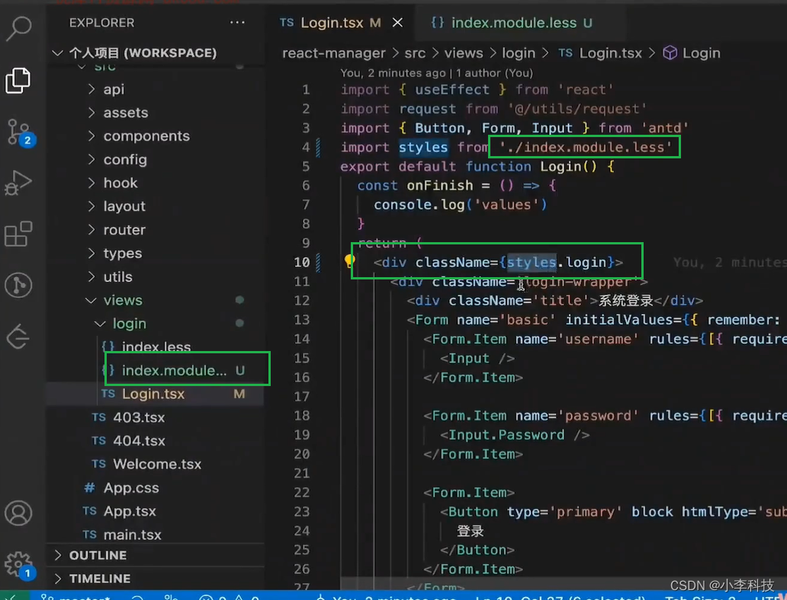
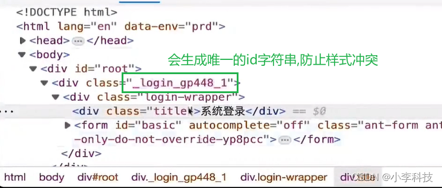

## CSS Module

### 什么是 CSS Module？

CSS Modules 不是官方规范或浏览器中的实现，而是构建步骤中的一个过程（在 Webpack 或 Browserify 的帮助下），它改变了类名和选择器的作用域（即有点像命名空间）。

目的：**解决 CSS 中全局作用域的问题**

### 开启 CSS Module

在 React 中默认开启了 CSS Module，样式表文件需要以 `xxx.module.sass/less/css` 命名。



### 作用域

默认Less或者CSS的规则是全局生效的，任何一个组件，只要有同名的className就会共用样式。

CSS Module可以有效避免作用域问题，它会生成一个唯一的标识作为className

### 全局作用域(:global)
> 修改第三方组件样式
> :global(), 保证包裹的变量不受影响
如果我们想要修改第三方组件样式，默认情况通过css-module无法修改，需要添加:global才可以。

```css
.login {
  height: 100vh;
  background: url(/imgs/login_bg.jpeg) no-repeat;
  background-size: cover;
  background-position: center;
  :global(.title) {
    font-size: 42px;
    line-height: 1.5;
    text-align: center;
    margin-bottom: 30px;
  }
  :global(.ant-btn-primary) {
    background-color: red;
  }
}
```
