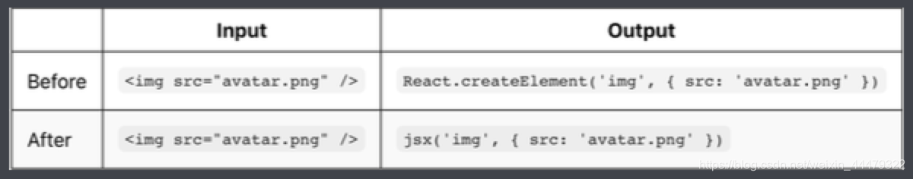
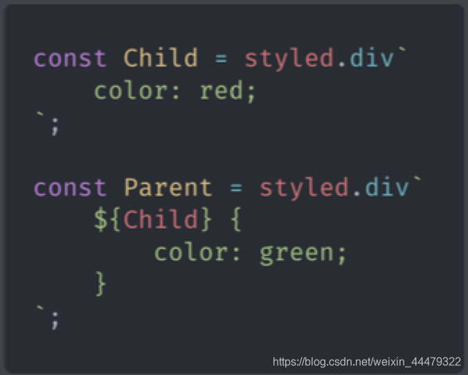
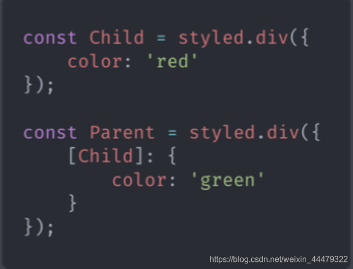
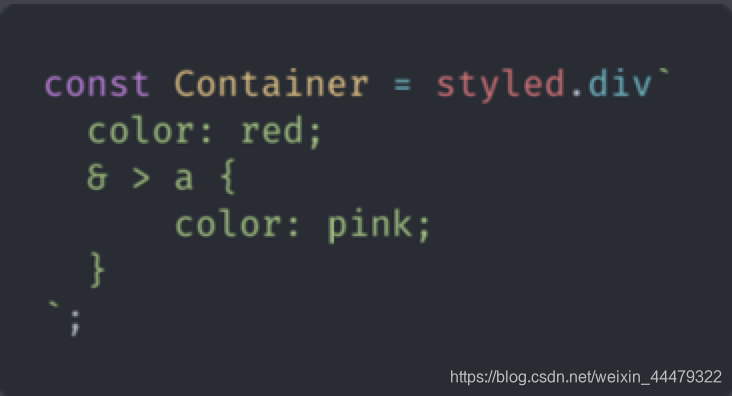
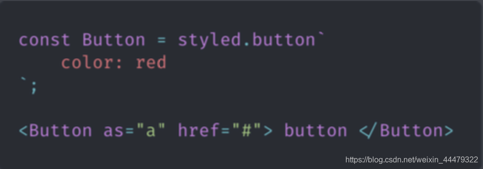
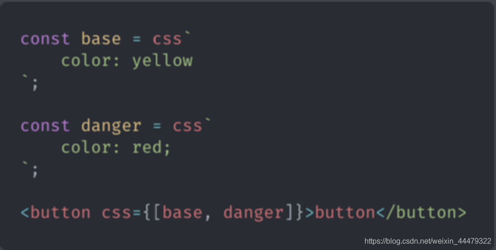
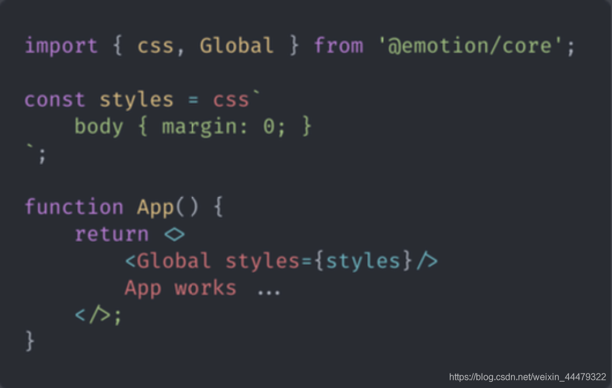

## CSS-in-js


相关文章:

https://blog.csdn.net/u012961419/article/details/117216004


1. 为什么会有 CSS-IN-JS
   CSS-IN-JS 是 WEB 项目中将 CSS 代码捆绑在 JavaScript 代码中的解决方案.

这种方案旨在解决 CSS 的局限性, 例如缺乏动态功能, 作用域和可移植性.
将css与js放在一起，方便组件移植，并且让其有自己的作用域，与VUE 中的 style 中的 scoped 作用一样。

2. CSS-IN-JS 方案的优缺点
   优点：

让 CSS 代码拥有独立的作用域, 阻止 CSS 代码泄露到组件外部, 防止样式冲突.
让组件更具可移植性, 实现开箱即用, 轻松创建松耦合的应用程序
让组件更具可重用性, 只需编写一次即可, 可以在任何地方运行. 不仅可以在同一应用程序中重用组件, 而且可以在使 用相同框架构建的其他应用程序中重用组件.
让样式具有动态功能, 可以将复杂的逻辑应用于样式规则, 如果要创建需要动态功能的复杂UI, 它是理想的解决方案.
缺点：

为项目增加了额外的复杂性.
自动生成的选择器大大降低了代码的可读性
推荐使用CSS-IN-JS方案

3. Emotion 库
   Emotion 是一个旨在使用 JavaScript 编写 CSS 样式的库. 实现 CSS-IN-JS 方案

3.1下载

> npm install @emotion/core @emotion/styled

3.2使用方式
1、JSX Pragma

通知 babel, 不再需要将 jsx 语法转换为 React.createElement 方法, 而是需要转换为 jsx 方法.



``` js
/** @jsx jsx **/  //注释也要写
import { jsx } from '@emotion/core';

function App() {
	return <div css={{ width: 200, height: 200 }}>lalal</div>
}

```

2、 Babel Preset

npm run eject 使用其弹窗 react 配置
在 package.json 文件中找到 babel 属性, 加入如下内容

``` js
"presets":[
	"react-app",
	"@emotion/babel-preset-css-prop"
]
```

之后便可在组件中直接使用css={}属性
推荐使用第二种方式

3.3 css方法

``` js
import { css } from '@emotion/core';
// 方式1 推荐
const style = css`
	width: 100px;
	background: skyblue;
`;
// 方式2
style = css({
	width: 100,
	background: 'skyblue'
})
```


``` js
<div css={style}> App </div>
```


3.4 css 属性优先级
props 对象中的 css 属性优先级高于组件内部的 css 属性.
在调用组件时可以在覆盖组件默认样式.

及外部优先级大于内部的

3.5 Styled Components 样式化组件
样式化组件就是用来构建用户界面的，是 emotion 库提供的另一种为元素添加样式的方式。

3.5.1 创建样式化组件
用法

``` js
import { styled } from '@emotion/styled';

const Conter = styled.div`  //也可使用对象形式
  width: 100px;
  height: 100px;
`;

function App() {
  return <div>
  	App works
  	<Conter/>
  </div>;
}
```


3.5.2 根据 props 属性覆盖样式

``` js
import { styled } from '@emotion/styled';

const Conter = styled.div`  //也可使用对象形式
  width: ${props => props.width || '100px'};
  height: 100px;
`;
// ----------------------
const Conter = styled.div(props => ({  //对象形式
  width: props && props.width || '100px',
  height: '100px'
)});

function App() {
  return <div>
  	App works
  	<Conter width={100}/>
  </div>;
}
```


3.5.3 为任何组件添加样式

3.5.3 为任何组件添加样式

``` js
import { styled } from '@emotion/styled';

function Demo ({className}) {
	return <div className={className}>Demo</div>
}

const Conter = styled(Demo)`
  width: 100px;
  height: 100px;
  color: red;
`;

function App() {
  return <div>
  	<Conter/>
  </div>;
}
```

3.5.4 通过父组件设置子组件样式



或者 



如果不生效 (需要 babel 插件支持)
babel 插件配置

> npm install babel-plugin-emotion

在 package.json 文件中找到 babel 属性, 加入如下内容：

``` js
"babel": {
	"plugins": ["emotion"]
}
```

3.5.5 嵌套选择器 &
& 表示组件本身.



3.5.6 as 属性
要使用组件中的样式, 但要更改呈现的元素, 可以使用 as 属性.



as 可以改变组件的标签；

3.6 样式组合




在样式组合中, 后调用的样式优先级高于先调用的样式. 后覆盖前的；

3.7 全局样式

引入 Global 组件

3.8 关键帧动画
引入 keyframes 组件

> import { css, keyframes } from '@emotion/core';





3.9 主题
下载主题模块

> npm install emotion-theming

使用

``` js
// index.js
import React from 'react';
import ReactDOM from 'react-dom';
import App from './App';
// 引入 ThemeProvider 组件
import { ThemeProvider } from 'emotion-theming';
// 主题
const theme = {
  colors: {
    primary: 'tomato'
  }
};

ReactDOM.render(
  // 将 ThemeProvider 放置在视图在最外层
  <ThemeProvider theme={theme}><App /></ThemeProvider>,
  document.getElementById('root')
);
```


``` js
// app.js
import React from 'react';
import { css, keyframes } from '@emotion/core';
import { styled } from '@emotion/styled';
import { useTheme } from 'emotion-theming';
// 获取主题
const primaryColor = props => css`
  color: ${props.colors.primary}
`

function App() {
  console.log(useTheme()); // 获取主题

  return <div css={primaryColor}>
    App works
    <Conter/>
  </div>;
}

export default App;
```
