---

---

## cml 框架与 wx 小程序对比

[TOC]

## 一 目录结构

1. 小程序目录结构

   

2. cml 目录结构

   https://cmljs.org/doc/framework/structure.html

## 二 项目结构

1. 小程序

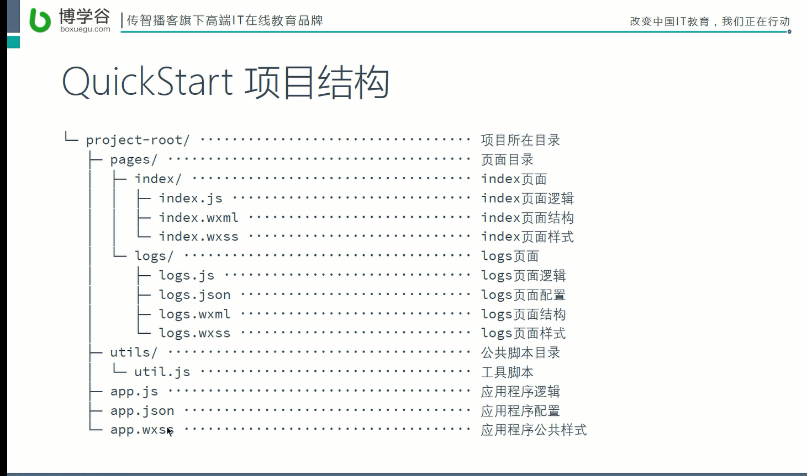

2. cml

   ```
   ├── chameleon.config.js                 // 项目的配置文件
   ├── dist                                // 打包产出目录
   ├── mock                                // 模拟数据目录
   ├── node_modules                        // npm包依赖
   ├── package.json
   └── src                                 // 项目源代码
       ├── app                             // app启动入口
       ├── components                      // 组件文件夹
       ├── pages                           // 页面文件夹
       ├── router.config.json              // 路由配置文件
       └── store                           // 全局状态管理
   
   ```

## 三 页面文件组成

1. 小程序(.wxml + .wxss + .js + .json)

   > **约定大于配置:** 要求文件夹的名称 , 与文件内的文件名称保持一致 , 保证之后的使用方便

   1. wxml 

      > <!--wxml: wei xin markup language-->
      >
      > <!--基于XML语言, 用来定义页面结构-->

   2. wxss (可选)

      > wxss : wei xin style sheet
      >
      > 完全遵循css 语法, 单位这点比css 高级 **rpx**
      >
      > 定义页面样式

   3. js 

      > 获取应用实例 完成页面的逻辑, 包括功能的实现..

   4. json(可选)

      > 配置
      >
      > 覆盖 **app.json** 中定义的选项

      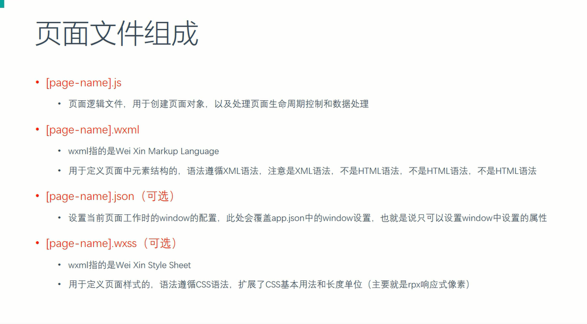

2. cml(.cml)

   + cml

     + CML

       > Chameleon Markup Language
       >
       > CML 为用户提供了一系列[组件](https://cmljs.org/doc/component/base/base.html)。CML 中还支持**模板语法**，例如条件渲染、列表渲染，数据绑定等等,更多参见[CML](https://cmljs.org/doc/view/cml.html)。

     + CMSS(可选)

       > CMSS(Chameleon Style Sheets)用于描述 CML 页面结构的样式语言，其具有大部分 CSS 的特性，也做了一些扩充和修改。单位这点比css 高级 **cpx**

     + JS 逻辑交互

       > JS 语法用于处理页面的逻辑部分，cml 文件``标签中的`export default`导出的 VM 对象即采用 JS 语法。它负责业务逻辑、交互逻辑的处理与  驱动视图更新，拥有完整的生命周期，watch，computed，**数据双向绑定**等优秀的特性，能够快速提高开发速度、降低维护成本。
       >
       > - data 为数据。
       > - props 为  属性，父组件进行传递。
       > - computed 为计算属性， 是动态的数据，可以对数据进行逻辑处理后返回结果。
       > - watch 为侦听属性，监听数据的变化，触发相应操作。
       > - methods 为方法 ，处理业务逻辑与交互逻辑。
       > - beforeCreate、created 等生命周期，掌握生命周期的触发时机，做相应操作。

     + JSON 配置(可选)

     ## 四 配置

     1. 小程序

        1. app.json

           主要下面 **5 个 选项**

           | 属性                                                         | 类型     | 必填 | 描述                          | 最低版本 |
           | :----------------------------------------------------------- | :------- | :--- | :---------------------------- | :------- |
           | [pages](https://developers.weixin.qq.com/miniprogram/dev/reference/configuration/app.html#pages) | string[] | 是   | 页面路径列表                  |          |
           | [window](https://developers.weixin.qq.com/miniprogram/dev/reference/configuration/app.html#window) | Object   | 否   | 全局的默认窗口表现            |          |
           | [tabBar](https://developers.weixin.qq.com/miniprogram/dev/reference/configuration/app.html#tabBar) | Object   | 否   | 底部 `tab` 栏的表现           |          |
           | [networkTimeout](https://developers.weixin.qq.com/miniprogram/dev/reference/configuration/app.html#networkTimeout) | Object   | 否   | 网络超时时间                  |          |
           | [debug](https://developers.weixin.qq.com/miniprogram/dev/reference/configuration/app.html#debug) | boolean  | 否   | 是否开启 debug 模式，默认关闭 |          |

           > window
           >
           > {
           >
           > "navigationBarBackgroundColor": "#219bf3",   // 导航条背景颜色
           >
           > "navigationBarTextStyle": "white", //  导航条文本颜色
           >
           > "navigationBarTitleText": "Hello world", // 导航条 文字
           >
           > "backgroundColor":"#f0f", // 窗口背景颜色
           >
           > "backgroundTextStyle":"dark", // 下拉 loading 的样式，仅支持 `dark` / `light`
           >
           > "enablePullDownRefresh":true // 是否开启下拉刷新 ,默认 :false
           >
           > }

           > debug
           >
           > "debug": true, // 开启调试模式, 会在控制台显示调试信息

        2. 页面的配置文件 page.json

           ``` json
             "tabBar": {
               "color": "#444", // 前景色
               "selectedColor": "#219bf3", // 选中项颜色
               "backgroundColor": "#e0e0e0", // 背景色
               "position": "bottom", // 标签栏位置
               "borderStyle": "white", // 边框样式 white| black
               "list": [ // 页面下方的标签按钮 , 最多 5 个
                 {
                   "pagePath": "pages/index/index", // 页面路径
                   "text": "首页", // 页面文本
                   "iconPath": "images/home.png", // 页面图标路径
                   "selectedIconPath": "images/home-actived.png" // 选中图标的路径
                 },
                 {
                   "pagePath": "pages/logs/logs",
                   "text": "日志",
                   "iconPath": "images/note.png",
                   "selectedIconPath": "images/note-actived.png"
                 }
               ]
             },
           ```

## 四 逻辑与页面分离结构

 1. 逻辑层

    > 由 js 完成, 业务数据供给界面事件处理

 2. 界面层

    > 界面结构 (WXML)
    >
    > 页面样式(WXSS)
    >
    > 由  **事件**-----------发送给**逻辑层,**   展示逻辑层的数据


  ### 逻辑层 js 差异

> CommJS 规范

``` js
// 1. 小程序不是运行在浏览器中,没有BOM, 和DOM 对象
// console.log(window); => undefined
// console.log(document);  => undefined


// 2. 小程序的JS 中有一些额外的成员, 这些成员是全局的, 意味着在每个 页面都可以使用
// App 方法 用于定义应用程序实例对象
// Page 方法 用于定义页面对象
// getApp 方法 用来获取全局应用程序对象
// getCurrentPages 方法 用来获取当前页面的 调用栈(数组, 最后一个就是当前页面) 
// wx 对象 用来提供核心API 的
// console.log(wx);

// 3. 小程序的JS 是支持 CommJs 规范的
const foo = require('./utils/foo');

foo.say('world')
```

utils/foo.js

``` js
function say(msg) {
    console.log('Hello ' + msg);
}


// 导出 say 方法
module.exports = {
    say: say
}

// 不支持exports.xxx 只支持module.exports
// exports.say = {}
```


### 界面层

####  1. 数据绑定

> 数据绑定使用 Mustache 语法（双大括号）将变量包起来，可以作用于：
>
> 类似**模板引擎**

``` html
<view> {{ message }} </view>
```

``` js
Page({
  data: {
    message: 'Hello MINA!'
  }
})
```

>   框架最大的特点就是让我们开发者必须按照特定的方式编写代码,
>
>   框架细节开发者不需要关心

``` html
<!--index.wxml-->
<!--wxml: wei xin markup language-->
<!--基于XML语言, 用来定义页面结构-->
<!-- 
  框架最大的特点就是让我们开发者必须按照特定的方式编写代码,
  框架细节开发者不需要关心
 -->
<!-- 
  1.数据在哪 (当前页面对象的 data 属性中)
  2.绑定到哪里去 (想绑定到哪, 就在哪里用 mustache 语法输出)
-->
<view class="container">
  <!-- 这种 {{}} 语法叫做 mustache -->
  <text>{{ message }}</text>
  <text>{{ person.name }} - {{ person.age }}</text>

  <!-- 在标签的属性中 使用 mustache 语法, (根据逻辑 控制 css 样式的值) -->
  <!-- mustache 语法可以用在
  1. innerHTML (类型)
  2. 元素的属性上
  不能用在标签名和属性名上
 -->
  <view class="word {{ viewClassName }}">1</view>

<!-- 
  可以直接使用字面量和简单的逻辑运算符
 -->
  <text>{{ 'hello' }}</text>
  <text>{{ 111 }}</text>
  <text>{{ 111+999 }}</text>
  <text>{{ 100>50?'你对了':'你错了' }}</text>

  <!-- 
    当语法解析误解了 true/ false
    可以使用 {{}} 解决
   -->
  <checkbox checked="{{ false }}">
  </checkbox>
</view>
```

``` js
//index.js
//获取应用实例
// 完成页面的逻辑, 包括功能的实现..
const app = getApp()

Page({
  // 为页面提供数据的
  // data 就是页面和逻辑之间的桥梁
  data: {
    message: "Hello world",
    person:{
      name:"张三",
      age:23
    },
    viewClassName:"hello"
  }
})
```

##### 注意

``` html
  <!-- 
    当语法解析误解了 true/ false
    可以使用 {{}} 解决
   -->
  <checkbox checked="{{ false }}">
  </checkbox>
```

***特别注意：不要直接写 `checked="false"`，其计算结果是一个字符串，转成 boolean 类型后代表真值。***


```html
<view wx:for="{{[1,2,3]}} ">
  {{item}}
</view>
```

等同于

```html
<view wx:for="{{[1,2,3] + ' '}}">
  {{item}}
</view>
```

**注意：** 花括号和引号之间如果有空格，将最终被解析成为字符串

```html
<template is="objectCombine" data="{{for: a, bar: b}}"></template>
Page({
  data: {
    a: 1,
    b: 2
  }
})
```

最终组合成的对象是 `{for: 1, bar: 2}`

也可以用扩展运算符 `...` 来将一个对象展开

```html
<template is="objectCombine" data="{{...obj1, ...obj2, e: 5}}"></template>
Page({
  data: {
    obj1: {
      a: 1,
      b: 2
    },
    obj2: {
      c: 3,
      d: 4
    }
  }
})
```

最终组合成的对象是 `{a: 1, b: 2, c: 3, d: 4, e: 5}`。

如果对象的 key 和 value 相同，也可以间接地表达。

```html
<template is="objectCombine" data="{{foo, bar}}"></template>
Page({
  data: {
    foo: 'my-foo',
    bar: 'my-bar'
  }
})
```

最终组合成的对象是 `{foo: 'my-foo', bar:'my-bar'}`。

**注意**：上述方式可以随意组合，但是如有存在变量名相同的情况，后边的会覆盖前面，如：

```html
<template is="objectCombine" data="{{...obj1, ...obj2, a, c: 6}}"></template>
Page({
  data: {
    obj1: {
      a: 1,
      b: 2
    },
    obj2: {
      b: 3,
      c: 4
    },
    a: 5
  }
})
```

最终组合成的对象是 `{a: 5, b: 3, c: 6}`。

#### 2.列表渲染

``` html
  <!-- 
    列表数据渲染
-->
  <!-- <view>
    <view>
      <checkbox checked="{{ true }}"></checkbox>
      <text>JavaScript</text>
    </view>

    <view>
      <checkbox checked="{{ false }}"></checkbox>
      <text>HTML</text>
    </view>
    <view>
      <checkbox checked="{{ true }}"></checkbox>
      <text>CSS</text>
    </view>
  </view> -->
  <view>
    <view wx:for="{{todos}}" wx:for-item="aaa" wx:for-index="i">
      <view>
        <text>{{ i }} . </text>
        <checkbox checked="{{ aaa.completed }}"></checkbox>
        <text> {{aaa.name}}</text>
        <text> {{item}}</text>
        <!-- 如果全局属性中有 item 这种关键词 ,  
            需要使用wx:for-index="idx"
            wx:for-item="itemName" 指定关键词(使用 wx:for-item
              给当前遍历数据起名字
            )
        
        -->
      </view>
    </view>
  </view>
  <!-- 
  基本的循环
    1. 明确页面结构中的循环体
    2. 删除多余的重复内容, 只保留一个
    3. 在剩下的这个上加上wx:for 属性, 属性值等于要遍历的数据源, 数据源必须是一个数组
    4. 在这个标签(循环体) 内部使用item 代表当前被遍历的元素

    给被遍历的对象定义名称: wx:for-item
    给遍历的下标(索引) 定义名称 : wx:for-index
   -->
  <view wx:for="{{[1, 2, 3, 4, 5, 6, 7, 8, 9]}}" wx:for-item="i">
    <view wx:for="{{[1, 2, 3, 4, 5, 6, 7, 8, 9]}}" wx:for-item="j">
      <!-- wx:if  用来根据一个bool 值 决定显示或隐藏 -->
      <view wx:if="{{i <= j}}">
        {{i}} * {{j}} = {{i * j}}
      </view>
    </view>
  </view>

```

``` js
//index.js
//获取应用实例
// 完成页面的逻辑, 包括功能的实现..
const app = getApp()

Page({
  // 为页面提供数据的
  // data 就是页面和逻辑之间的桥梁
  data: {
    item: "haha",
    todos: [{
        name: 'JavaScript',
        completed: false
      },
      {
        name: 'HTML',
        completed: true
      },
      {
        name: 'CSS',
        completed: false
      }
    ]
  }
})
```

#### 3. 事件处理

> https://developers.weixin.qq.com/miniprogram/dev/framework/view/wxml/event.html
>
> **bindtap**

 + 1. 什么是事件? 

   + 事件是视图层到逻辑层的**通讯方式**。
   + 事件可以将用户的行为反馈到逻辑层进行处理。
   + 事件可以**绑定在组件上**，当达到触发事件，就会执行逻辑层中对应的**事件处理函数**。
   + 事件对象可以携带额外信息，如** id, dataset, touches**。

+ 2. 事件的使用方式

  - 在组件中绑定一个事件处理函数。

  如`bindtap`，当用户点击该组件的时候会在该页面对应的Page中找到相应的事件处理函数。

  ``` html
  <view id="tapTest" data-hi="WeChat" bindtap="tapName"> Click me! </view>
  ```

  在相应的Page定义中写上相应的事件处理函数，参数是**event**。

  ``` js
  Page({
    tapName: function(event) {
      console.log(event)
    }
  })
  ```

  + 可以看到log出来的信息大致如下

  ``` js
  {
    "type":"tap",
    "timeStamp":895,
    "target": {
      "id": "tapTest",
      "dataset":  {
        "hi":"WeChat"
      }
    },
    "currentTarget":  {
      "id": "tapTest",
      "dataset": {
        "hi":"WeChat"
      }
    },
    "detail": {
      "x":53,
      "y":14
    },
    "touches":[{
      "identifier":0,
      "pageX":53,
      "pageY":14,
      "clientX":53,
      "clientY":14
    }],
    "changedTouches":[{
      "identifier":0,
      "pageX":53,
      "pageY":14,
      "clientX":53,
      "clientY":14
    }]
  }
  ```

  + 3. 事件分为**冒泡事件**和**非冒泡事件**：

    4. **冒泡事件**：当一个组件上的事件被触发后，该事件**会向父节点传递**。
    5. **非冒泡事件**：当一个组件上的事件被触发后，该事件**不会向父节点传递**。

  

#### 3. 事件处理(cml)

> 当用户点击该组件的时候会在该组件逻辑对象的`methods`中寻找相应的处理函数
>
> **c-bind:tap**
>
> https://cmljs.org/doc/view/event.html

``` js
<template>
  <view id="tapTest" data-hi="WeChat" c-bind:tap="tapName">
    <text>Click me!</text>
  </view>
</template>
<script>
class Index {
  methods = {
    tapName(e) {
      // 打印事件对象
      console.log('事件对象:', e);
    }
  }
}
export default new Index();
</script>

```

chameleon所有元素都支持**基础事件类型**如下：

| 类型       | 触发条件           |
| ---------- | ------------------ |
| tap        | 手指触摸后马上离开 |
| touchstart | 手指触摸动作开始   |
| touchmove  | 手指触摸后移动     |
| touchend   | 手指触摸动作结束   |

#### 4. 事件冒泡

wx 小程序 阻止事件冒泡

> https://blog.csdn.net/mo3408/article/details/83104225

``` html
  <!-- 
  事件处理
 -->
  <!-- 基本的事件使用, 就是通过给组件添加一个 "bind + 事件名" 的属性, 属性的值指向一个定义在当前页面的一个 JS 方法
-->
  <!-- <button bindtap="buttonTapHandle">点我</button> -->

  <!-- 事件冒泡 -->

  <view bindtap="outerHandle" style="width:200px; height:200px; background-color:red">
    <view catchtap="innerHandle" style="width:100px; height:100px; background-color:blue"></view>

  </view>

  <!-- catch + 事件名 是阻止冒泡并且绑定事件  -->
```


``` js
//index.js
//获取应用实例
// 完成页面的逻辑, 包括功能的实现..
const app = getApp()

Page({
  innerHandle: function () {
    console.log("inner")
  },
  outerHandle:function(){
    console.log("outer")
  }
})
```

##### 阻止小程序冒泡的三种方法

``` js
1.直接用方法 ：catchtouchmove="preventD"
 
<view class="selector-bj {{isTapSelector ? '' : 'is-focus-selector' }}"
wx:if="{{selectorBj}}" bindtap='tapSeleBj' catchtouchmove="preventD"></view>
//防止点击穿透 背景层
preventD:function(){
},
2. 使用 catch 不用bind
bind事件绑定不会阻止冒泡事件向上冒泡，catch事件绑定可以阻止冒泡事件向上冒泡。
如在下边这个例子中，点击 inner view 会先后调用handleTap3和handleTap2(因为tap事件会冒泡到 middle view，而 middle view 阻止了 tap 事件冒泡，不再向父节点传递)，点击 middle view 会触发handleTap2，点击 outer view 会触发handleTap1。
<view id="outer" bindtap="handleTap1">
  outer view
  <view id="middle" catchtap="handleTap2">
    middle view
    <view id="inner" bindtap="handleTap3">
      inner view
    </view>
  </view>
</view
3.在方法最后加上return false
```

> ### 事件分类
>
> 事件分为冒泡事件和非冒泡事件：
>
> 1. 冒泡事件：当一个组件上的事件被触发后，该事件会向父节点传递。
> 2. 非冒泡事件：当一个组件上的事件被触发后，该事件不会向父节点传递。
>
> WXML的**冒泡事件**列表：
>
> | 类型               | 触发条件                                                     | 最低版本                                                     |
> | :----------------- | :----------------------------------------------------------- | :----------------------------------------------------------- |
> | touchstart         | 手指触摸动作开始                                             |                                                              |
> | touchmove          | 手指触摸后移动                                               |                                                              |
> | touchcancel        | 手指触摸动作被打断，如来电提醒，弹窗                         |                                                              |
> | touchend           | 手指触摸动作结束                                             |                                                              |
> | tap                | 手指触摸后马上离开                                           |                                                              |
> | longpress          | 手指触摸后，超过350ms再离开，如果指定了事件回调函数并触发了这个事件，tap事件将不被触发 | [1.5.0](https://developers.weixin.qq.com/miniprogram/dev/framework/compatibility.html) |
> | longtap            | 手指触摸后，超过350ms再离开（推荐使用longpress事件代替）     |                                                              |
> | transitionend      | 会在 WXSS transition 或 wx.createAnimation 动画结束后触发    |                                                              |
> | animationstart     | 会在一个 WXSS animation 动画开始时触发                       |                                                              |
> | animationiteration | 会在一个 WXSS animation 一次迭代结束时触发                   |                                                              |
> | animationend       | 会在一个 WXSS animation 动画完成时触发                       |                                                              |
> | touchforcechange   | 在支持 3D Touch 的 iPhone 设备，重按时会触发                 | [1.9.90](https://developers.weixin.qq.com/miniprogram/dev/framework/compatibility.html) |
>
> **注：除上表之外的其他组件自定义事件如无特殊声明都是非冒泡事件，如 [form](https://developers.weixin.qq.com/miniprogram/dev/component/form.html) 的`submit`事件，[input](https://developers.weixin.qq.com/miniprogram/dev/component/input.html) 的`input`事件，[scroll-view](https://developers.weixin.qq.com/miniprogram/dev/component/scroll-view.html) 的`scroll`事件，(详见各个[组件](https://developers.weixin.qq.com/miniprogram/dev/component/))**
>
> ### 普通事件绑定
>
> 事件绑定的写法类似于组件的属性，如：
>
> ```html
> <view bindtap="handleTap">
>     Click here!
> </view>
> ```
>
> 如果用户点击这个 view ，则页面的 `handleTap` 会被调用。
>
> 事件绑定函数可以是一个数据绑定，如：
>
> ```html
> <view bindtap="{{ handlerName }}">
>     Click here!
> </view>
> ```
>
> 此时，页面的 `this.data.handlerName` 必须是一个字符串，指定事件处理函数名；如果它是个空字符串，则这个绑定会失效（可以利用这个特性来暂时禁用一些事件）。
>
> 自基础库版本 [1.5.0](https://developers.weixin.qq.com/miniprogram/dev/framework/compatibility.html) 起，在大多数组件和自定义组件中， `bind` 后可以紧跟一个冒号，其含义不变，如 `bind:tap` 。基础库版本 [2.8.1](https://developers.weixin.qq.com/miniprogram/dev/framework/compatibility.html) 起，在所有组件中开始提供这个支持。

#### 5. 事件传参

``` html
  <!-- 事件传参 -->
  <button bindtap="tap2Handle" data-name="张三" data-age="13">点我</button>
  <button bindtap="tap2Handle" data-hello-world="张三">点我2</button>
  <!-- <input type="button" onclick="clickHandle(12)"/> -->

  <!-- 
  1. 事件的基本使用 bind[xxx] catch[xxx]
  2. 小程序中事件冒泡和HTML 处理起来不一样, 这里是使用catch[xxx]
  3. 如果需要给事件处理函数指定参数, 只能通过事件处理函数 'dataset' 方式 传递属性
   -->
```


``` js
  const app = getApp()

Page({
   tap2Handle:function(e){
    // e.target 拿到的就是点击的元素
    // dataset 指的是 元素上所有以 data-xxx 开头的属性
    
    console.dir(e)
    // console.dir(e.currentTarget.dataset.name)
    // console.dir(e.currentTarget.dataset.helloWorld)

    // console.log(this) // 事件处理函数中的this 指向的还是页面对象!!! 跟 HTML 不一样
  }
})
```

#### 6. 条件渲染

##### 1. wx:if

在框架中，使用 `wx:if=""` 来判断是否需要渲染该代码块：

```html
<view wx:if="{{condition}}"> True </view>
```

``` html
  <view >
    <view bindtap="toggle">
      <text>切换面板展示</text>
    </view>
    <view wx:if="{{ show }}">
      <text>
        这里是内容
        这里是内容
        这里是内容
      </text>
    </view>
  </view>
```

``` js
const app = getApp()

Page({
  // 为页面提供数据的
  // data 就是页面和逻辑之间的桥梁
  data: {
    show:false,
  },

  toggle: function(e) {
    this.setData({
      show: !this.data.show
    })
  }
  
})
```


也可以用 `wx:elif` 和 `wx:else` 来添加一个 else 块：

```html
<view wx:if="{{length > 5}}"> 1 </view>
<view wx:elif="{{length > 2}}"> 2 </view>
<view wx:else> 3 </view>
```

##### 2. block wx:if

> 需要控制多个 元素标签

因为 `wx:if` 是一个控制属性，需要将它添加到一个标签上。如果要一次性判断多个组件标签，可以使用一个 `` 标签将多个组件包装起来，并在上边使用 `wx:if` 控制属性。

```html
<block wx:if="{{true}}">
  <view> view1 </view>
  <view> view2 </view>
</block>
```

**注意：** `` 并不是一个组件，它仅仅是一个包装元素，不会在页面中做任何渲染，只接受控制属性。

``` html
  <!-- block 只是控制属性(wx: 开头)的载体, 页面渲染过程中没有实际意义 -->

  <view>
    <view>
      <view bindtap="toggle">
        <text>切换面板展示</text>
      </view>

    </view>

    <block  wx:if="{{ show }}">
      <view>
        <text>
        这里是内容
        这里是内容
        这里是内容
      </text>
      </view>
      <view>
        <text>
        这里是内容
        这里是内容
        这里是内容
      </text>
      </view>
    </block>
  </view>
```

``` js
const app = getApp()

Page({
  // 为页面提供数据的
  // data 就是页面和逻辑之间的桥梁
  data: {
    show:false,
  },

  toggle: function(e) {
    this.setData({
      show: !this.data.show
    })
  } 
})
```

##### `wx:if` vs `hidden`

> hidden (display:none):  只能作用于具体的元素, 不能作用在 block 上

> 同时 `wx:if` 也是**惰性的**，如果在初始渲染条件为 `false`，框架什么也不做，在条件第一次变成真的时候才开始局部渲染。
>
> 相比之下，`hidden` 就简单的多，组件始终会被渲染，只是简单的控制显示与隐藏。
>
> 一般来说，
>
> `wx:if` 有更高的切换消耗而 `hidden` 有更高的初始渲染消耗。因此，如果需要频繁切换的情景下，用 `hidden` 更好，如果在运行时条件不大可能改变则 `wx:if` 较好。

``` html
    <!-- hidden 隐藏, display:none 标签仍然会工作, 只是不显示在界面上  -->
    <view hidden="{{ !show }}">
      <text>
        这里是内容
        这里是内容
        这里是内容
      </text>
    </view>

    <!-- wx:if 当条件为假的时候不渲染(这个标签不工作)  -->
    <view wx:if="{{ show }}"> 
      <text>
        这里是内容
        这里是内容
        这里是内容
      </text>
    </view>

  </view>
```

``` js
const app = getApp()

Page({
  // 为页面提供数据的
  // data 就是页面和逻辑之间的桥梁
  data: {
    show:false,
  },

  toggle: function(e) {
    this.setData({
      show: !this.data.show
    })
  } 
})
```

#### 7. wxss vs. css

##### 1. wxss

WXSS (WeiXin Style Sheets)是一套样式语言，用于描述 WXML 的组件样式。

> **rpx**（responsive pixel）: 可以根据屏幕宽度进行**自适应**。
>
> 在不同设备中, 使用一套相同的单位来**适配设备的样式**

750rpx = 375px = 750物理像素

> https://developers.weixin.qq.com/miniprogram/dev/framework/view/wxss.html

##### 2.样式导入

> `@import`

使用`@import`语句可以导入外联样式表，`@import`后跟需要导入的外联样式表的相对路径，用`;`表示语句结束。

**示例代码：**

```less
/** common.wxss **/
.small-p {
  padding:5px;
}
/** app.wxss **/
@import "common.wxss";
.middle-p {
  padding:15px;
}
```

##### 3. 选择器

目前支持的选择器有：

| 选择器           | 样例             | 样例描述                                       |
| :--------------- | :--------------- | :--------------------------------------------- |
| .class           | `.intro`         | 选择所有拥有 class="intro" 的组件              |
| #id              | `#firstname`     | 选择拥有 id="firstname" 的组件                 |
| element          | `view`           | 选择所有 view 组件                             |
| element, element | `view, checkbox` | 选择所有文档的 view 组件和所有的 checkbox 组件 |
| ::after          | `view::after`    | 在 view 组件后边插入内容                       |
| ::before         | `view::before`   | 在 view 组件前边插入内容                       |

##### 4.全局样式与局部样式

定义在 app.wxss 中的样式为**全局样式**，作用于每一个页面。在 page 的 wxss 文件中定义的样式为**局部样式**，只作用在对应的页面，并会**覆盖 app.wxss **中相同的选择器。

``` css
/** rpx 样式可以适配设备的宽度 **/
.demo {
  width: 750rpx;
  height: 200px;
  background-color: pink
}
```

``` css
/** px : 1px = 2 实际的物理像素, 不适配设备 **/
.demo {
  width: 375px;
  height: 200px;
  background-color: pink
}
```


``` html
  <view class="demo">
  </view>
```


## 五 单向数据流

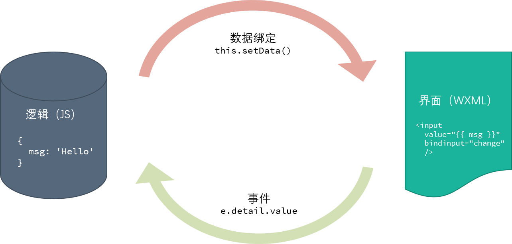

```html
<!-- 
  1. 事件的基本使用 bind[xxx] catch[xxx]
  2. 小程序中事件冒泡和HTML 处理起来不一样, 这里是使用catch[xxx]
  3. 如果需要给事件处理函数指定参数, 只能通过事件处理函数 'dataset' 方式 传递属性
   -->


  <!-- 单向数据流 -->
  <view>
    <input type='text' placeholder='请输入内容' value="{{ msg }}" style="border: 1px solid #ccc;" bindinput="inputHandle" />
    <text>{{ msg }}</text>
  </view>
```

``` js
//index.js
//获取应用实例
// 完成页面的逻辑, 包括功能的实现..
const app = getApp()

Page({
  // 为页面提供数据的
  // data 就是页面和逻辑之间的桥梁
  data: {
    msg: "initial",
  },

  inputHandle: function(e) {
    // this.data.message = e.detail.value
    this.setData({
      msg: e.detail.value
    })
    console.log(this.data)
    // this.setData 是用来改变data 中的数据
    // 他与直接赋值区别在于 setData 可以通知页面做出变化
    // 直接赋值没有办法实现这一点 ( 早期的 js )
  }
})
```


### 登录案例

##### 1. demo1

``` html
  <view>
    <input value="{{ username }}" bindinput="usernameChangeHandle" placeholder="请输入用户名" style="border: 1px solid #ccc;" ></input>
    <input value="{{ password }}" bindinput="passwordChangeHandle" placeholder="请输入密码" style="border: 1px solid #ccc;" ></input>

      <button type="primary" bindtap="loginHandle">登录</button>
  <button type="default">注册</button>
  </view>
```


``` js
//index.js
/*
1. 设计数据的结构(data 属性)
2.将数据绑定到特定的元素上
3. 登录按钮的点击事件(具体的登录逻辑)
 */
const app = getApp()

Page({
  // 为页面提供数据的
  // data 就是页面和逻辑之间的桥梁
  data: {
    username:"admin",
    password:"123",
  },
  // 用于处理登录事件按钮的点击事件
  loginHandle:function(){
   // TODO: 完成逻辑
   // 1 先需要知道用户输入了什么
    console.log(this.data) // 获取data 中的用户名和密码 
   // 2 根据用户输入的值判断
   // 3. 根据判断的结果做出响应
  },

  usernameChangeHandle: function (e){
     // this.data.username = e.detail.value // 不要用这种方式, 因为界面层无法得知
    this.setData({
      username: e.detail.value
    })
  },

  passwordChangeHandle: function (e) {
    this.setData({
      password: e.detail.value
    })
  }
})
```

##### 2.demo2 抽象共同的事件处理函数

``` html
  <view>
    <input value="{{ username }}" data-prop="username" bindinput="inputChangeHandle" placeholder="请输入用户名" style="border: 1px solid #ccc;" ></input>
    <input value="{{ password }}" data-prop="password" bindinput="inputChangeHandle" placeholder="请输入密码" style="border: 1px solid #ccc;" ></input>

      <button type="primary" bindtap="loginHandle">登录</button>
  <button type="default">注册</button>
  </view>
```

``` js
//index.js
/*
1. 设计数据的结构(data 属性)
2.将数据绑定到特定的元素上
3. 登录按钮的点击事件(具体的登录逻辑)
 */
const app = getApp()

Page({
  // 为页面提供数据的
  // data 就是页面和逻辑之间的桥梁
  data: {
    username:"admin",
    password:"123",
  },
  // 用于处理登录事件按钮的点击事件
  loginHandle:function(){
   // TODO: 完成逻辑
   // 1 先需要知道用户输入了什么
    console.log(this.data) // 获取data 中的用户名和密码 
   // 2 根据用户输入的值判断
   // 3. 根据判断的结果做出响应
  },

  // version 2 
  inputChangeHandle: function (e) {
    var prop = e.target.dataset[`prop`] //?? 可变的
    var changed = {}
    changed[prop] = e.detail.value
    this.setData(changed)
  },
    
})
```

##### 3.demo3 form 表单版本

``` html
<form bindsubmit="loginHandle" bindreset="formReset">
  <view>
    <input value="{{ username }}" name="username"  placeholder="请输入用户名" style="border: 1px solid #ccc;" ></input>
    <input value="{{ password }}" name="password" placeholder="请输入密码" style="border: 1px solid #ccc;" ></input>

      <button type="primary" form-type="submit">登录</button>
  <button type="default">注册</button>
  </view>
</form>
```

``` js
//index.js
/*
1. 设计数据的结构(data 属性)
2.将数据绑定到特定的元素上
3. 登录按钮的点击事件(具体的登录逻辑)
 */
const app = getApp()

Page({
  // 为页面提供数据的
  // data 就是页面和逻辑之间的桥梁
  data: {
    username:"admin",
    password:"123",
  },
  // 用于处理登录事件按钮的点击事件
  loginHandle:function(){
   // TODO: 完成逻辑
   // 1 先需要知道用户输入了什么
    console.log(this.data) // 获取data 中的用户名和密码 
   // 2 根据用户输入的值判断
   // 3. 根据判断的结果做出响应
  },

  // version 3  用于处理表单提交事件
  loginHandle:function(e){
   // TODO: 完成逻辑
   // 1 先需要知道用户输入了什么
    console.log(e.detail.value ) // 获取data 中的用户名和密码 
   // 2 根据用户输入的值判断
   // 3. 根据判断的结果做出响应
  },
    
})
```

## 六 UI 开发

### User Interface (用户界面)

> [WEUI](https://weui.io/): WeUI 是微信原生基础样式库

> 和网页开发一样, 网页提供了一套UI 组件 标签,  方便开发, 
>
> 同样 wx 也提供了一套 **UI组件**, 通过wx 小程序提供的这一套UI 组件,快速开发


> USER INTERFACE Module，即用户界面组件。组件即将一段或几段完成各自功能的[代码段](https://baike.baidu.com/item/代码段)封装为一个或几个独立的部分。用户界面组件包含了这样一个或几个具有各自功能的[代码段](https://baike.baidu.com/item/代码段)，最终完成了用户界面的表示。

框架为开发者提供了一系列基础组件，开发者可以通过组合这些基础组件进行快速开发。详细介绍请参考[组件文档](https://developers.weixin.qq.com/miniprogram/dev/component/)。

什么是组件：

- 组件是视图层的基本组成单元。
- 组件自带一些功能与微信风格一致的样式。
- 一个组件通常包括 `开始标签` 和 `结束标签`，`属性` 用来修饰这个组件，`内容` 在两个标签之内。

```html
<tagname property="value">
Content goes here ...
</tagname>
```

**注意：所有组件与属性都是小写，以连字符`-`连接**

#### 1.属性类型

| 类型         | 描述           | 注解                                                         |
| :----------- | :------------- | :----------------------------------------------------------- |
| Boolean      | 布尔值         | 组件写上该属性，不管是什么值都被当作 `true`；只有组件上没有该属性时，属性值才为`false`。 如果属性值为变量，变量的值会被转换为Boolean类型 |
| Number       | 数字           | `1`, `2.5`                                                   |
| String       | 字符串         | `"string"`                                                   |
| Array        | 数组           | `[ 1, "string" ]`                                            |
| Object       | 对象           | `{ key: value }`                                             |
| EventHandler | 事件处理函数名 | `"handlerName"` 是 [Page](https://developers.weixin.qq.com/miniprogram/dev/framework/app-service/page.html) 中定义的事件处理函数名 |
| Any          | 任意属性       |                                                              |

#### 2.公共属性

所有组件都有以下属性：

| 属性名         | 类型         | 描述           | 注解                                                         |
| :------------- | :----------- | :------------- | :----------------------------------------------------------- |
| id             | String       | 组件的唯一标示 | 保持整个页面唯一                                             |
| class          | String       | 组件的样式类   | 在对应的 WXSS 中定义的样式类                                 |
| style          | String       | 组件的内联样式 | 可以动态设置的内联样式                                       |
| hidden         | Boolean      | 组件是否显示   | 所有组件默认显示                                             |
| data-*         | Any          | 自定义属性     | 组件上触发的事件时，会发送给事件处理函数                     |
| bind* / catch* | EventHandler | 组件的事件     | 详见[事件](https://developers.weixin.qq.com/miniprogram/dev/framework/view/wxml/event.html) |

#### 3.特殊属性

几乎所有组件都有各自定义的属性，可以对该组件的功能或样式进行修饰，请参考各个[组件](https://developers.weixin.qq.com/miniprogram/dev/component/)的定义。


### 组件分类

wx 小程序基础组件分为以下八大类：

**视图容器(View Container)：**

| 组件名                                                       | 说明             |
| ------------------------------------------------------------ | ---------------- |
| [view](https://www.w3cschool.cn/weixinapp/sp6z1q8q.html)     | 视图容器         |
| [scroll-view](https://www.w3cschool.cn/weixinapp/weixinapp-scroll-view.html) | 可滚动视图容器   |
| [swiper](https://www.w3cschool.cn/weixinapp/weixinapp-swiper.html) | 可滑动的视图容器 |

**基础内容(Basic Content)：**

| 组件名                                                       | 说明   |
| ------------------------------------------------------------ | ------ |
| [icon](https://www.w3cschool.cn/weixinapp/rmcw1q8t.html)     | 图标   |
| [text](https://www.w3cschool.cn/weixinapp/weixinapp-text.html) | 文字   |
| [progress](https://www.w3cschool.cn/weixinapp/weixinapp-progress.html) | 进度条 |

**表单(Form)：**

| 标签名                                                       | 说明           |
| ------------------------------------------------------------ | -------------- |
| [button](https://www.w3cschool.cn/weixinapp/9w841q8w.html)   | 按钮           |
| [form](https://www.w3cschool.cn/weixinapp/m8x71q8z.html)     | 表单           |
| [input](https://www.w3cschool.cn/weixinapp/3glu1q92.html)    | 输入框         |
| [checkbox](https://www.w3cschool.cn/weixinapp/oj6e1q8x.html) | 多项选择器     |
| [radio](https://www.w3cschool.cn/weixinapp/gqhd1q96.html)    | 单项选择器     |
| [picker](https://www.w3cschool.cn/weixinapp/d9mw1q95.html)   | 列表选择器     |
| [picker-view](https://www.w3cschool.cn/weixinapp/weixinapp-component-pickerview.html) | 内嵌列表选择器 |
| [slider](https://www.w3cschool.cn/weixinapp/hk941q97.html)   | 滑动选择器     |
| [switch](https://www.w3cschool.cn/weixinapp/anr21q99.html)   | 开关选择器     |
| [label](https://www.w3cschool.cn/weixinapp/vn371q94.html)    | 标签           |

**导航(Navigation)：**

| 组件名                                                       | 说明       |
| ------------------------------------------------------------ | ---------- |
| [navigator](https://www.w3cschool.cn/weixinapp/weixinapp-navigator.html) | 应用内跳转 |

**操作反馈(Interaction)**

| 组件名                                                     | 说明                               |
| ---------------------------------------------------------- | ---------------------------------- |
| [action-sheet](https://www.php.cn/js/js-action-sheet.html) | wxapp操作反馈上拉菜单 action-sheet |
| [modal](https://www.php.cn/js/js-modal.html)               | 模态弹框                           |
| [toast](https://www.php.cn/js/js-toast.html)               | 提示框                             |
| [loading](https://www.php.cn/js/js-loading.html)           | 加载提示框                         |

**多媒体(Media)：**

| 组件名                                                       | 说明 |
| ------------------------------------------------------------ | ---- |
| [audio](https://www.w3cschool.cn/weixinapp/weixinapp-audio.html) | 音频 |
| [image](https://www.w3cschool.cn/weixinapp/weixinapp-image.html) | 图片 |
| [video](https://www.w3cschool.cn/weixinapp/weixinapp-video.html) | 视频 |

**地图(Map)：**

| 组件名                                                       | 说明           |
| ------------------------------------------------------------ | -------------- |
| [map](https://www.w3cschool.cn/weixinapp/weixinapp-map.html) | 地图(腾讯地图) |

**画布(Canvas)：**

| 组件名                                                       | 说明 |
| ------------------------------------------------------------ | ---- |
| [canvas](https://www.w3cschool.cn/weixinapp/weixinapp-canvas.html) | 画布 |

**客服会话：**

| 组件名                                                       | 说明             |
| ------------------------------------------------------------ | ---------------- |
| [contact-button](https://www.w3cschool.cn/weixinapp/weixinapp-component-contactbutton.html) | 进入客服会话按钮 |

### 基础内容组件

#### 1. icon

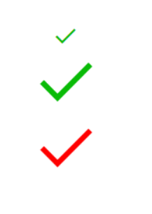

``` html
<!--index.wxml-->
<view class="container">
    <!-- icon progress text -->
    <!-- success|success_no_circle|info|warn|waiting|cancel|download|search|clear -->
    <!-- type 用于定义图标类型, 只能是规定范围的类型, 除了这些内置图标, 其他图标必须通过图片的方式使用 -->
    <icon class="" type="success_no_circle"></icon>
    <!-- size 用于指定图标大小, 默认是23 , 单位 px -->
    <icon class="" type="success_no_circle" size="60"></icon>
    <!-- color 用于指定图标颜色, 取值就是css 颜色取值 -->
    <icon class="" type="success_no_circle" size="60" color="red"></icon>
</view>
```

| 属性  | 类型          | 默认值 | 必填 | 说明                                                         |
| :---- | :------------ | :----- | :--- | :----------------------------------------------------------- |
| type  | string        |        | 是   | icon的类型，有效值：success, success_no_circle, info, warn, waiting, cancel, download, search, clear |
| size  | number/string | 23     | 否   | icon的大小                                                   |
| color | string        |        | 否   | icon的颜色，同css的color                                     |

#### 2. progress

进度条。组件属性的长度单位默认为px，[2.4.0](https://developers.weixin.qq.com/miniprogram/dev/framework/compatibility.html)起支持传入单位(rpx/px)。

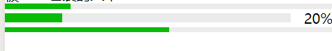


``` html
    <!-- 显示一个进度条 -->
    <progress percent="20" />
    <progress percent="20" show-info stroke-width="10"/>
    <progress percent="50" active/>
```


| 属性          | 类型          | 默认值  | 必填 | 说明                            |
| :------------ | :------------ | :------ | :--- | :------------------------------ |
| percent       | number        |         | 否   | 百分比0~100                     |
| show-info     | boolean       | false   | 否   | 在进度条右侧显示百分比          |
| border-radius | number/string | 0       | 否   | 圆角大小                        |
| font-size     | number/string | 16      | 否   | 右侧百分比字体大小              |
| stroke-width  | number/string | 6       | 否   | 进度条线的宽度                  |
| color         | string        | #09BB07 | 否   | 进度条颜色（请使用activeColor） |

#### 3. text

``` html
    <!-- text类似于HTML 中的p 标签, 但是p标签不能嵌套, text 标签支持嵌套 -->
    <!-- text 主要是为了可以很好的控制页面上的内容 -->
    <!-- text标签还支持换行 -->
    <text>这是一段<text>文本</text>内容</text>
    
    这是一段没有被text 包裹的文本
```

### 表单组件

#### 1. button

``` html
<!--index.wxml-->
<view class="container">
<!-- type: 用来控制按钮的类型 只有三种: primary|default|warn -->
<!-- <button type="warn" size="mini" plain loading> 这是一个按钮 </button>   -->
<!-- hover 指的是按下, hover-class 指的就是按下过后的作用class -->
<button hover-class="btn-active"> hover class </button>
</view>
```

``` css
/** 添加自定义button点击态样式类**/
.btn-active {
  background-color: red;
}
```

| 属性     | 类型    | 默认值  | 必填 | 说明                      | 最低版本                                                     |
| :------- | :------ | :------ | :--- | :------------------------ | :----------------------------------------------------------- |
| size     | string  | default | 否   | 按钮的大小                | [1.0.0](https://developers.weixin.qq.com/miniprogram/dev/framework/compatibility.html) |
| type     | string  | default | 否   | 按钮的样式类型            | [1.0.0](https://developers.weixin.qq.com/miniprogram/dev/framework/compatibility.html) |
| plain    | boolean | false   | 否   | 按钮是否镂空，背景色透明  | [1.0.0](https://developers.weixin.qq.com/miniprogram/dev/framework/compatibility.html) |
| disabled | boolean | false   | 否   | 是否禁用                  | [1.0.0](https://developers.weixin.qq.com/miniprogram/dev/framework/compatibility.html) |
| loading  | boolean | false   | 否   | 名称前是否带 loading 图标 | [1.0.0](https://developers.weixin.qq.com/miniprogram/dev/framework/compatibility.html) |

#### 2.checkbox

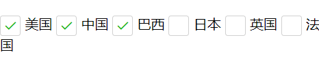

``` html
<checkbox-group bindchange="checkboxChange">
    <label class="checkbox" wx:for-items="{{items}}">
        <checkbox value="{{item.name}}" checked="{{item.checked}}"/>{{item.value}}
    </label>
</checkbox-group>
```

``` js
//index.js
//获取应用实例
const app = getApp()

Page({
  data: {
    items: [
      {name: 'USA', value: '美国'},
      {name: 'CHN', value: '中国', checked: 'true'},
      {name: 'BRA', value: '巴西'},
      {name: 'JPN', value: '日本'},
      {name: 'ENG', value: '英国'},
      {name: 'TUR', value: '法国'},
    ]
  },
  checkboxChange: function(e) {
    console.log('checkbox发生change事件，携带value值为：', e.detail.value)
  }
})
```

#### 3.input

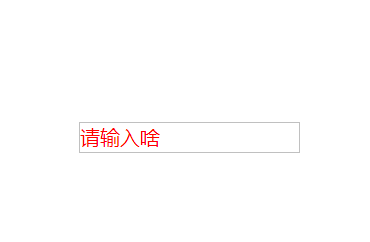

``` html
<input class="input1" placeholder="请输入啥" placeholder-class="input-placeholder"></input>

```

``` css
.input1{
  border: 1px solid #c0c0c0
}

.input-placeholder{
  color: red
}
```


| 属性              | 类型    | 默认值            | 必填 | 说明                      |
| :---------------- | :------ | :---------------- | :--- | :------------------------ |
| value             | string  |                   | 是   | 输入框的初始内容          |
| type              | string  | text              | 否   | input 的类型              |
| password          | boolean | false             | 否   | 是否是密码类型            |
| placeholder       | string  |                   | 是   | 输入框为空时占位符        |
| placeholder-style | string  |                   | 是   | 指定 placeholder 的样式   |
| placeholder-class | string  | input-placeholder | 否   | 指定 placeholder 的样式类 |

### 操作反馈

#### 1. action-sheet

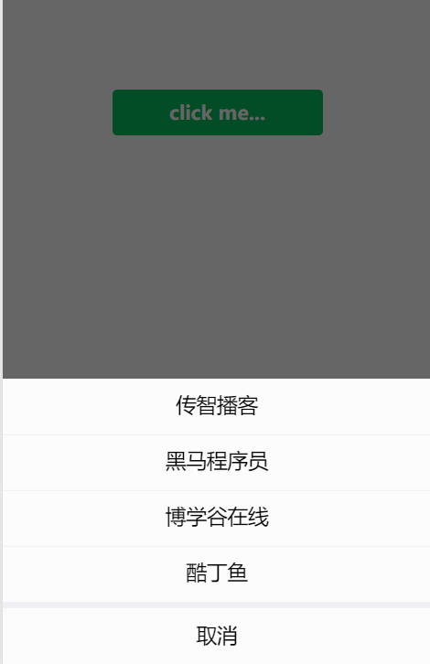

``` html
<!--index.wxml-->
<view class="container">
<button type="primary" bindtap="btnTodo">click me...</button>
</view>
```

``` js
//index.js
//获取应用实例
const app = getApp()

Page({
  btnTodo:function(){
    // 当点击按钮触发
    // console.log(111)

    // 交互操作组件必须调用Api 方式使用
    wx.showActionSheet({
      itemList: ['传智播客', '黑马程序员', '博学谷在线', '酷丁鱼'],// 显示出来的项目列表
      success: function (res) { // 点击其中任一项的回调
        if (!res.cancel) {// res.cancel
          console.log(res.tapIndex)
        }
      },
      fail: function (res) {

      }
    })
  }

})

```

#### 2. showModal

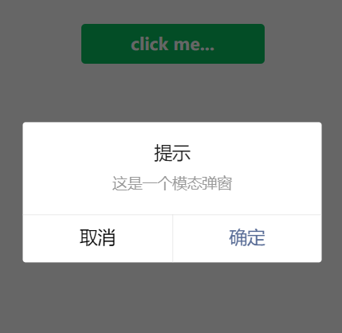

``` html
<!--index.wxml-->
<view class="container">
<button type="primary" bindtap="btnTodo">click me...</button>
</view>
```

``` js
//index.js
//获取应用实例
const app = getApp()

Page({
  btnTodo:function(){
    wx.showModal({
      title: '提示',
      content: '这是一个模态弹窗',
      success(res) {
        if (res.confirm) {
          console.log('用户点击确定')
        } else if (res.cancel) {
          console.log('用户点击取消')
        }
      }
    })
  }
})

```

#### 3. showToast

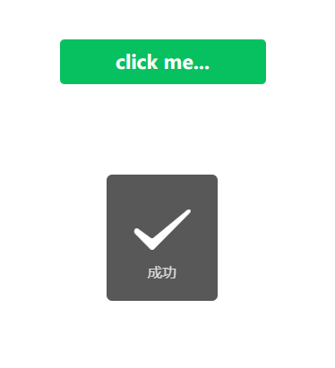

``` html
<!--index.wxml-->
<view class="container">
<button type="primary" bindtap="btnTodo">click me...</button>
</view>
```

``` js
//index.js
//获取应用实例
const app = getApp()

Page({
  btnTodo:function(){
    wx.showToast({
      title: '成功',
      // 只支持 success 和 loading
      icon: 'success',
      duration: 2000
    })
  }
})

```

#### 基础组件总结

#### 组件的基本用法

##### 语法问题

组件的使用是类似于HTML的方式（有不同），组件使用的严格的XML标准（开闭标签问题）

##### 组件的分类

- 功能性的组件
  - 完成具体功能的
- 布局类型的组件
  - 用来完成页面结构的（DIV）
- API 类型（使用的角度）
  - wx.showModal
  - 通过调用一个方法来使用的

### 布局类组件

#### 伸缩布局 flex

> 参考链接：https://developer.mozilla.org/zh-CN/docs/Web/CSS/flex

以前在网页开发过程中，布局一直是不可或缺的，从最早的表格布局，到后来的DIV+CSS布局，现在再到CSS3的伸缩布局。

CSS3在布局方面做了非常大的改进，使得我们对块级元素的布局排列变得十分灵活，适应性非常强，其强大的伸缩性，在响应式开发中可以发挥极大的作用。

如下图：

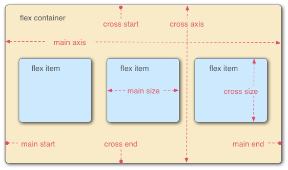

**主轴：**Flex容器的主轴主要用来配置Flex项目，默认是水平方向

**侧轴：**与主轴垂直的轴称作侧轴，默认是垂直方向的

**方向：**默认主轴从左向右，侧轴默认从上到下

_主轴和侧轴并不是固定不变的，通过flex-direction可以互换。_

​                              

#### 使用说明

1. 指定一个父盒子为伸缩盒子，即指定：`display: flex`
2. 明确你需要的主侧轴方向，并设置`flex-direction` 默认是row ，纵向是column
3. 设置父盒子的属性来调整子元素的布局，例如`align-items`
4. 设置子盒子的宽高或者比例，完成具体的子元素在父盒子中的布局


#### 各个属性介绍

1. `flex-direction`调整主轴方向（默认为水平方向）
2. `justify-content`调整主轴对齐
3. `align-items`调整侧轴对齐（子元素可以使用`align-self`覆盖）
4. `flex-wrap`控制是否换行
5. `align-content`堆栈（由flex-wrap产生的独立行）对齐
6. `flex-flow`是`flex-direction` + `flex-wrap`的简写形式
7. `flex`是子项目在主轴的缩放比例，不指定flex属性，则不参与伸缩分配
8. `order`控制子项目的排列顺序，正序方式排序，从小到大


_此知识点重在理解，要明确找出主轴、侧轴、方向，各属性对应的属性值可参考示例源码。_

**flex1**

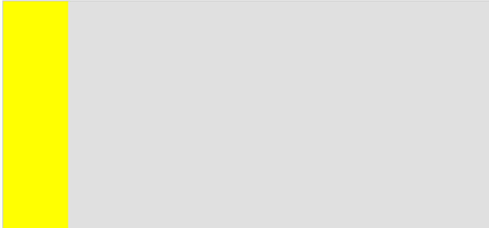

``` html
<!DOCTYPE html>
<html lang="en">

<head>
    <meta charset="UTF-8">
    <meta name="viewport" content="width=device-width, initial-scale=1.0">
    <title>Flex Demo1</title>
    <style>
        body,
        html {
            height: 100%;
        }

        /* 1. 设计好Dom 结构
           2. 将父盒子设置为伸缩盒子 
         */
        .root {
            /* 将父盒子设置为伸缩盒子 */
            display: flex;
            height: 100%;
            border: 2px solid #ccc;
        }

        .sidebar {
            width: 200px;
            background-color: yellow;
        }

        .content {
            /*    width: 300px; */
            /* ???? */
            flex: 1;
            background-color: #e0e0e0;
        }
    </style>
</head>

<body>
    <div class="root">
        <div class="sidebar">

        </div>
        <div class="content">

        </div>
    </div>
</body>

</html>
```

**flex2**

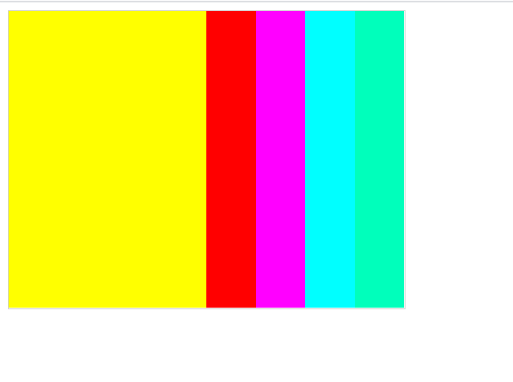

``` html
<!-- <!DOCTYPE html>
<html lang="en">

<head>
    <meta charset="UTF-8">
    <meta name="viewport" content="width=device-width, initial-scale=1.0">
    <title>Flex Demo2</title>
    <style>
        .container {
            width: 400px;
            height: 300px;
            border: 1px solid #ccc;
            font-size: 0;
        }
        .item{
            display: inline-block;
            width: 25%;
            height: 200px;
        }
    </style>
</head>

<body>
    <div class="container">
      <div class="item" style="background-color: #ff0;"></div>
      <div class="item" style="background-color: #f00;"></div>
      <div class="item" style="background-color: #f0f;"></div>
      <div class="item" style="background-color: #0ff;"></div>
    </div>
</body>

</html> -->

<!DOCTYPE html>
<html lang="en">

<head>
    <meta charset="UTF-8">
    <meta name="viewport" content="width=device-width, initial-scale=1.0">
    <title>Flex Demo2</title>
    <style>
        .container {
            display: flex;
            /* flex-direction: column; */
            width: 400px;
            height: 300px;
            border: 1px solid #ccc;
        }

        .item {
           flex: 1;
        }
        /* 总的是4份, 每一项占一份,  其中每一项占 1 / 4 */
    </style>
</head>

<body>
    <div class="container">
        <div class="item" style="background-color: #ff0; flex: inherit;width: 200px;"></div>
        <div class="item" style="background-color: #f00;"></div>
        <div class="item" style="background-color: #f0f;"></div>
        <div class="item" style="background-color: #0ff;"></div>
        <div class="item" style="background-color: #0fb;"></div>
    </div>
</body>

</html>
```


### 基础布局案例

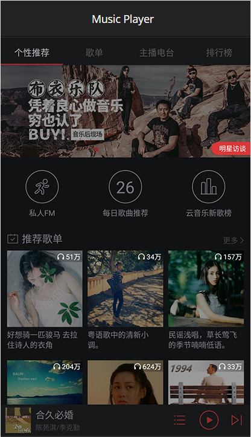

### 页面导航

> 先配置路由 **config.json** 文件, 然后再使用API 跳转页面

#### 页面间跳转

> **navigator** 组件
>
> html 中 --- **a 链接**跳转
>
> **注意:** 找图片文件, 或者跳转页面, 需要找**文件相对路径**
>
> **小技巧:** 在app.json 的`pages` 配置项下 输入文件的名称,  小程序开发工具会自动创建`xxx.js`+`xxx.wxml`+`xxx.wxss`+`xxx.json`  和一个 `xxx` 文件夹
>
> ``` json
> {
> "pages": [
>  "pages/demo1/demo1",
>  "pages/demo2/demo2",
>  "pages/demo3/demo3"
> ],
> "window": {
> ...
> },
> ...
> }
> ```

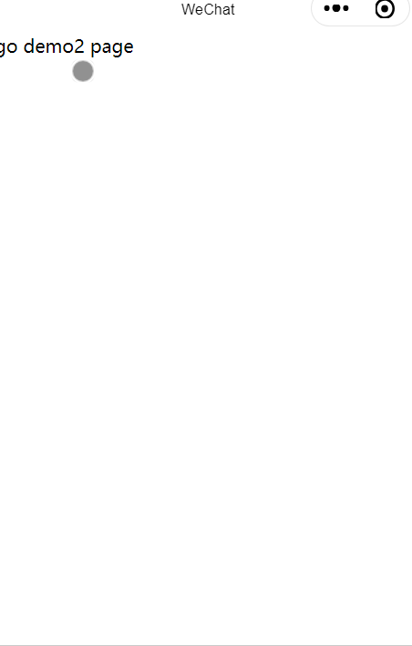

pages/demo1/demo1.wxml

``` html
<navigator url="../demo2/demo2">
  go demo2 page
</navigator>
```

pages/demo2/demo2.wxml

``` html
<!--pages/demo2/demo2.wxml-->
<navigator url="../demo3/demo3">
  go demo3 page
  <image src="../../images/poster.jpg"></image>
</navigator>
```

pages/demo3/demo3.wxml

``` html
<!--pages/demo3/demo3.wxml-->
<text>pages/demo3/demo3.wxml</text>
```


#### 页面传值

 页面间参数传递

    1. 传递 跳转链接加上问号参数 

``` html
    <navigator url="../demo2/demo2?name=小明&age=18">
       小明
    </navigator>

  <navigator url="../demo2/demo2?name=小红">
     小红
  </navigator>
```

2. 接收 onLoad 的第一个参数( 对象 ) options

``` js
// pages/demo2/demo2.js
Page({

  /**
   * 生命周期函数--监听页面加载, options为页面加载跳转所带来的参数
   */
  onLoad: function (options) {
    console.log(options) // 接收
  },
...
}) 
```


#### 页面导航模式补充

> 跳转过去,不返回

``` html
<navigator url="../demo2/demo2" redirect>
  跳转过去(不回来了)
</navigator>
```

#### 导航元素点击高亮

``` html
<!-- 点击时文字高亮 -->
<navigator hover-class="my-hover">点我</navigator>

<!-- 点击没有任何效果 -->
<navigator hover-class="none">点我</navigator>

<!-- 普通元素点击高亮 -->
<navigator hover-class="hover-demo1">
  <image src="../../images/poster.jpg"></image>
</navigator>

<!-- 
cursor pointer 的方式是一个我们发现的小技巧, 可以让任何元素点击时高亮
 -->
<image class="hover-demo2" src="../../images/poster.jpg"></image>
```


``` css
/* pages/demo1/demo1.wxss */
.my-hover{
  color: red
}

.hover-demo1{
  border: 10px solid #ccc
}

.hover-demo2{
  cursor: pointer
}
```

#### 页面导航API

> 除了**navigator** 标签导航外 , 通过**API** 方式实现页面导航, 调用 **wx** 内置方法, 通过 **wx** 内置方法实现页面导航

##### 注意

使用 navigateTo 跳转页面出现下面错误

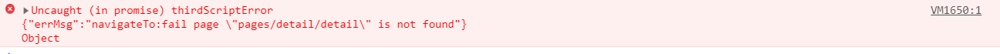

**@Tffans 先检查下代码，router.config.json里有没有配置**

**忘记配置路由了**


demo1.wxml

``` html
<button type="primary" bindtap="tapHandle">跳转过去</button>
```

demo1.js

``` js
// pages/demo1/demo1.js
Page({
  tapHandle: function() { // 点击跳转
    // 当我们点击按钮  系统会自动执行这里的代码
    // 相当于navigator
    wx.navigateTo({
      url: '../demo2/demo2?id=123',
    })

    // 相当于 redirect 的 navigator
    // wx.redirectTo({
    //   url: '../demo2/demo2',
    // })
  },
})
```


demo2.wxml

``` html
<navigator url="../demo3/demo3">
  go demo3 page
  <image src="../../images/poster.jpg"></image>
</navigator>
```


demo3.wxml

``` html
<button type="primary" bindtap="backHandle">返回</button>
```

demo3.js

``` js
  Page({
  backHandle: function() {
    // 默认返回上一页
    // wx.navigateBack()

    // 指定 delta 就是返回指定页面
    // 当 delta 过大(超出历史记录) 默认返回最开始的页面
    wx.navigateBack({
      delta: 2
    })

    // wx.navigateTo
    // wx.navigateBack
    // wx.redirectTo
  },
})

```


## 七 TODOS 案例

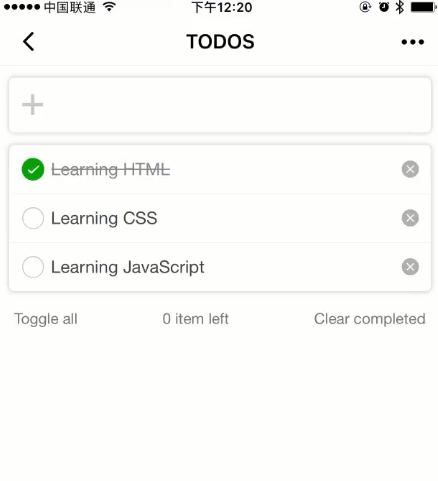

#### 1.案例介绍

#### 2.页面布局(wxml)

#### 3. 样式调整(wxss)

#### 4. 抽象数据模型

> 先把能看到的数据通过数据模型体现出来,  下方需要变化的数据(不需要)
>
> 这个数据和数据模型中的某一个对象有关系,  与任务清单的数据有关系 , 如果单独抽象出这个数据,
>
> 那么在下面的业务的过程中, 还需要维护这样的数据

#### 5. 新增任务逻辑

> **注意单向数据流**:完成业务闭环

#### 6. 细节优化

#### 7. 数据持久化

> 结合wx 的Api 实现数据持久化, 对接真实数据库


## 八 生命周期

> [https://cml.js.org/doc/example/wx_to_chameleon.html?h=%E7%94%9F%E5%91%BD%E5%91%A8%E6%9C%9F](https://cml.js.org/doc/example/wx_to_chameleon.html?h=生命周期)

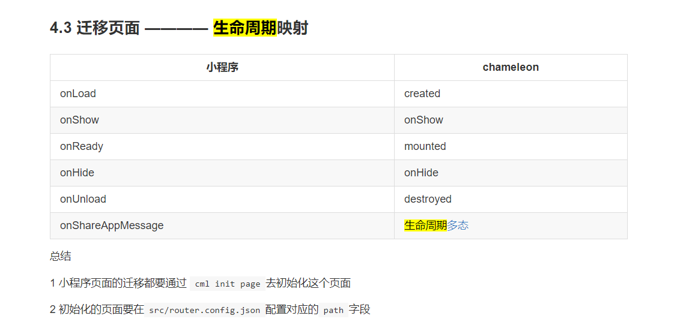


## 注意

1.wx

+ wx 小程序使用的是严格的XML 语法

  + 对

    + ``` html
      <person property="value">
        <name></name>
      </person>
      ```

  + 错

    + ``` html
      <image class="" src="" />
      ```

​	

2.cml


## 框架特点

### 1. cml 

多态协议( https://cml.js.org/doc/framework/polymorphism/api.html )

​				https://cml.js.org/doc/example/chameleon-api.html

父子传值

组件化


框架分析

1. https://mp.weixin.qq.com/s/BJl54Hn2H2AoRyHH-jafmg

### 2. wx小程序

父子传值

组件化

**丰富的组件**

## 参考文档

1. 小程序

​		[WXML](https://developers.weixin.qq.com/miniprogram/dev/reference/wxml/)

​		[WX组件](https://developers.weixin.qq.com/miniprogram/dev/component/)

​		[WXSS](https://developers.weixin.qq.com/miniprogram/dev/framework/view/wxss.html)

​		[WEUI](https://weui.io/)

​		[微信小程序开发教程手册文档](https://www.w3cschool.cn/weixinapp/9wou1q8j.html)

> 注意:  获取数据  this.data.username, 修改数据 通过 this.setData 方法去修改

2. cml

   [CML](https://cmljs.org/doc/view/cml.html)

   [只是web和小程序](https://cml.js.org/doc/example/web_wx.html) 

   [数据修改+直接在逻辑层修改]([https://cmljs.org/doc/logic/data_bind.html?h=%E4%BF%AE%E6%94%B9%E6%95%B0%E6%8D%AE](https://cmljs.org/doc/logic/data_bind.html?h=修改数据))

   > ```
   > this.formData[`${name}`] = value// 当做数据修改的时候，只需要在逻辑层修改数据，视图层就会做相应的更新
   > ```

   > 注意: cml 中, 
   >
   > ​    console.log(this.data) // 获取data 中的用户名和密码 
   >
   > ​    this.data.username = e.detail.value // 不要用这种方式, 因为界面层无法得知
   >
   > this.data.username ,  是获取 数据层中的数据, 
   >
   > 要修改数据 直接使用  this. username = xxx 修改,  this. username (界面层数据)

   

   ```js
   // 当做数据修改的时候，只需要在逻辑层修改数据，视图层就会做相应的更新
   当做数据修改的时候，只需要在逻辑层修改数据，视图层就会做相应的更新。
   
   通过这个简单的例子来看：
   
   <template>
     <view>
       <text>Hello {{name}}!</text>
       <button c-bind:onclick="changeName"> Click me! </button>
     </view>
   </template>
   <script>
   class Index {
     data = {
       name: 'Chameleon'
     }
     methods = {
       changeName: function(e) {
         // sent data change to view
         this.name = 'CML';
       }
     }
   };
   export default new Index();
   </script>
   框架首先将逻辑层数据中的 name 与视图层的 name 进行了绑定，所以打开页面的时候会显示 Hello Chameleon!； 当点击按钮的时候，视图层会发送 changeName 的事件给逻辑层，逻辑层找到并执行对应的事件处理函数； 回调函数触发后，逻辑层执行数据赋值的操作，将 data 中的 name 从 Chameleon 变为 CML，因为该数据和视图层已经绑定了，从而视图层会自动改变为 Hello CML!。
   ```


4. 布局
   1. 固比模型


::: tip
```

## Q&A

> https://github.com/didi/chameleon/issues?q=is%3Aopen+is%3Aissue

> https://cmljs.org/doc/framework/faq.html

1. https://github.com/chameleon-team/cml-subpage
   这里也有如何调用底层组件的使用案例

2. @Tffans http://cml.didi.cn/doc/framework/framework.html 建议你先看下文档学习下
   多态协议：http://cml.didi.cn/doc/framework/polymorphism/intro.html

3. 组件
   https://cmljs.org/doc/component/component.html

4. 青桔单车(小程序)

5. JiM:
   https://github.com/chameleon-team

6. JiM:
   @Tffans @. 
   https://github.com/didi/chameleon

​	7.px 与cpx 换算关系

​		https://cmljs.org/doc/api/px.html?h=cpx

8. 使用 navigateTo 跳转页面出现下面错误

   

   **@Tffans 先检查下代码，router.config.json里有没有配置**

   **忘记配置路由了**

9. 问下:cml要怎么获取元素标签高度么?

   ```
   let height= this.$refs.getheight.offsetHeight;
   ref文档说cml不支持
   ```

   @  https://cmljs.org/doc/api/getRect.html#getrect

10. 这个小程序加载本地图片, `require()` 引入相对路径, 用真机调试, 本地图片出不来?

    > 前提是, 手机和 电脑在同一个 wifi 下

    设置 `chameleon.config.js` 文件中, 本地地址为 `const publicPath = './'` ,   在小程序端 即可预览本地路径的图片

11. 群主大大, c-dialog 这个弹框组件的 icon 可以进行隐藏掉吗?

    现在是 

    

    需要改成这样

    

    > showIcon:false

12. 群主大大,chameleon 框架有没有 <form> 表单组件, 获取用户提交的数据? 谢谢大家

    + 用 <view> 拼起来吗, 那我获取数据只能一个个拿了

    答: 没有`form`表单组件，用数据存起来自己取

    > 我可以自定义 我自己的 formItem , 表单组件 , 来批量创建
    >
    > 参考https://cmljs.org/doc/framework/custom-component/custom-component.html

13. 引入 `cml-tt-api` 是什么意思?

    > 内置支持头条小程序的版本, 为(tt)头条 小程序开发

14. 官网地址

    > 新官网 入口：https://cml.js.org/
    > 旧管网：https://cml.js.org/doc/
    >
    > 快速官网(国内源):   http://cml.didi.cn

  15.群主大大 , 对于 HTML 代码, 怎么渲染到页面上?

> 就是说, 原始 HTML 数据, 怎么通过cml 框架 指令, 加载到页面上?

答案: 

> [cml issues 解释](https://github.com/didi/chameleon/issues/359)

https://cml.js.org/doc/component/expand/native/richtext.html

https://developers.weixin.qq.com/community/develop/doc/0008c87ade06f875e167f460351800

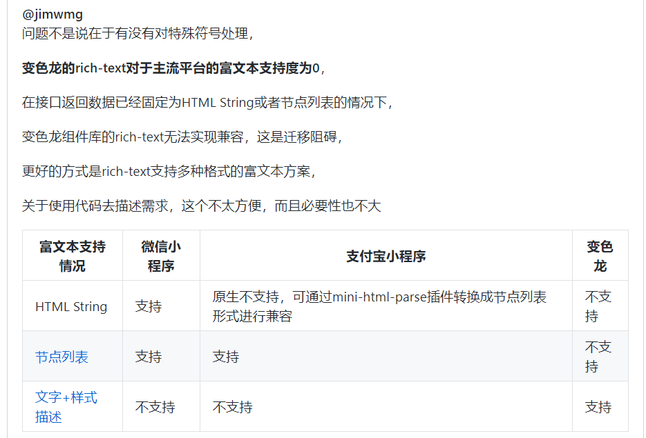

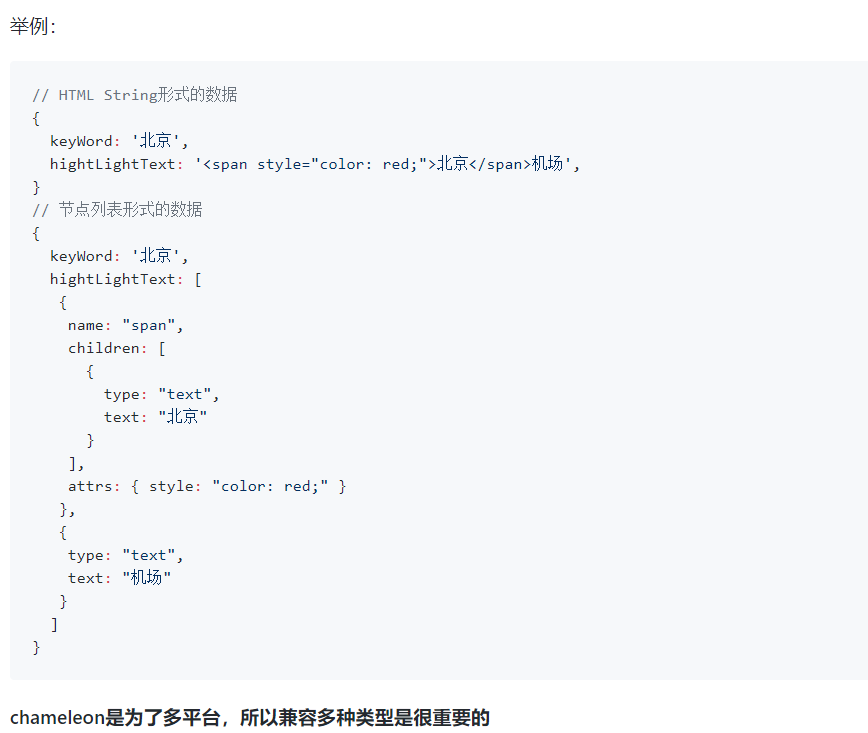


16.有没有类似uni-app中的uni.$emit或者wx.navigateTo中events页面间通信功能

> 1.可以通过 store 进行数据通信
> https://cmljs.org/doc/logic/store.html
> 2 组件间可以利用 父子组件通信
> https://cmljs.org/doc/view/event.html


17.chameleon 内置组件库

> 这个网站是 chameleon 内置组件库 的源码, 学习这些组件是怎么设计出来的?

> https://github.com/chameleon-team/chameleon-ui-builtin

18. 如何获取 wx(小程序) , weex , 等应用的变量(wx, weex ...) 等内部变量

> 在cml 框架中,  wx, weex , 等变量 作为**内置保留字 **,  不可重复定义,   使用时在方法的内部直接使用

``` js
... 
methods = {
      preViewImg(fileUrl,fileName){
        console.log(wx) // 即可获得wx 内部变量
        wx.previewImage({
          urls:[fileUrl]
        })

      }
    }

```

> 高级使用

使用多端方案,  建立 Interface 兼容多端, 写法上类似Java **类实现接口细节**

index.interface

``` html
<script cml-type="interface">
type extraOptions = {
  closeCurrent: bool
}
interface openPageInterface {
  open(url: string, commonPatchParams: CMLObject, extraOptions: extraOptions): void
}
</script>

<script cml-type="web">
import bridge from '../../lib/sdk/cmlBridge';
import { inSDK } from '../../lib/sdk/env';
import {
  tryJsonParse,
  getOpenObj,
  buildQueryStringUrl,
} from '../../lib/utils.js';

/*
 * 打开新的web页面
 * @param {String} url 地址带参数
 * @param {Object} commonPatchParams 额外传入的三端都需要的参数，会被merge到前面
 * @param {Object} extraOptions 其他配置，目前支持传入closeCurrent: true 关闭当前页面
 */

class Method implements openPageInterface {
  open(url, commonPatchParams, extraOptions) {
    url = buildQueryStringUrl(commonPatchParams, url)
    const openObj = getOpenObj(url);
    if (inSDK() && openObj.weex) {
      bridge.openPage({
        url: openObj.weex,
        closeCurrent: extraOptions.closeCurrent
      });
    } else {
      extraOptions.closeCurrent ? location.replace(openObj.web) : location.href = openObj.web;
    }
  }
}

export default new Method();
</script>


<script cml-type="wx">
import {
  tryJsonParse,
  getOpenObj,
  buildQueryStringUrl,
} from '../../lib/utils.js';
class Method implements openPageInterface {

  open(url, commonPatchParams, extraOptions) {
    url = buildQueryStringUrl(commonPatchParams, url)    
    wx.navigateToMiniProgram(getOpenObj(url).wx);
  }
}

export default new Method();

</script>
```

index.js

``` js
import Interface from './index.interface';

export default function open(url = '', commonPatchParams = {}, extraOptions = { closeCurrent: false}) {
  Interface.open(url, commonPatchParams, extraOptions);
}

```

19. 我的项目只运行微信小程序端，官方提供的某个组件灵活性不够？

不仅仅是微信小程序端，任意端想实现自己想要的功能时皆可适用。 找到改组件原来的代码，使用[多态组件的重载能力](https://cmljs.org/docs/mvvm.html#多态组件扩展) 或者[多态接口的重载能力](https://cmljs.org/docs/mvvm.html#多态接口扩展)重新实现微信小程序端的实现，实现自己定制化能力。

20.小程序的图标怎么引入，群主?

> @一土一业 参考：https://cmljs.org/faq/#%E5%A6%82%E4%BD%95%E5%BC%95%E7%94%A8%E5%AD%97%E4%BD%93%E5%9B%BE%E6%A0%87-inonfont%EF%BC%9F

21.问下clameleon-tool 升级成1.0.5的命令是啥啊?

> npm i chameleon-tool@1.0.5 -g
>
> npm i chameleon-tool@1.0.5 --save

22. 怎么在接口多态中定义一个含可选属性的对象?

    > https://github.com/didi/chameleon/issues/327


23. cml 框架不支持的东西如何实现:

    微信小程序只支持拍照，不支持摄像吗?

    > 因为摄像能力是 web等其他端不支持的能力，无法做到统一所以没有提供封装，
    > 所以提供了[多态协议](https://cml.js.org/doc/framework/polymorphism/api.html)让开发者自己扩展 CML组件库不支持的能力，在多态协议里面用户可以自由按需发挥自己的定制化产品需求，比如你们的业务形态在 web 端可能是提示用户打开小程序或者客户端使用这个功能。
    >
    > 不过我们现在正在封装只针对各类小程序的组件库，到时候会支持摄像能力。

24. c-picker 这个组件现在支持 objectArray 了吗?

    https://github.com/didi/chameleon/issues/396

     
    Beatles-JiM 15:38:22
    看文档  文档不支持的话那就不行 既然只支持数组你可以吧你的对象处理成你想要的数组  如果不想用c-picker ,那么可以通过 origin-picker 使用微信原生的
    
    太阳王子 15:39:57
    处理成数组, 我的索引就没有了, 我只好通过 origin-picker 使用原生的组件
    
    太阳王子 15:40:01
    是这样吗
    
    太阳王子 15:43:05
    https://cml.js.org/doc/api/clipBoard.html
    
    
    
    太阳王子 15:46:28
    https://blog.csdn.net/qq_39539221/article/details/80222027
    
    Beatles-JiM 15:55:03
    @太阳王子 c-picker源码有看过吗
    
    太阳王子 15:55:11
    看了
    
    太阳王子 15:55:17
    源码不支持
    
    Beatles-JiM 15:55:17
    厉害 
    
    太阳王子 15:55:26
    源码是*this
    
    Beatles-JiM 15:55:35
    所以你可以用 origin- 解决
    
    太阳王子 15:56:03
    我想改源码,又怕改坏
    
    Beatles-JiM 15:56:11
    可以给我们提pr啊
    
    太阳王子 15:56:34
    我还是用 origin- 解决
    
    太阳王子 15:56:44
    我提了个issue
    
    太阳王子 15:57:05
    pr 还不会提
    
    Beatles-JiM 15:57:51
    你们这个是用到哪些端？
    
    Beatles-JiM 15:58:36
    https://cmljs.org/docs/poly.html#%E5%A4%9A%E6%80%81%E7%BB%84%E4%BB%B6
    
    Beatles-JiM 15:58:39
    看下多态组件
    
    太阳王子 15:58:54
    一个端 wx
    
    太阳王子 15:59:02
    谢谢
    
    ================================
    太阳王子 16:03:41
    问题是 做到 子组件里面, 如何拿到父组件的属性值,
    
    太阳王子 16:03:51
    还要兼顾数据流的问题
    
    太阳王子 16:03:53
    谢谢
    
    Beatles-JiM 16:04:03
    业务的问题自己多思考吧
    
    太阳王子 16:05:09
    好的
    
    太阳王子 16:05:13
    谢谢大佬
    

    ### 注意:

    Beatles-JiM 16:02:20
    用到 origin- 的地方在多态组件里  xxx.wx.cml 里面去实现

    Beatles-JiM 16:02:30
    不要直接在 xxx.cml 里面写

    太阳王子 16:02:46
    是的 , cml 是公共部分

    Beatles-JiM 16:02:56
    厉害 不错不错

    Beatles-JiM 16:03:10
    多接触下 欢迎你成为chameleon的外部贡献者

25. 有没有使用chameleon-store 的例子？

    
    Beatles-JiM 16:21:08
    https://cmljs.org/docs/store.html#%E5%9C%A8-cml-%E7%BB%84%E4%BB%B6%E4%B8%AD%E8%8E%B7%E5%BE%97-store-%E7%8A%B6%E6%80%81
    
    
    Beatles-JiM 16:21:18
    和vue差不多啊 基本使用
    
    Beatles-JiM 16:21:23
    官网都有
    

26.button 按钮禁用时候, 点击事件触发了

> 使用button 按钮通过 **c-bind:onclick**,绑定事件, 不能通过c-bind:tap 绑定

27.**微信小程序没有提供webview等html解析**，原展示类文本没有办法图文并茂的原生展示，wxParse主要目的就是弥补富文本解析空缺的问题。

> https://www.jianshu.com/p/e8cc2479fa90


28.**vue中如何防止多次点击（防止重复提交）**

https://blog.csdn.net/weixin_30916125/article/details/97331871


29.**小程序内嵌Html示例**

https://www.cnblogs.com/fger/p/11108552.html

https://blog.csdn.net/zhuming3834/article/details/74280038/


这里使用这个插件并不难。但是需要主要data里面的那个变量article(这个名字是可变)在几个位置是一样的。需要看看小程序-template。


30.[微信小程序中如何识别图片二维码](https://segmentfault.com/q/1010000017841007)

[小程序](https://segmentfault.com/t/小程序)

小程序页面中放一张非小程序二维码图片，长按可以识别吗。二维码是H5链接

> https://segmentfault.com/q/1010000017841007


点击图片放大后，长按可以识别小程序码，但是不能识别普通二维码。。

 赞

[评论](javascript:;) [赞赏](javascript:;) 2019-01-10

[**whiteplayer**](https://segmentfault.com/u/whiteplayer)

-  **2.5k**

可以使用这个API，`wx.previewImage`

 赞

[评论](javascript:;) [赞赏](javascript:;) 2019-01-10

- [**sumemr**](https://segmentfault.com/u/wpby2)： 

  这个只能识别小程序二维码，其他二维码不能识别

  [ ](javascript:;) [回复](javascript:;) 2019-01-10

[**chekun**](https://segmentfault.com/u/chekun)

-  **3.3k**
- 

如你所言，只能识别菊花码。

那就只有自己做长按，把识别工作交给后端服务处理了。

 赞

[评论](javascript:;) [赞赏](javascript:;) 2019-01-10

[**独醉莫邪**](https://segmentfault.com/u/xiexianfei)

-  **1.2k**
- 

小程序中的图片不能识别除小程序码以外的二维码 这个我测试过


31.**router.config.json**

https://cmljs.org/doc/framework/router.html


## 软件开发

1. **约定大于配置:** 要求文件夹的名称 , 与文件内的文件名称保持一致 , 保证之后的使用方便

2. **框架最大的特点: ** 让我们开发者必须按照特定的方式编写代码,   框架细节开发者不需要关心

3. console.dir() 将一个对象以树状形式打印到控制台, 便于调试复杂对象

4. **可以通过计算得到的数据, 不需要单独抽象**

   这个数据和数据模型中的某一个对象有关系,  与任务清单的数据有关系 , 如果单独抽象出这个数据,

   那么**在下面的业务的过程中, 还需要维护这样的数据**

:::