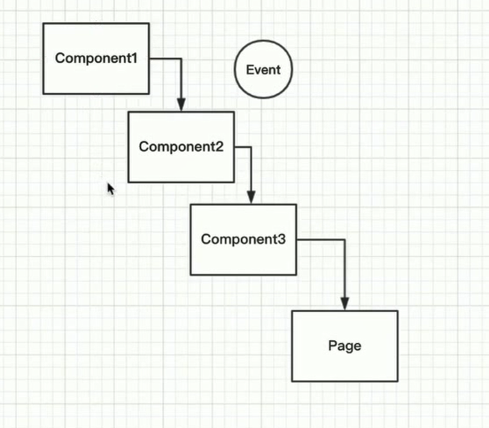

# 小程序开发

[TOC]


## 文档

框架

https://developers.weixin.qq.com/miniprogram/dev/reference/configuration/app.html#window

组件

https://developers.weixin.qq.com/miniprogram/dev/component/

自定义组件

https://developers.weixin.qq.com/miniprogram/dev/framework/custom-component/

生命周期

https://developers.weixin.qq.com/miniprogram/dev/framework/custom-component/lifetimes.html


API:

https://developers.weixin.qq.com/miniprogram/dev/api/network/request/wx.request.html


## 一 准备阶段

### 1. 申请小程序账号

### 2. 开发环境搭建 

### 3. 小程序组织结构

#### 3.1 小程序基本结构


#### 3.2 小程序组件 结构


## 二.配置

### 1. app.json

https://developers.weixin.qq.com/miniprogram/dev/reference/configuration/app.html#pages

主要下面 **5 个 选项**

| 属性                                                         | 类型     | 必填 | 描述                          | 最低版本 |
| :----------------------------------------------------------- | :------- | :--- | :---------------------------- | :------- |
| [pages](https://developers.weixin.qq.com/miniprogram/dev/reference/configuration/app.html#pages) | string[] | 是   | 页面路径列表                  |          |
| [window](https://developers.weixin.qq.com/miniprogram/dev/reference/configuration/app.html#window) | Object   | 否   | 全局的默认窗口表现            |          |
| [tabBar](https://developers.weixin.qq.com/miniprogram/dev/reference/configuration/app.html#tabBar) | Object   | 否   | 底部 `tab` 栏的表现           |          |
| [networkTimeout](https://developers.weixin.qq.com/miniprogram/dev/reference/configuration/app.html#networkTimeout) | Object   | 否   | 网络超时时间                  |          |
| [debug](https://developers.weixin.qq.com/miniprogram/dev/reference/configuration/app.html#debug) | boolean  | 否   | 是否开启 debug 模式，默认关闭 |          |

```json
{
  "pages": [// 1.注册
    "pages/classic"
  ], 
  "window": {
        "navigationBarBackgroundColor": "#FFFF00", // 导航条背景颜色
        "navigationBarTitleText": "林间有风",// 导航条 文字
        "navigationBarTextStyle": "black", //  导航条文本颜色
        "navigationStyle":"default", // 导航栏样式  default/custom
        "backgroundColor": "#FFFFFF",// 窗口背景颜色
        "backgroundTextStyle": "dark",// 下拉 loading 的样式，仅支持 `dark` / `light`
        "enablePullDownRefresh": false// 是否开启下拉刷新 ,默认 :false
    }
}
```


## 三. 基本概念

### 1.组件分类

wx 小程序基础组件分为以下八大类：

**视图容器(View Container)：**

| 组件名                                                       | 说明             |
| ------------------------------------------------------------ | ---------------- |
| * [view](https://www.w3cschool.cn/weixinapp/sp6z1q8q.html)   | 视图容器         |
| [scroll-view](https://www.w3cschool.cn/weixinapp/weixinapp-scroll-view.html) | 可滚动视图容器   |
| [swiper](https://www.w3cschool.cn/weixinapp/weixinapp-swiper.html) | 可滑动的视图容器 |

**基础内容(Basic Content)：**

| 组件名                                                       | 说明   |
| ------------------------------------------------------------ | ------ |
| [icon](https://www.w3cschool.cn/weixinapp/rmcw1q8t.html)     | 图标   |
| * [text](https://www.w3cschool.cn/weixinapp/weixinapp-text.html) | 文字   |
| [progress](https://www.w3cschool.cn/weixinapp/weixinapp-progress.html) | 进度条 |

**表单(Form)：**

| 标签名                                                       | 说明           |
| ------------------------------------------------------------ | -------------- |
| [button](https://www.w3cschool.cn/weixinapp/9w841q8w.html)   | 按钮           |
| [form](https://www.w3cschool.cn/weixinapp/m8x71q8z.html)     | 表单           |
| [input](https://www.w3cschool.cn/weixinapp/3glu1q92.html)    | 输入框         |
| [checkbox](https://www.w3cschool.cn/weixinapp/oj6e1q8x.html) | 多项选择器     |
| [radio](https://www.w3cschool.cn/weixinapp/gqhd1q96.html)    | 单项选择器     |
| [picker](https://www.w3cschool.cn/weixinapp/d9mw1q95.html)   | 列表选择器     |
| [picker-view](https://www.w3cschool.cn/weixinapp/weixinapp-component-pickerview.html) | 内嵌列表选择器 |
| [slider](https://www.w3cschool.cn/weixinapp/hk941q97.html)   | 滑动选择器     |
| [switch](https://www.w3cschool.cn/weixinapp/anr21q99.html)   | 开关选择器     |
| [label](https://www.w3cschool.cn/weixinapp/vn371q94.html)    | 标签           |

**导航(Navigation)：**

| 组件名                                                       | 说明       |
| ------------------------------------------------------------ | ---------- |
| [navigator](https://www.w3cschool.cn/weixinapp/weixinapp-navigator.html) | 应用内跳转 |

**操作反馈(Interaction)**

| 组件名                                                     | 说明                               |
| ---------------------------------------------------------- | ---------------------------------- |
| [action-sheet](https://www.php.cn/js/js-action-sheet.html) | wxapp操作反馈上拉菜单 action-sheet |
| [modal](https://www.php.cn/js/js-modal.html)               | 模态弹框                           |
| [toast](https://www.php.cn/js/js-toast.html)               | 提示框                             |
| [loading](https://www.php.cn/js/js-loading.html)           | 加载提示框                         |

**多媒体(Media)：**

| 组件名                                                       | 说明 |
| ------------------------------------------------------------ | ---- |
| [audio](https://www.w3cschool.cn/weixinapp/weixinapp-audio.html) | 音频 |
| * [image](https://www.w3cschool.cn/weixinapp/weixinapp-image.html) | 图片 |
| [video](https://www.w3cschool.cn/weixinapp/weixinapp-video.html) | 视频 |

<p style="color:red">*image组件默认宽度320px、高度240px, 引入图片时需要设置宽高*</p>

设置图片原始尺寸, 两倍图技术,  


**rpx**（responsive pixel）: 可以根据屏幕宽度进行**自适应**。

1. 小程序中的图片尺寸大小要使用**rpx 大小**

2. 或者使用原px 32px 除以2的大小===> 16px 可以还原

   

px 除以2,  rpx 是1:1 的比例关系


<p style="color:red">*建议以*iphone6* 尺寸为设计稿尺寸,  其他尺寸换算关系复杂*</p>


设计稿满足: 750px,  高度满足:667*2=1334px 设置

> 设计稿还原 , rem布局


**好处:**

rpx 尺寸, 在屏幕尺寸变化时候会自动适应的

* 理论上面屏幕尺寸小时候,  图片应该缩小

大部分时候使用**rpx**,  字体, loading 时候的时候需要使用**px**

<p style="color:red">*建议以**iphone6** 尺寸为设计稿尺寸,  其他尺寸换算关系复杂*</p>


https://blog.csdn.net/weixin_45685544/category_9381881.html

* 如果是别的尺寸宽度, 修改换算尺寸

https://blog.csdn.net/abcd2144163/article/details/101702789


**地图(Map)：**

| 组件名                                                       | 说明           |
| ------------------------------------------------------------ | -------------- |
| [map](https://www.w3cschool.cn/weixinapp/weixinapp-map.html) | 地图(腾讯地图) |

**画布(Canvas)：**

| 组件名                                                       | 说明 |
| ------------------------------------------------------------ | ---- |
| [canvas](https://www.w3cschool.cn/weixinapp/weixinapp-canvas.html) | 画布 |

**客服会话：**

| 组件名            | 说明 |
| ----------------- | ---- |
| [contact-button]( |      |

### 2.布局

#### 2.1. bootstrap

#### 2.2 flex布局

#### 2.3 响应

<p style="color:red">rpx , 响应 flex</p>


## 三. 必备知识

### 3.1 编码规范

* 1. 文件结构

* 2. [自定义组件]思想,  考虑代码复用性 (不去复制粘贴)

     > 函数: util ,代码复用的最小单元

     

     解决wxml, wxss, js 代码的复用

     

     引用组件,  制定规范

     > **相对路径/绝对路径思想体现**

     

     *-cmp 形式

     > 键值对形式

     ``` js
     {
       "usingComponents": {
         "like-cmp":"components/like/like"
       }
     }
     ```

     v-*  形式

     

     ``` js
      
     {
       "usingComponents": {
       	"v-like":"/components/like/index", # 写法1 绝对路径   根目录来的路径
         "v-like":"../../components/like/index", # 写法2 相对路径
         "v-loading":"components/loading/index" # 本page组件目录中的 [组件]
       }
     }
     ```

+ 代码复用作用

+ 代码分离作用,  **优先考虑分离性**

+ 引入**Modal概念**

+ **自定义事件**

  自定义组件触发事件时，需要使用 `triggerEvent` 方法，指定事件名、detail对象和事件选项：

  》 https://developers.weixin.qq.com/miniprogram/dev/framework/custom-component/events.html#%E7%9B%91%E5%90%AC%E4%BA%8B%E4%BB%B6

  ``` js
  // 激活一个事件(自定义事件名|传递的值|配置项)
       this.triggerEvent('like',{
        behavior:behavior
       })
  ```

  引用：

  ``` html
    <v-like bind:like="onLike" like="{{ classicData.like_status }}" count="{{ classicData.fav_nums }}"/>
  ```

  ``` js
    onLike:function (event) {
      console.log('event',event); 
    }
  ```

  

* **WXS**


### 3.2 样式继承

 组件继承全局样式

https://developers.weixin.qq.com/miniprogram/dev/framework/custom-component/wxml-wxss.html

### 组件样式

组件对应 `wxss` 文件的样式，只对组件wxml内的节点生效。编写组件样式时，需要注意以下几点：

- 组件和引用组件的页面不能使用id选择器（`#a`）、属性选择器（`[a]`）和标签名选择器，请改用class选择器。
- 组件和引用组件的页面中使用后代选择器（`.a .b`）在一些极端情况下会有非预期的表现，如遇，请避免使用。
- 子元素选择器（`.a>.b`）只能用于 `view` 组件与其子节点之间，用于其他组件可能导致非预期的情况。
- 继承样式，如 `font` 、 `color` ，会从组件外继承到组件内。
- 除继承样式外， `app.wxss` 中的样式、组件所在页面的的样式对自定义组件无效（除非更改组件样式隔离选项）。

```css
#a { } /* 在组件中不能使用 */
[a] { } /* 在组件中不能使用 */
button { } /* 在组件中不能使用 */
.a > .b { } /* 除非 .a 是 view 组件节点，否则不一定会生效 */
```

除此以外，组件可以指定它所在节点的默认样式，使用 `:host` 选择器（需要包含基础库 [1.7.2](https://developers.weixin.qq.com/miniprogram/dev/framework/compatibility.html) 或更高版本的开发者工具支持）。


 /* 开放了color, 字体样式， 其他不会影响封闭设计， 合理 */

 /* 多数css 样式不会全局继承 */


 /* page 页面会继承全局， 组件页面， 不继承全局样式 */


### 3.3 事件 

https://developers.weixin.qq.com/miniprogram/dev/framework/view/wxml/event.html#%E4%BA%8B%E4%BB%B6%E8%AF%A6%E8%A7%A3

``` html
bind:tap="onLike"        // 不会阻止事件向上冒泡
catch:tap="onLike"       // 会阻止事件向上冒泡
```

下方这些事件都是冒泡事件,  不要阻止事件的冒泡

| 类型               | 触发条件                                                     | 最低版本                                                     |
| :----------------- | :----------------------------------------------------------- | :----------------------------------------------------------- |
| touchstart         | 手指触摸动作开始                                             |                                                              |
| touchmove          | 手指触摸后移动                                               |                                                              |
| touchcancel        | 手指触摸动作被打断，如来电提醒，弹窗                         |                                                              |
| touchend           | 手指触摸动作结束                                             |                                                              |
| tap                | 手指触摸后马上离开                                           |                                                              |
| longpress          | 手指触摸后，超过350ms再离开，如果指定了事件回调函数并触发了这个事件，tap事件将不被触发 | [1.5.0](https://developers.weixin.qq.com/miniprogram/dev/framework/compatibility.html) |
| longtap            | 手指触摸后，超过350ms再离开（推荐使用longpress事件代替）     |                                                              |
| transitionend      | 会在 WXSS transition 或 wx.createAnimation 动画结束后触发    |                                                              |
| animationstart     | 会在一个 WXSS animation 动画开始时触发                       |                                                              |
| animationiteration | 会在一个 WXSS animation 一次迭代结束时触发                   |                                                              |
| animationend       | 会在一个 WXSS animation 动画完成时触发                       |                                                              |
| touchforcechange   | 在支持 3D Touch 的 iPhone 设备，重按时会触发                 |                                                              |


**非冒泡事件，如 [form]() 的`submit`事件，[input]() 的`input`事件，[scroll-view]() 的`scroll`事件，(详见各个[组件]())**

### 

事件传递机制




项目文件结构

``` bash
$   tree /f >tree.txt 
```


```
│  app.js
│  app.json
│  project.config.json
│  sitemap.json
│  tree.txt
│  
│      
├─components
│  ├─images  组件相关的图片
│  └─like
│          index.js
│          index.json
│          index.wxml
│          index.wxss
│          
├─images    项目page 相关的图片
└─pages
    └─classic
            classic.js
            classic.json
            classic.wxml
            classic.wxss
```


## 四 数据来源

* image组件默认宽度320px、高度240px, 

  引入图片时需要设置宽高


  // 三元表达式

  // 封装性, 开放性

  // 封装在内部 ,开放出来的

  // 粒度

  // 非常简单的功能, 非常复杂的功能


**自定义组件封装**


``` js
// components/like/index.js
Component({
  /**
   * 组件的属性列表
   */
  properties: {
    like:{
      type: Boolean,
      // value: false, // 设置初始值 , false 可以省略
    },
    count:{
      type:Number,
      // value: 0, // 设置初始值 , 0 可以省略
    },
  
  },

  /**
   * 组件的初始数据
   */
  data: {
    // 三元表达式
    // 封装性,  开放性
    // 封装在内部  ,开放出来的
    // 粒度
    // 非常简单的功能,  非常复杂的功能
    // like:false,
    yesSrc:"./../images/like.png",
    noSrc:"./../images/like@dis.png",
    // 数据绑定
    // count:98,
  
  },

  /**
   * 组件的方法列表
   */
  methods: {
    onLike: function(event) {
      // 访问properties 下方的变量
     let like = this.properties.like
     let count = this.properties.count

     count = like?count-1:count+1

     this.setData({
      like:!like,
      count: count
     })

  

    }


  }
})

```


```js
// components/classic/essay/essay.js
Component({
  /**
   * 组件的属性列表
   */
  properties: {
    index:{ // 期刊号
      type:String,
      // 监听变化， 原始值、 新值, 改变路径
      observer:function (newVal, oldVal, changedPath ) {
        // 补0 操作
        let val = newVal < 10 ? '0' + newVal: newVal

        // 更新index数据
        // 属性被改变时执行的函数（可选），也可以写成在methods段中定义的方法名字符串, 如：'_propertyChange'
        // 通常 newVal 就是新设置的数据， oldVal 是旧数据
        /*当index数据类型为number时，这样处理不行，因为小程序会自动转化。而string类型又因为会无限递归，而报错所以我们在data中定义一个新的_index
        数据给他赋值，注意使用_index时，你组件的{{}}中调用的也必须时{{_index}}而不是{{index}}*/
        this.setData({
          _index: val
        })
        console.log(newVal)
        console.log(oldVal)
      }
    }, 
  },

  // wxs
  /**
   * 组件的初始数据
   */
  data: {
    year:0,
    month:"",
    _index:''
  },

  lifetimes: {
    attached: function() {
      // 在组件实例进入页面节点树时执行
    },
    detached: function() {
      // 在组件实例被从页面节点树移除时执行
    },
  },


  /**
   * 组件的方法列表
   */
  methods: {

  }
})

```


* 组件封装时候保证通用性， 特定业务逻辑不要写组件中


生命周期


组件的生命周期函数

https://developers.weixin.qq.com/miniprogram/dev/framework/custom-component/lifetimes.html


API:

| 名称       | 作用         |
| ---------- | ------------ |
| wx.request | 请求网络数据 |
|            |              |
|            |              |
|            |              |
|            |              |
|            |              |
|            |              |
|            |              |
|            |              |

### wx.request

``` js
   // wx.request({
    //   url: 'http://bl.7yue.pro/v1/classic/latest',
    //   data: {},
    //   header: {
    //     appkey:"KOLDaSADSDLWWbF",

    //   },
    //   method: 'GET',
    //   dataType: 'json',
    //   responseType: 'text',
    //   success: (result) => {
        	let code = res.statusCode.toString();
       		// (string) startsWith
        	// (string) endsWith
        	if (code.startsWith("2")) {
                
            }else{// 服务器异常
                
            }
    //   },
    //   fail: () => {},// // api 调用失败
    //   complete: () => {}
    // });
      
```


promise

> Promise, 解决异步函数嵌套结果


**异步函数回调地狱问题**


Promise 滥用


优化后：


``` js
let promise = new Promise((resolve, reject)=>{
      wx.request({
        url: 'http://bl.7yue.pro/v1/classic/latest',
        data: {},
        header: {
          appkey:"KOLDaSADSDLWWbF",
  
        },
        method: 'GET',
        dataType: 'json',
        responseType: 'text',
        success: (res) => {
           resolve(res)
        },
        fail: () => {},
        complete: () => {}
      });
    })

    promise.then(res=>{
      console.log(res);
      
    })
```


**behavior**

小程序行为-代码继承复用

``` js
// behavior 行为-代码复用
// 为多个组件定义共同行为

// 组件继承之后,  会继承 behavior 中的生命周期, 行为,  data , properties 等属性


//引用
import {classicBeh} from './../classic-beh.js'

Component({
  // 继承 behaviors
  behaviors:[classicBeh], 
})

// https://developers.weixin.qq.com/miniprogram/dev/reference/api/Behavior.html

```


## 使用 npm 云开发

https://developers.weixin.qq.com/miniprogram/dev/wxcloud/guide/functions/npm.html

## 体验

1. 增大可触碰区域的面积
