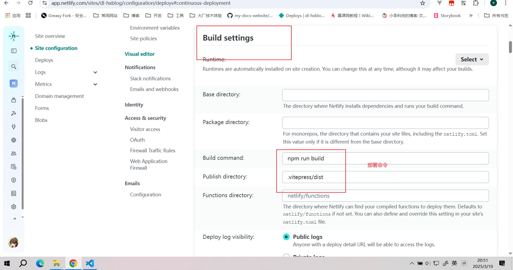
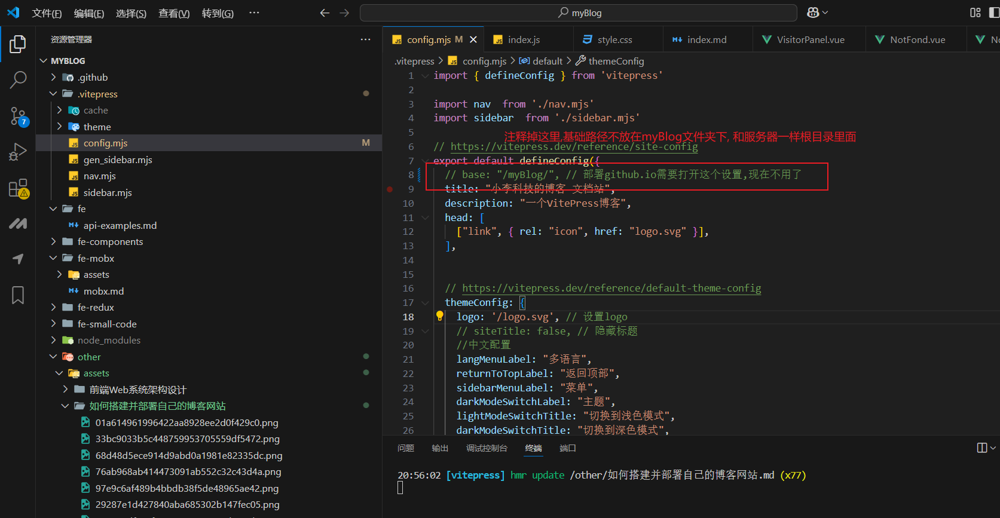

## 新的改变
### 旧的github.io地址,现在不用
[https://dl-hx.github.io/myBlog/](https://dl-hx.github.io/myBlog/)

### 更新netlify托管之后为这个
[https://dl-hxblog.netlify.app/](https://dl-hxblog.netlify.app)

## 一 如何搭建[1]:
### 安装vitepress

首先新建文件夹，打开cmd窗口


```sh
pnpm add -D vitepress
```
### 初始化Vitepress

```sh
pnpm vitepress init
```
这是我的配置，简单介绍一下

+ 第一个是在当前根目录下创建vitepress项目

+ 站点标题和描述。后续可以在配置中改

+ 主题，建议选择第二个，个人觉得比较好看

+ 是否使用ts，我们个人学习就没必要ts了，主要还是我懒

+ 是否添加脚本到package.json，这个还是需要的，启动命令，打包命令这些都得用


初始化成功后，使用vscode或webstorm打开文件夹，会看到这样一个目录。接下来简单介绍一下每个文件的含义


+ .vitepress，最核心的目录，
+ theme目录。自定义主题配置，css样式等
+ config.mjs。最核心的文件，各种配置导航栏、侧边栏、标题什么的都是在这里
+ node_modules。安装的依赖
+ api-examples.md和markdown-examples.md。官方给的两个示例
+ index.md。主页相关
+ package.json和pnpm-lock.yml。包管理工具需要用的


### 启动项目


```sh
pnpm run docs:dev
```
打开，看到这个，说明初始化成功


## 二 如何部署[2]
0. 需要在config.mjs里面配置base，名称为github仓库名称，注意不要忘记改之前的icon
```sh
base: "/myBlog/"
```
修改package.json, 添加` "packageManager": "pnpm@8.6.12"`, 版本号要与后面yaml中的pnpm版本号一致
```json
{
  "devDependencies": {
    "vitepress": "^1.6.3"
  },
  "scripts": {
    "docs:dev": "vitepress dev",
    "docs:build": "vitepress build",
    "docs:preview": "vitepress preview"
  },
+ "packageManager": "pnpm@8.6.12"
}
```
2. 在 github 中创建一个名称为myBlog的仓库

3. 在项目中初始化 git
```sh
$ git init
```
4. 根目录添加.gitignore 文件
```sh
# Project exclude paths
.idea
.DS_Store
node_modules
/dist
```
4. 上传代码
```sh
$ git push -u origin master
```

5. 选择github actions


6. 设置工作流


8. 重命名并设置deploy脚本[2]
脚本文件：参考的vitepress官方文档：https://vitepress.dev/guide/deploy#github-pages
**这里发现参考资料里面的node包有问题,换成我们的**


```yaml

name: Deploy VitePress site to Pages

on:
  push:
    branches: [master]
  workflow_dispatch:
# 设置tokenn访问权限
permissions:
  contents: read
  pages: write
  id-token: write

# 只允许同时进行一次部署，跳过正在运行和最新队列之间的运行队列
# 但是，不要取消正在进行的运行，因为我们希望允许这些生产部署完成
concurrency:
  group: pages
  cancel-in-progress: false

jobs:
  # 构建工作
  build:
    runs-on: ubuntu-latest
    steps:
      - name: Checkout
        uses: actions/checkout@v3
        with:
          fetch-depth: 0 # 如果未启用 lastUpdated，则不需要
      - name: Setup pnpm
        uses: pnpm/action-setup@v2 # 安装pnpm并添加到环境变量
        with:
          version: 8.6.12 # 指定需要的 pnpm 版本
      - name: Setup Node
        uses: actions/setup-node@v3
        with:
          node-version: 18
          cache: pnpm # 设置缓存
      - name: Setup Pages
        uses: actions/configure-pages@v5  # 在工作流程自动配置GithubPages
      - name: Install dependencies
        run: pnpm install # 安装依赖
      - name: Build with VitePress
        run: |
          pnpm run docs:build # 启动项目
          touch .nojekyll  # 通知githubpages不要使用Jekyll处理这个站点，不知道为啥不生效，就手动搞了
      - name: Upload artifact
        uses: actions/upload-pages-artifact@v3  # 上传构建产物
        with:
          path: .vitepress/dist # 指定上传的路径，当前是根目录，如果是docs需要加docs/的前缀

  # 部署工作
  deploy:
    environment:
      name: github-pages
      url: ${{ steps.deployment.outputs.page_url }} # 从后续的输出中获取部署后的页面URL
    needs: build    # 在build后面完成
    runs-on: ubuntu-latest  # 运行在最新版本的ubuntu系统上
    name: Deploy
    steps:
      - name: Deploy to GitHub Pages
        id: deployment  # 指定id
        uses: actions/deploy-pages@v4 # 将之前的构建产物部署到github pages中
```


8. 点击确定，耐心等待15秒左右，就可以了，接下来查看我们的域名：

这里我自己的是这个[https://dl-hx.github.io/myBlog/](https://dl-hx.github.io/myBlog/)


***点击之后.可以看到我们的页面***

-------


***最后，就部署完毕了***
## 视频教程 [3]

## 三 部署到netlify 托管 , 免费的 [4]
+ 1、把项目部署到github


+ 2、打开netlify官网[app.netlify.com](https://app.netlify.com)，使用github登录，登录后创建一个team

+ 3、创建完team后点击如图所示创建网站 

+ 4、我们使用github里的项目，点击github后会有一个授权的步骤，授权后进入下一步


+ 5、进入选择你的github仓库项目，选择项目后进入下一步,这里是`myBlog`项目


 该这里修改部署命令, 这里图片改成我们的


+ 6. 项目根目录


添加`netlify.toml`文件


内容
```yaml
[build]
  command = "npm run build"
  publish = ".vitepress/dist"

```
修改base,否则图片出不来


+ 7、点击更新触发自动部署


+ 8. 部署成功打开地址进行查看复制这个
`https://dl-hxblog.netlify.app/`


------

## 四 总结
::: tip
这里部署我们要知道:

要有公网ip,  才能公网访问.   

域名: 为了人们便于记忆,就要买域名,   没有域名直接访问公网ip也可以访问

域名价格: 10块钱左右,但是不是永久的又要经常换

+ 这里为了获取公网ip: 
可以买服务器,  ECS 99 一年 ,然后配置nginx,  然后把域名解析到服务器的公网ip上,  这样就可以通过域名访问了


+ 或者选择Serverless服务
这里我们用的是netlify,  免费的,  但是有流量限制,  可以自己买流量包,  也可配置自己的域名

或者之前的 github的actions自动部署,  国内访问收到限制,也可以配置域名.

+ 其实这里是将其部署在了`netlify`服务器进行托管, 相当于一种Serverless服务

+ 还有一些其他的,后面将的DNS解析啥的`去腾讯云进行域名解析` ,**没有域名就没弄**

+ 还想到可以用`vercel`进行部署

+ 还有一种就是买个**服务器,  将资源放在服务器上, 相当于OSS访问.  需要将dist传进去, 用nginx启动**

+ 还有`docker`镜像这些

+ 阿里云腾讯云有**轻量服务器部署**
**如果有需要的化, 可以买秒杀的服务器**


:::


::: tip
1. 传统方案 服务器+ 买域名+资源上传(OSS)+nginx修改启动
2. 免费托管的
+ netlify
+ vercel
+ github action
+ cloudflare  [5] 有大小限制25MB


:::


::: tip
我们这里是静态网站, 与动态网站,前后端分离项目又有区别

| 特性               | 静态网站 (VitePress)                     | 前后端分离项目                |
|--------------------|------------------------------------------|-------------------------------|
| **构建方式**        | 构建时生成静态HTML文件                     | 运行时动态渲染                |
| **部署要求**        | 只需静态文件托管（Netlify/GitHub Pages）   | 需要Node/Java等运行时环境      |
| **数据加载**        | 构建时预取数据                            | 运行时通过API获取数据          |
| **技术栈**          | Markdown + 静态生成器                     | React/Vue + Node/Spring 等     |
| **交互复杂度**      | 适合文档/博客类简单交互                   | 适合需要复杂状态管理的应用      |
| **SEO支持**         | 原生支持（预渲染HTML）                    | 需要SSR（服务端渲染）          |
| **部署成本**        | 免费方案可用    


**适合场景对比**：
- ✅ 静态网站：技术文档、博客、产品介绍页、开源项目主页
- ✅ 前后端分离：电商平台、后台管理系统、实时协作工具


**静态网站局限性**：
1. 内容更新需重新构建部署 ➜ 每次修改都要运行`pnpm build`
2. 动态功能依赖第三方服务 ➜ 评论系统需集成 utterances/Giscus
3. 不适合实时数据展示 ➜ 无法直接对接数据库
4. 大规模内容管理困难 ➜ 超过1000篇文档时构建速度下降
5. 个性化交互有限 ➜ 无法实现用户登录状态保持


6. 大流量成本问题 ➜ Netlify免费版每月100GB带宽限制
7. 大文件加载缓慢 ➜ 建议超过1MB的图片使用CDN加速


+ **性能优化(资源压缩)** 我们要压缩
所以后面引出 **数据库(数据存储)** 这些杂七杂八的, 

+ 为了通信 **AJAX,  SOCEKTMQ**

+ 还有**监控埋点这些, 看PV, UV**

:::

 [1]:  https://docs.bugdesigner.cn/docs/Tutorial/vitepress.html
 [2]:https://docs.bugdesigner.cn/docs/Tutorial/vitepress.html#%E4%BD%BF%E7%94%A8github-pages%E9%83%A8%E7%BD%B2
 [3]: https://www.bilibili.com/video/BV1XW4y1w7bc/
 [4]: https://juejin.cn/post/7296017053468000282?searchId=20250310201138F464A1702E6BDAF9CEBC#heading-3
 [5]: https://juejin.cn/post/7366070642045911055?searchId=20250310211816DC408081490B91F9750A#heading-7
